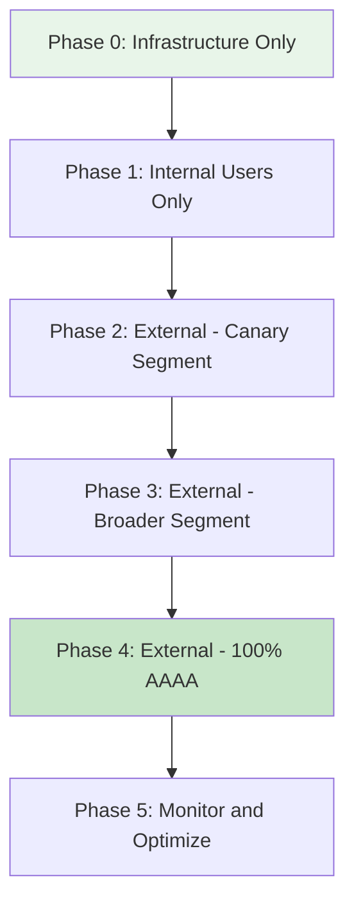

# How to Roll Out IPv6 in Phases

Author: [nawazdhandala](https://www.github.com/nawazdhandala)

Tags: IPv6, Migration, Rollout, Phased Deployment, Change Management

Description: Execute a phased IPv6 rollout using canary deployments, traffic percentage splitting, and monitoring-driven progression to minimize risk during production IPv6 enablement.

## Introduction

A phased IPv6 rollout gradually increases IPv6 exposure by expanding AAAA record visibility, enabling IPv6 on services group by group, and monitoring error rates before proceeding to the next phase. This limits the blast radius of any IPv6-related issue while building operator confidence.

## Phased Rollout Strategy



## Phase 0: Infrastructure Foundation

Enable IPv6 on infrastructure without affecting users:

```bash
# Enable IPv6 on internal routers and switches

# No user-visible change yet

# Test internal IPv6 reachability
ping6 2001:db8:100::1  # Core router
ping6 2001:db8:100::10 # Internal DNS

# Enable IPv6 on monitoring
# prometheus.yml: add IPv6 targets
# Grafana: bind to [::]

# Enable IPv6 on staging
# Run full test suite against staging
python -m pytest tests/test_ipv6_staging.py -v
```

**Exit Criteria:**
- All internal routers have IPv6 addresses
- Internal DNS resolves AAAA records
- Monitoring shows IPv6 traffic
- Staging tests pass 100%

## Phase 1: Internal Users

Publish AAAA records only for internal DNS resolvers:

```bind
; Internal DNS zone - add AAAA records
; External DNS: A records only (no AAAA yet)
internal.example.com.  IN  AAAA  2001:db8:1::1
api.internal.example.com.  IN  AAAA  2001:db8:1::2
```

```bash
# Monitor internal IPv6 adoption
# Check web server logs for IPv6 requests from internal users
grep -cE '^[0-9a-fA-F:]{3,39} ' /var/log/nginx/internal-access.log
```

**Exit Criteria:**
- 20%+ of internal users reaching services via IPv6
- Error rate < 0.1% for IPv6 requests
- No user complaints about connectivity issues

## Phase 2: External DNS Canary (~10%)

Publish AAAA records only for a limited external canary segment (for example, a canary hostname, provider-supported policy, or selected resolver view) that represents about 10% of traffic:

```python
#!/usr/bin/env python3
# Simulate an external canary DNS plan.
# DNS weights are applied within records that share the same name and type;
# do not use A-vs-AAAA weighting to hide AAAA records from a percentage of clients.

external_canary_dns_plan = {
    "segment": "external-canary",
    "estimated_traffic_percent": 10,
    "records": {
        "www.example.com": {
            "AAAA": "2001:db8::1"
        }
    }
}
```

```bash
# Monitor error rate during Phase 2
# Prometheus query: IPv6 error rate
curl -s "http://localhost:9090/api/v1/query" \
    --data-urlencode 'query=sum(rate(http_requests_total{status=~"5..",ip_version="ipv6"}[5m])) / sum(rate(http_requests_total{ip_version="ipv6"}[5m])) * 100' | \
    python3 -m json.tool
```

**Exit Criteria:**
- IPv6 error rate < 0.5% and < 5x IPv4 error rate
- No IPv6-specific incidents
- Run for 48+ hours without issues

## Phase 3: External DNS Expansion (~50%)

Increase AAAA record exposure to a segment representing about 50% of traffic:

```bash
# Expand the canary segment to about 50% of expected traffic
# Monitor for 24 hours

# Check IPv6 percentage in access logs
awk '
{
    ip = $1
    gsub(/[\[\]]/, "", ip)
    if (ip ~ /:/) ipv6++
    else ipv4++
    total++
}
END {
    printf "IPv6: %.1f%%  IPv4: %.1f%%\n",
        ipv6*100/total, ipv4*100/total
}
' /var/log/nginx/access.log
```

## Phase 4: Full AAAA Publication

```bash
# Enable AAAA for all clients
# Remove canary segmentation - all clients get AAAA
# Lower DNS TTL to 60s first for fast rollback capability

# Verify from multiple external points
# Test from IPv6-only network
curl -6 https://www.example.com

# Monitor for 1 hour intensively, then 24 hours before declaring stable
```

## Phase 5: Monitoring and Optimization

```bash
# After full rollout, optimize:

# 1. Verify address selection and Happy Eyeballs behavior
# Modern clients should prefer IPv6 when it is healthy and fall back quickly if it is not
python3 -c "
import socket
addrs = socket.getaddrinfo('www.example.com', 443, proto=socket.IPPROTO_TCP)
for addr in addrs:
    print(addr[0].name, addr[4])
"
# Confirm IPv6 candidates are returned; ordering is OS policy dependent

# 2. Increase DNS TTL back to normal
# Change from 60 to 300 seconds

# 3. Track IPv6 percentage over time
# Goal: IPv6 > 40% within 3 months of full launch
```

## Rollout Decision Gate Criteria

| Metric | Pass Threshold | Action if Fail |
|--------|----------------|----------------|
| IPv6 error rate | < 0.5% | Roll back, investigate |
| IPv6 latency vs IPv4 | < 20% higher | Investigate routing |
| User complaints about connectivity | Zero | Roll back |
| IPv6 traffic adoption | > 5% | Continue (low but expected) |

## Conclusion

A phased IPv6 rollout controls risk by limiting AAAA record publication, monitoring error rates at each phase, and requiring explicit exit criteria before proceeding. Use segmented AAAA publication to control which client cohorts receive AAAA responses during phases 2 and 3; use DNS weights only among records with the same name and type. The most important monitoring signal is IPv6 error rate - if it exceeds 5x the IPv4 error rate, roll back and investigate before proceeding.
