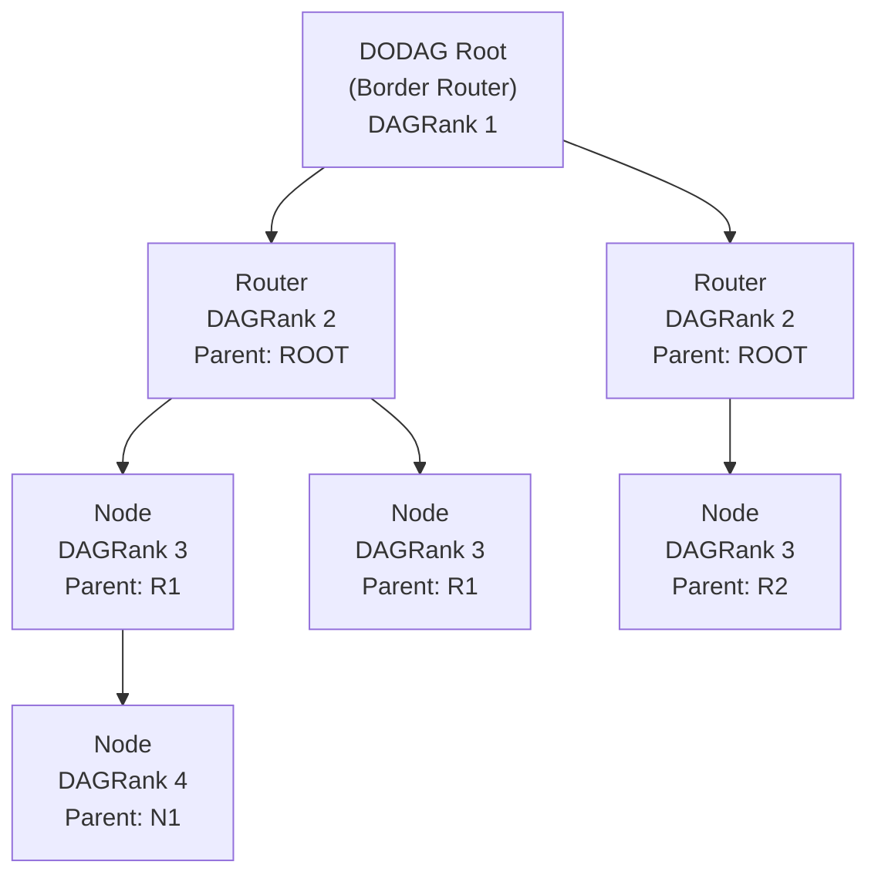

# How to Understand RPL (Routing Protocol for Low-Power Networks) over IPv6

Author: [nawazdhandala](https://www.github.com/nawazdhandala)

Tags: IPv6, RPL, IoT, Routing, 6LoWPAN, Networking

Description: Understand how RPL builds and maintains routing topology in IPv6 IoT mesh networks using DODAG construction, objective functions, and control messages.

## Introduction

RPL (Routing Protocol for Low-Power and Lossy Networks) is defined in RFC 6550. It is the standard routing protocol for IPv6 mesh networks in IoT environments where links are unreliable, nodes have limited resources, and the network topology changes frequently due to device movement or radio interference.

## Core Concepts

### DODAG (Destination-Oriented Directed Acyclic Graph)

RPL organizes the network as a tree-like structure rooted at the border router (or another DODAG root):



### Rank

Each node has a "Rank" in the DODAG. The root has normalized DAGRank 1; the raw Rank value is based on MinHopRankIncrease. Nodes increase Rank as they move away from the root. Rank is computed by the **Objective Function** based on link metrics like ETX (Estimated Transmission Count).

### Objective Functions

- **OF0**: Basic/default objective function that does not require metric containers; it may behave like hop count when static per-hop rank increments are used
- **MRHOF**: Minimum Rank with Hysteresis Objective Function (RFC 6719) - minimizes an additive path metric, commonly ETX, with hysteresis to avoid frequent parent switching

## RPL Control Messages

| Message | ICMPv6 Type / Code | Purpose |
|---|---|---|
| DIO (DODAG Information Object) | 155 / 0x01 | Advertise DODAG parameters and Rank |
| DIS (DODAG Information Solicitation) | 155 / 0x00 | Solicit DIO messages from neighbors |
| DAO (Destination Advertisement Object) | 155 / 0x02 | Propagate destination information upward |
| DAO-ACK | 155 / 0x03 | Acknowledge DAO receipt when requested |

## How a New Node Joins

1. Node powers on and listens for **DIO** messages, or sends **DIS** messages to solicit them
2. Selects the best parent based on the Objective Function
3. Computes its rank (parent rank + rank_increase)
4. Sends a **DAO** upward to advertise reachability (to selected parent(s) in storing mode, or to the root in non-storing mode)
5. The root, and intermediate routers in storing mode, now have downward routing state for the new node

## Routing Concepts in OpenThread

OpenThread implements Thread mesh routing rather than RFC 6550 RPL. Thread uses Mesh Link Establishment (MLE) for neighbor and link information, and distance-vector route propagation. To observe similar routing concepts:

```bash
# OpenThread CLI commands for understanding mesh routing

# Show the current parent

> parent
# Ext Addr: be1857c6c21dce55
# Rloc: 5c00
# Link Quality In: 3
# Link Quality Out: 3
# Age: 20
# Version: 4
# Done

# Show all routers in the mesh
> router table
# | ID | RLOC16 | Next Hop | Path Cost | LQ In | LQ Out | Age | Extended MAC     | Link |
# +----+--------+----------+-----------+-------+--------+-----+------------------+------+
# | 22 | 0x5800 |       63 |         0 |     0 |      0 |   0 | 0aeb8196c9f61658 |    0 |
# | 49 | 0xc400 |       63 |         0 |     3 |      3 |   0 | faa1c03908e2dbf2 |    1 |
# Done

# Show external routes in the local Thread Network Data
> route
# 2001:dead:beef:cafe::/64 s med
# Done
```

## RPL in Contiki-NG

```c
// Enable RPL in Contiki-NG project configuration
// project-conf.h
// In a Makefile, Contiki-NG typically selects these with MAKE_ROUTING.

#define NETSTACK_CONF_ROUTING rpl_lite_driver    // RPL Lite (default; non-storing only)
// #define NETSTACK_CONF_ROUTING rpl_classic_driver // RPL Classic (supports storing and non-storing)

// Set RPL mode (RPL Classic; RPL Lite defaults to non-storing)
#define RPL_CONF_MOP RPL_MOP_NON_STORING
// #define RPL_CONF_MOP RPL_MOP_STORING_NO_MULTICAST
```

```c
// In application code, check RPL status
#include "net/netstack.h"
#include "net/routing/routing.h"
#include "sys/log.h"

#define LOG_MODULE "RPL-App"
#define LOG_LEVEL LOG_LEVEL_INFO

static void
log_rpl_status(void)
{
    if (NETSTACK_ROUTING.node_is_reachable()) {
        // This node has an upward route to the root - can send data
        LOG_INFO("Reachable via RPL DAG\n");
    } else {
        LOG_WARN("Not yet joined RPL DAG\n");
    }
}
```

## RPL Storing vs Non-Storing Mode

| Mode | Route Storage | Upward Traffic | Downward Traffic |
|---|---|---|---|
| Storing | Each router stores routes | All nodes | Via stored routes |
| Non-Storing | Only root stores routes | All nodes | Via source routing headers |

Non-storing mode uses less memory on intermediate nodes (important for class 1 devices) but adds overhead to downward packets (RPL Source Route Header).

## Objective Function Configuration

```c
// Contiki-NG: Use MRHOF for better link quality selection
// project-conf.h

#define RPL_CONF_SUPPORTED_OFS {&rpl_mrhof}
#define RPL_CONF_OF_OCP RPL_OCP_MRHOF   // Use MRHOF

// To use OF0 instead, build nodes with OF0 support and select OF0:
// #define RPL_CONF_SUPPORTED_OFS {&rpl_of0, &rpl_mrhof}
// #define RPL_CONF_OF_OCP RPL_OCP_OF0

// Optional: square ETX to penalize high-ETX links more strongly
#define RPL_MRHOF_CONF_SQUARED_ETX 1
```

## Conclusion

RPL provides automatic topology discovery and maintenance for IPv6 IoT mesh networks without any manual route configuration. The DODAG construction through DIO/DAO messages, combined with the objective function's link quality metrics, creates a policy-driven routing topology from constrained sensor nodes to the border router. Understanding RPL storing vs non-storing modes helps choose the right tradeoff between node memory requirements and packet overhead for your specific deployment.
