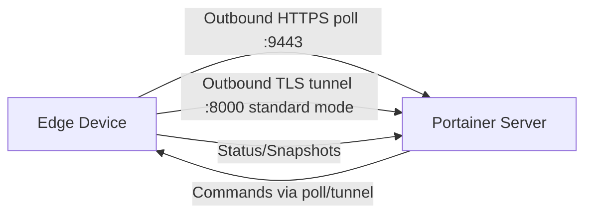

# How to Run Edge Agent on ARM Devices

Author: [nawazdhandala](https://www.github.com/nawazdhandala)

Tags: Portainer, Edge Agent, ARM, IoT, Raspberry Pi

Description: Install the Portainer Edge Agent on ARM-based devices such as Raspberry Pi for IoT and edge computing management.

---

Portainer Edge Agents enable management of remote environments that are behind NAT, firewalls, or have limited connectivity. The Edge Agent establishes an outbound connection to the Portainer server, eliminating the need for inbound firewall rules.

## How Edge Agent Works



The Edge Agent polls the Portainer API on the UI/API port, usually 9443. In standard mode it can also establish an outbound tunnel to the Portainer tunnel server on port 8000 for interactive management; async mode only requires the UI/API port.

## Generate Edge Deployment Script

```bash
PORTAINER_API_KEY="ptr_your_api_key_here"

# Create an edge Docker environment and export the values used by the agent
EDGE_ENV=$(curl -s -X POST \
  https://portainer.example.com:9443/api/endpoints \
  -H "X-API-Key: $PORTAINER_API_KEY" \
  -F "Name=edge-site-01" \
  -F "EndpointCreationType=4" \
  -F "ContainerEngine=docker" \
  -F "URL=https://portainer.example.com:9443" \
  -F "EdgeCheckinInterval=30")

export EDGE_KEY=$(printf '%s' "$EDGE_ENV" | python3 -c 'import sys,json; print(json.load(sys.stdin)["EdgeKey"])')
export EDGE_ID=$(printf '%s' "$EDGE_ENV" | python3 -c 'import sys,json,uuid; data=json.load(sys.stdin); print(data.get("EdgeID") or uuid.uuid4())')
```

## Standard Mode Installation

```bash
# Standard mode - agent polls frequently (real-time management)
docker run -d \
  --name portainer_edge_agent \
  --restart=always \
  -v /var/run/docker.sock:/var/run/docker.sock \
  -v /var/lib/docker/volumes:/var/lib/docker/volumes \
  -v /:/host \
  -v portainer_agent_data:/data \
  -e EDGE=1 \
  -e EDGE_ID="${EDGE_ID}" \
  -e EDGE_KEY="${EDGE_KEY}" \
  -e EDGE_INSECURE_POLL=0 \
  portainer/agent:lts
```

## Async Mode Installation

```bash
# Async mode - intervals are configured in Portainer, suitable for limited bandwidth
docker run -d \
  --name portainer_edge_agent \
  --restart=always \
  -v /var/run/docker.sock:/var/run/docker.sock \
  -v /var/lib/docker/volumes:/var/lib/docker/volumes \
  -v /:/host \
  -v portainer_agent_data:/data \
  -e EDGE=1 \
  -e EDGE_ID="${EDGE_ID}" \
  -e EDGE_KEY="${EDGE_KEY}" \
  -e EDGE_INSECURE_POLL=0 \
  -e EDGE_ASYNC=1 \
  portainer/agent:lts
```

## ARM / Windows Variations

```powershell
# ARM64 (Raspberry Pi 4, Apple M1)
docker pull portainer/agent:lts  # Multi-arch: Docker selects ARM64 on ARM64 hosts

# Windows (Docker Desktop or Docker Engine for Windows)
docker run -d `
  --mount type=npipe,src=\\.\pipe\docker_engine,dst=\\.\pipe\docker_engine `
  --mount type=bind,src=C:\ProgramData\docker\volumes,dst=C:\ProgramData\docker\volumes `
  --mount type=volume,src=portainer_agent_data,dst=C:\data `
  --restart always `
  -e EDGE=1 `
  -e EDGE_ID="$Env:EDGE_ID" `
  -e EDGE_KEY="$Env:EDGE_KEY" `
  -e EDGE_INSECURE_POLL=0 `
  --name portainer_edge_agent `
  portainer/agent:lts
```

## Verify Edge Agent Connection

```bash
# Check agent is running
docker logs portainer_edge_agent 2>&1 | tail -20

# On Portainer server, check if environment shows as connected
curl -s https://portainer.example.com:9443/api/endpoints \
  -H "X-API-Key: $PORTAINER_API_KEY" | python3 -c "
import sys, json
envs = json.load(sys.stdin)
for e in envs:
    if e.get('EdgeKey'):
        print(f'Edge: {e[\"Name\"]}, Status: {\"Online\" if e.get(\"Heartbeat\") else \"Offline\"}')
"
```

---

*Monitor edge device health and connectivity with [OneUptime](https://oneuptime.com).*
