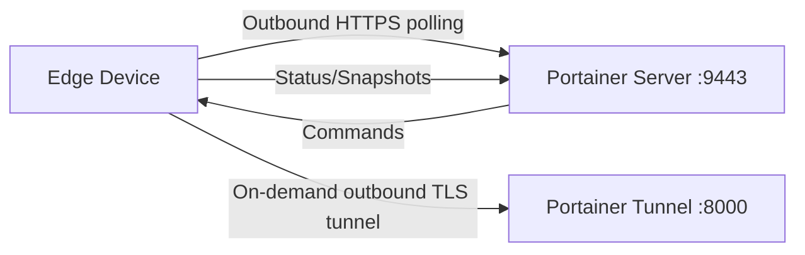

# How to Run Edge Agent on Windows

Author: [nawazdhandala](https://www.github.com/nawazdhandala)

Tags: Portainer, Edge Agent, Window, Docker Desktop, Configuration

Description: Deploy the Portainer Edge Agent on Windows hosts running Docker Desktop or Docker Engine for Windows remote management.

---

Portainer Edge Agents enable management of remote environments that are behind NAT, firewalls, or have limited connectivity. The Edge Agent establishes an outbound connection to the Portainer server, eliminating the need for inbound firewall rules.

## How Edge Agent Works



The Edge Agent polls the Portainer API on the UI/API port (typically 9443). In standard mode it opens an outbound TLS tunnel to the Portainer tunnel port (8000 by default) when Portainer needs an interactive management session, so no inbound ports need to be opened on the edge network.

## Generate Edge Deployment Script

```bash
TOKEN=$(curl -s -X POST \
  https://portainer.example.com:9443/api/auth \
  -H "Content-Type: application/json" \
  -d '{"username":"admin","password":"yourpassword"}' \
  --insecure | python3 -c "import sys,json; print(json.load(sys.stdin)['jwt'])")

# Create an edge environment and extract the values used by the deployment command

EDGE_ENVIRONMENT=$(curl -s -X POST \
  https://portainer.example.com:9443/api/endpoints \
  -H "Authorization: Bearer $TOKEN" \
  -F "Name=edge-site-01" \
  -F "EndpointCreationType=4" \
  -F "URL=https://portainer.example.com:9443" \
  -F "ContainerEngine=docker" \
  -F "EdgeCheckinInterval=30" \
  --insecure)

EDGE_ID=$(python3 -c "import sys,json,uuid; env=json.load(sys.stdin); print(env.get('EdgeID') or str(uuid.uuid4()))" <<< "$EDGE_ENVIRONMENT")
EDGE_KEY=$(python3 -c "import sys,json; print(json.load(sys.stdin)['EdgeKey'])" <<< "$EDGE_ENVIRONMENT")
```

## Standard Mode Installation

```bash
# Standard mode - API polling with on-demand tunnel management
docker run -d \
  --name portainer_edge_agent \
  --restart=always \
  -v /var/run/docker.sock:/var/run/docker.sock \
  -v /var/lib/docker/volumes:/var/lib/docker/volumes \
  -v /:/host \
  -v portainer_agent_data:/data \
  -e EDGE=1 \
  -e EDGE_ID="${EDGE_ID}" \
  -e EDGE_KEY="${EDGE_KEY}" \
  -e EDGE_INSECURE_POLL=0 \
  portainer/agent:latest
```

## Async Mode Installation

```bash
# Async mode (Portainer Business Edition) - suitable for limited or intermittent connectivity
docker run -d \
  --name portainer_edge_agent \
  --restart=always \
  -v /var/run/docker.sock:/var/run/docker.sock \
  -v /var/lib/docker/volumes:/var/lib/docker/volumes \
  -v /:/host \
  -v portainer_agent_data:/data \
  -e EDGE=1 \
  -e EDGE_ID="${EDGE_ID}" \
  -e EDGE_KEY="${EDGE_KEY}" \
  -e EDGE_INSECURE_POLL=0 \
  -e EDGE_ASYNC=1 \
  portainer/agent:latest
```

## ARM / Windows Variations

```bash
# ARM64 (Raspberry Pi 4, Apple M1)
docker pull portainer/agent:latest  # Multi-arch: automatically uses ARM64
```

```powershell
# Windows containers mode (Docker Desktop or Docker Engine for Windows)
docker run -d `
  --name portainer_edge_agent `
  --restart always `
  --mount type=npipe,src=\\.\pipe\docker_engine,dst=\\.\pipe\docker_engine `
  --mount type=bind,src=C:\ProgramData\docker\volumes,dst=C:\ProgramData\docker\volumes `
  --mount type=volume,src=portainer_agent_data,dst=C:\data `
  -e EDGE=1 `
  -e EDGE_ID="${EDGE_ID}" `
  -e EDGE_KEY="${EDGE_KEY}" `
  -e EDGE_INSECURE_POLL=0 `
  portainer/agent:latest
```

## Verify Edge Agent Connection

```bash
# Check agent is running
docker logs portainer_edge_agent 2>&1 | tail -20

# On Portainer server, check if environment shows as connected
curl -s https://portainer.example.com:9443/api/endpoints \
  -H "Authorization: Bearer $TOKEN" \
  --insecure | python3 -c "
import sys, json
envs = json.load(sys.stdin)
for e in envs:
    if e.get('Type') in (4, 7):
        print(f'Edge: {e[\"Name\"]}, Status: {\"Online\" if e.get(\"Status\")==1 else \"Offline\"}')
"
```

---

*Monitor edge device health and connectivity with [OneUptime](https://oneuptime.com).*
