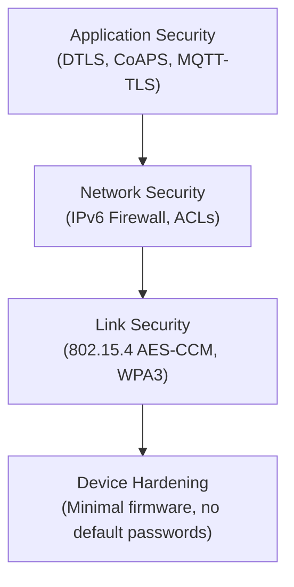

# How to Secure IPv6 IoT Devices

Author: [nawazdhandala](https://www.github.com/nawazdhandala)

Tags: IPv6, IoT, Security, Firewall, DTLS, Networking

Description: Implement security best practices for IPv6-connected IoT devices including firewall rules, DTLS for encrypted communication, and network segmentation.

## Introduction

IPv6 can give IoT devices globally scoped addresses, which means devices may be directly reachable from the internet unless a stateful firewall or routing policy blocks unsolicited traffic. This significantly raises the security stakes: without proper controls, your temperature sensor could be accessible to anyone on the internet.

## Security Layers for IPv6 IoT



## Step 1: Firewall Rules at the Border Router

The border router is the primary defense for the entire IoT segment:

```bash
# /etc/ip6tables-iot.rules

# Applied on the Linux border router's infrastructure interface (eth0)

# Default policies
ip6tables -P INPUT DROP
ip6tables -P FORWARD DROP
ip6tables -P OUTPUT ACCEPT

# Allow established/related connections (stateful inspection)
ip6tables -A FORWARD -m conntrack --ctstate ESTABLISHED,RELATED -j ACCEPT

# Allow ICMPv6 (required for IPv6 to work)
ip6tables -A FORWARD -p icmpv6 -j ACCEPT
ip6tables -A INPUT -p icmpv6 -j ACCEPT

# Allow IoT devices to initiate approved cloud connections (outbound from mesh)
CLOUD_PREFIX="2001:db8:20::/48"
ip6tables -A FORWARD -i lowpan0 -o eth0 \
    -d "$CLOUD_PREFIX" \
    -m conntrack --ctstate NEW -j ACCEPT

# Allow specific management traffic (e.g., from a trusted management host only)
MGMT_HOST="2001:db8:100::10"
IOT_DEVICE="2001:db8:10:1::10"
ip6tables -A FORWARD -i eth0 -o lowpan0 \
    -s "$MGMT_HOST" -d "$IOT_DEVICE" \
    -p tcp --dport 22 \
    -m conntrack --ctstate NEW -j ACCEPT  # SSH management

# Block all unsolicited inbound connections to IoT devices from the internet
ip6tables -A FORWARD -i eth0 -o lowpan0 -j DROP
```

## Step 2: Enable DTLS on CoAP (CoAPS)

For encrypted communication between IoT devices and servers using DTLS-PSK:

```python
# coap_server_secure.py - CoAP server with DTLS-PSK using aiocoap

import asyncio
import aiocoap
import aiocoap.resource as resource
from aiocoap.credentials import CredentialsMap


class StatusResource(resource.Resource):
    async def render_get(self, request):
        return aiocoap.Message(payload=b"ok")


async def main():
    root_resource = resource.Site()
    root_resource.add_resource(["status"], StatusResource())

    server_credentials = CredentialsMap()
    server_credentials.load_from_dict({
        ":sensor1": {
            "dtls": {
                "psk": {"hex": "00112233445566778899aabbccddeeff"},
                "client-identity": {"ascii": "sensor1"}
            }
        }
    })

    # Create DTLS-enabled CoAP server context
    # coaps:// uses DTLS on port 5684
    protocol = await aiocoap.Context.create_server_context(
        root_resource,
        bind=('::', 5684),
        server_credentials=server_credentials,
        transports=["tinydtls_server"],
    )

    await asyncio.get_running_loop().create_future()


asyncio.run(main())
```

## Step 3: Network Segmentation for IoT

Separate IoT devices from enterprise systems using VLANs or separate subnets:

```bash
# Create separate IPv6 prefix for IoT devices
# This is a /64 from the border router's delegated prefix

IOT_PREFIX="2001:db8:10:1::/64"
ENTERPRISE_PREFIX="2001:db8:1:1::/64"
CLOUD_PREFIX="2001:db8:20::/48"

# Prevent IoT devices from talking to enterprise systems
ip6tables -A FORWARD \
    -s "$IOT_PREFIX" \
    -d "$ENTERPRISE_PREFIX" \
    -j DROP

# Only allow IoT to cloud endpoints
ip6tables -A FORWARD \
    -s "$IOT_PREFIX" \
    -d "$CLOUD_PREFIX" \
    -m conntrack --ctstate NEW \
    -j ACCEPT

ip6tables -A FORWARD \
    -s "$IOT_PREFIX" \
    -j DROP  # Block all other IoT egress
```

## Step 4: 802.15.4 Link-Layer Security

For Thread/6LoWPAN mesh networks, enable IEEE 802.15.4 security in the mesh stack. For example, with OpenThread CLI:

```bash
# Set the Thread network key (32 hex chars = 128-bit key)
# IMPORTANT: Use a strong random key in production
sudo ot-ctl dataset networkkey 00112233445566778899aabbccddeeff
sudo ot-ctl dataset commit active

# Thread data frames use 802.15.4 MAC-layer security with AES-CCM
```

## Step 5: Rate Limiting

Prevent DoS attacks against IoT devices:

```bash
# Rate limit inbound management connections to IoT devices
# Use this in place of the unrestricted SSH management ACCEPT rule from Step 1
ip6tables -A FORWARD -i eth0 -o lowpan0 \
    -s "$MGMT_HOST" -d "$IOT_DEVICE" \
    -p tcp --dport 22 --syn \
    -m conntrack --ctstate NEW \
    -m limit --limit 10/min --limit-burst 20 \
    -j ACCEPT

# Log and drop connection floods
ip6tables -A FORWARD -i eth0 -o lowpan0 \
    -m limit --limit 5/sec --limit-burst 30 \
    -j LOG --log-prefix "IoT-FLOOD: "
ip6tables -A FORWARD -i eth0 -o lowpan0 -j DROP
```

## Step 6: IPv6 Neighbor Discovery Protection

Prevent ND spoofing attacks (IPv6 address resolution and Router Advertisement abuse):

```bash
# Enable ND security with RA Guard on the border router's LAN switch
# (handled at the switch level - see switch vendor documentation)

# On the Linux border router, reject source-routed packets and RAs on IoT interfaces
sysctl -w net.ipv6.conf.lowpan0.accept_source_route=-1
sysctl -w net.ipv6.conf.lowpan0.accept_ra=0    # BR doesn't accept RAs
sysctl -w net.ipv6.conf.lowpan0.accept_redirects=0
```

## Step 7: Certificate-Based Device Identity

```bash
# Generate a device certificate for a specific IoT device
openssl req -newkey ec -pkeyopt ec_paramgen_curve:P-256 \
    -noenc \
    -keyout /etc/iot/device-sensor1.key \
    -out /etc/iot/device-sensor1.csr \
    -subj "/CN=sensor1.iot.example.com/O=IoT Department" \
    -addext "subjectAltName=DNS:sensor1.iot.example.com"

# Sign with your IoT CA
openssl x509 -req -in /etc/iot/device-sensor1.csr \
    -CA /etc/iot/iot-ca.crt -CAkey /etc/iot/iot-ca.key \
    -CAcreateserial -out /etc/iot/device-sensor1.crt -days 365 \
    -copy_extensions copy
```

## Conclusion

Securing IPv6 IoT devices requires a multi-layer approach: firewall rules at the border router to control what traffic reaches the devices, DTLS for encrypted application-layer communication, 802.15.4 link-layer security for mesh networks, network segmentation to isolate IoT from enterprise systems, and certificate-based device identity. The direct addressability of globally scoped IPv6 addresses makes these protections critical - without them, IoT devices can be exposed to the internet.
