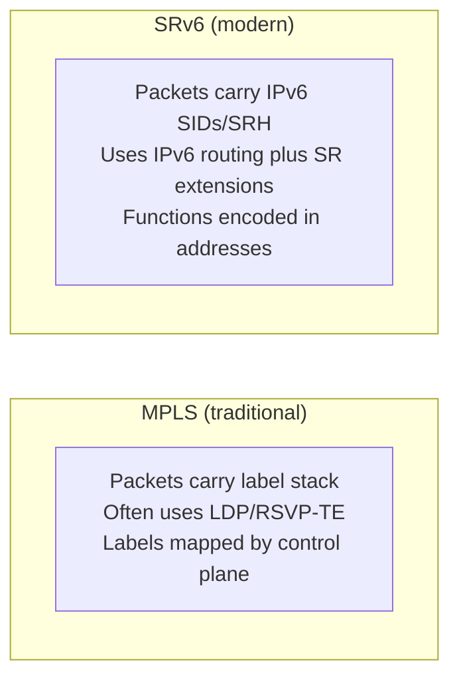
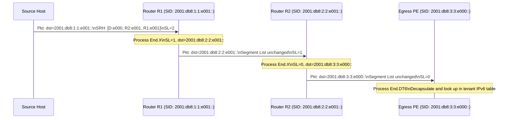

# How to Understand Segment Routing over IPv6 (SRv6)

Author: [nawazdhandala](https://www.github.com/nawazdhandala)

Tags: SRv6, Segment Routing, IPv6, Networking, MPLS, RFC 8754

Description: Understand Segment Routing over IPv6 (SRv6) architecture, how SIDs encode both routing and service instructions, and why SRv6 is replacing MPLS in modern networks.

## Introduction

Segment Routing over IPv6 (SRv6) is a source-routing architecture that uses IPv6 extension headers to carry a sequence of routing instructions (segments). Each instruction is encoded as an IPv6 address (a Segment Identifier, or SID), removing the need for an MPLS data plane inside an SRv6 domain while adding programmable network behavior.

## Core Concepts

### Segment Identifier (SID)

An SRv6 SID is a 128-bit IPv6 address structured as:

```text
SID = Locator (prefix) + Function + Arguments

Example SID: 2001:db8:1:1:e000::
  Locator:   2001:db8:1:1::/64  (identifies the node)
  Function:  e000               (example function value mapped to End.DT4)
  Arguments: ::                  (none in this case)
```

### Segment Routing Header (SRH)

The SRH is an IPv6 Routing Header (Type 4) that encodes the ordered list of SIDs. In the SRH Segment List, index 0 is the final segment, and the highest index is the first segment.

```text
SID list: <S1, S2, S3> where S1 is first to process

IPv6 Header:
  Destination: S1 (active SID)
  Next Header: 43 (Routing Header)

Segment Routing Header (Type 4):
  Segments Left: 2 (decremented at each SID)
  Last Entry: 2
  Flags: 0
  Tag: 0
  Segment List[2]: S1 = 2001:db8:1:1:e001::  (first segment)
  Segment List[1]: S2 = 2001:db8:2:2:e001::
  Segment List[0]: S3 = 2001:db8:3:3:e000::  (final segment)

IPv6 Payload (upper-layer data or encapsulated packet)
```

## SRv6 vs MPLS



| Feature | MPLS | SRv6 |
|---|---|---|
| Encapsulation | Label stack | IPv6 header plus SRH when a SID list is needed |
| Address space | 20-bit labels | 128-bit IPv6 addresses |
| End-to-end visibility | Limited; label meaning is local or control-plane dependent | Higher inside the SR domain; SIDs are IPv6 addresses under routable locators |
| Service encoding | MPLS VPN labels | Service SIDs and endpoint behaviors (L3VPN, L2VPN) |
| Hardware support | Widespread | Growing rapidly |
| Compression | Labels are compact | RFC 9800 CSID compression (NEXT-CSID/REPLACE-CSID), often used for uSID-style designs |

## SRv6 End Functions

Functions are opaque values in the SID that identify local behaviors. Common SRv6 endpoint behaviors:

| Function | Name | Description |
|---|---|---|
| End | Plain endpoint | Advance to next SID, or process the next header if Segments Left is 0 |
| End.X | Cross-connect | Advance to next SID and forward through a specific L3 adjacency |
| End.T | Table lookup | Advance to next SID and look up in a specific IPv6 table |
| End.DX4 | IPv4 decap | Decapsulate and cross-connect to an IPv4 next hop |
| End.DX6 | IPv6 decap | Decapsulate and cross-connect to an IPv6 next hop |
| End.DT4 | IPv4 table | Decapsulate and look up in a specific IPv4 table |
| End.DT6 | IPv6 table | Decapsulate and look up in a specific IPv6 table |

## Basic SRv6 Packet Processing



## Why SRv6 Matters

1. **Simplicity**: No MPLS data plane or LDP/RSVP-TE signaling inside the SRv6 domain
2. **Flexibility**: Supported behaviors can be selected by adding SID functions and arguments
3. **VPN support**: L3VPN, L2VPN, and EVPN services can be signaled with SRv6 service SIDs
4. **Traffic engineering**: Explicit paths encoded directly in packet
5. **Observability**: Active SIDs and SRH contents are IPv6 header data that can be inspected by OAM tools inside the SR domain

## Conclusion

SRv6 is the foundation of modern programmable networking, combining IPv6 routing with service chaining through SID functions. It is being deployed in major ISP and data center networks as an MPLS alternative or replacement. Use OneUptime to monitor availability and latency across SRv6 network paths and correlate failures with SID reachability.
