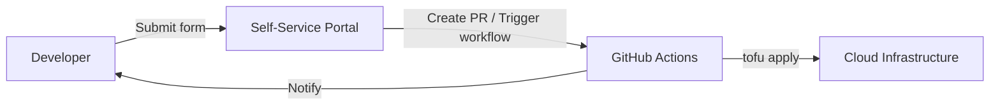

# How to Build a Self-Service Portal with OpenTofu

Author: [nawazdhandala](https://www.github.com/nawazdhandala)

Tags: OpenTofu, Self-Service, Portal, Automation, Developer Platform, Infrastructure as Code

Description: Learn how to build a self-service infrastructure portal that lets developers provision environments by submitting forms that trigger OpenTofu pipelines.

## Introduction

A self-service portal allows developers to provision their own environments without involving operations. They fill out a form, and a CI/CD pipeline runs OpenTofu to create the requested infrastructure. This reduces toil and accelerates development.

## Architecture



## Environment Request Template

Store environment requests as YAML files in a Git repository.

```yaml
# environments/requests/my-feature-env.yaml

name: my-feature-env
owner: nawazdhandala
team: platform-eng
expires: "2026-04-30"  # auto-cleanup after this date
size: small             # small, medium, large

services:
  - type: rds
    engine: postgres
    version: "16"
    instance_class: db.t3.micro

  - type: ecs
    task_cpu: 256
    task_memory: 512
    desired_count: 1

tags:
  CostCenter: cc-1234
  Jira: PLAT-456
```

## OpenTofu Configuration that Reads Requests

```hcl
# environments/dynamic/main.tf

terraform {
  # Backend settings are passed with tofu init -backend-config=backend.hcl
  backend "s3" {}
}

locals {
  # Read environment request from YAML file
  request = yamldecode(file("${path.module}/request.yaml"))
}

# Size definitions
locals {
  sizes = {
    small  = { db_class = "db.t3.micro",  task_cpu = 256,  task_memory = 512  }
    medium = { db_class = "db.t3.medium", task_cpu = 512,  task_memory = 1024 }
    large  = { db_class = "db.r6g.large", task_cpu = 1024, task_memory = 2048 }
  }

  config = local.sizes[local.request.size]
}

# Provision RDS if requested
resource "aws_db_instance" "env_db" {
  count = contains([for s in local.request.services : s.type], "rds") ? 1 : 0

  identifier        = "${local.request.name}-db"
  allocated_storage = 20
  engine            = "postgres"
  engine_version    = [for s in local.request.services : s.version if s.type == "rds"][0]
  instance_class    = local.config.db_class

  username                    = "appuser"
  manage_master_user_password = true

  db_subnet_group_name   = var.db_subnet_group_name
  vpc_security_group_ids = [aws_security_group.env.id]
  skip_final_snapshot    = true  # ephemeral environments

  tags = merge(var.base_tags, {
    Owner      = local.request.owner
    Team       = local.request.team
    Expires    = local.request.expires
    CostCenter = local.request.tags.CostCenter
  })
}
```

## GitHub Actions Workflow

```yaml
# .github/workflows/provision-environment.yml
name: Provision Environment

on:
  push:
    paths:
      - "environments/requests/*.yaml"

permissions:
  contents: read
  id-token: write

env:
  AWS_REGION: us-east-1
  TOFU_STATE_BUCKET: ${{ vars.TOFU_STATE_BUCKET }}

jobs:
  provision:
    runs-on: ubuntu-latest

    steps:
      - uses: actions/checkout@v6
        with:
          fetch-depth: 0

      - name: Find changed request files
        id: changed
        run: |
          BASE="${{ github.event.before }}"
          if [[ "$BASE" == "0000000000000000000000000000000000000000" ]]; then
            CHANGED=$(git ls-files 'environments/requests/*.yaml' | tr '\n' ' ')
          else
            CHANGED=$(git diff --name-only --diff-filter=AM "$BASE" "${{ github.sha }}" -- 'environments/requests/*.yaml' | tr '\n' ' ')
          fi
          echo "files=${CHANGED}" >> "$GITHUB_OUTPUT"

      - uses: aws-actions/configure-aws-credentials@v6.1.0
        with:
          role-to-assume: ${{ secrets.AWS_ROLE_TO_ASSUME }}
          aws-region: ${{ env.AWS_REGION }}

      - uses: opentofu/setup-opentofu@v2

      - name: Provision environments
        run: |
          for request_file in ${{ steps.changed.outputs.files }}; do
            env_name=$(basename "$request_file" .yaml)
            mkdir -p "environments/active/${env_name}"
            cp "$request_file" "environments/active/${env_name}/request.yaml"
            cp environments/dynamic/*.tf "environments/active/${env_name}/"

            cd "environments/active/${env_name}"
            cat > backend.hcl <<EOF
          bucket       = "${TOFU_STATE_BUCKET}"
          key          = "self-service/environments/${env_name}.tfstate"
          region       = "${AWS_REGION}"
          use_lockfile = true
          EOF

            tofu init -backend-config=backend.hcl
            tofu apply -auto-approve
            cd -

            echo "Environment ${env_name} provisioned successfully"
          done
```

## Auto-Cleanup Cron

```yaml
# .github/workflows/cleanup-expired-environments.yml
name: Cleanup Expired Environments

on:
  schedule:
    - cron: "0 0 * * *"  # daily at midnight

permissions:
  contents: write
  id-token: write

env:
  AWS_REGION: us-east-1
  TOFU_STATE_BUCKET: ${{ vars.TOFU_STATE_BUCKET }}

jobs:
  cleanup:
    runs-on: ubuntu-latest
    steps:
      - uses: actions/checkout@v6

      - uses: aws-actions/configure-aws-credentials@v6.1.0
        with:
          role-to-assume: ${{ secrets.AWS_ROLE_TO_ASSUME }}
          aws-region: ${{ env.AWS_REGION }}

      - uses: opentofu/setup-opentofu@v2

      - name: Find and destroy expired environments
        run: |
          set -euo pipefail
          shopt -s nullglob

          TODAY=$(date -u +%Y-%m-%d)
          for request_file in environments/requests/*.yaml; do
            expires=$(grep '^expires:' "$request_file" | awk '{print $2}' | tr -d '"')
            if [[ "$expires" < "$TODAY" ]]; then
              env_name=$(basename "$request_file" .yaml)
              echo "Destroying expired environment: ${env_name} (expired: ${expires})"

              mkdir -p "environments/active/${env_name}"
              cp "$request_file" "environments/active/${env_name}/request.yaml"
              cp environments/dynamic/*.tf "environments/active/${env_name}/"

              cd "environments/active/${env_name}"
              cat > backend.hcl <<EOF
          bucket       = "${TOFU_STATE_BUCKET}"
          key          = "self-service/environments/${env_name}.tfstate"
          region       = "${AWS_REGION}"
          use_lockfile = true
          EOF

              tofu init -backend-config=backend.hcl
              tofu destroy -auto-approve
              cd -
              rm -rf "environments/active/${env_name}"
              git rm "$request_file"
            fi
          done

          if ! git diff --cached --quiet; then
            git config user.name "github-actions[bot]"
            git config user.email "41898282+github-actions[bot]@users.noreply.github.com"
            git commit -m "chore: clean up expired environments"
            git push
          fi
```

## Summary

A self-service portal backed by Git and OpenTofu empowers developers to provision their own environments. YAML-based request files, automated pipelines, and expiry-based cleanup create a scalable, cost-controlled developer platform without manual operations involvement.
