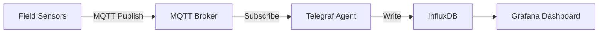

# How to Deploy Sensor Data Collection Pipelines with Portainer

Author: [nawazdhandala](https://www.github.com/nawazdhandala)

Tags: IoT, Sensor, Portainer, Docker, Data Pipeline, MQTT, Time Series

Description: Build a complete sensor data collection pipeline using Portainer stacks, connecting field sensors through MQTT and Telegraf to InfluxDB for real-time storage and analysis.

---

Sensor data collection requires a reliable pipeline from the physical world to a time-series database. This guide shows how to deploy the full stack - MQTT broker, Telegraf agent, and InfluxDB - using Portainer stacks on your edge nodes or on-premise servers.

## Pipeline Architecture



## Step 1: Deploy the Stack in Portainer

Navigate to **Stacks > Add Stack** and paste the following:

```yaml
# sensor-pipeline.yml

services:
  mosquitto:
    image: eclipse-mosquitto:2.0
    volumes:
      - /opt/sensor-pipeline/mosquitto.conf:/mosquitto/config/mosquitto.conf:ro
      - mosquitto-data:/mosquitto/data
      - mosquitto-log:/mosquitto/log
    ports:
      - "1883:1883"    # MQTT
      - "9001:9001"    # MQTT over WebSocket
    restart: unless-stopped
    networks:
      - sensor-net

  telegraf:
    image: telegraf:1.29
    volumes:
      # Bind-mount the Telegraf config from the host
      - /opt/sensor-pipeline/telegraf.conf:/etc/telegraf/telegraf.conf:ro
    depends_on:
      - mosquitto
      - influxdb
    restart: unless-stopped
    networks:
      - sensor-net

  influxdb:
    image: influxdb:2.7
    environment:
      - DOCKER_INFLUXDB_INIT_MODE=setup
      - DOCKER_INFLUXDB_INIT_USERNAME=admin
      - DOCKER_INFLUXDB_INIT_PASSWORD=secure_password_here
      - DOCKER_INFLUXDB_INIT_ADMIN_TOKEN=sensor_pipeline_token_here
      - DOCKER_INFLUXDB_INIT_ORG=sensors-org
      - DOCKER_INFLUXDB_INIT_BUCKET=sensor-data
      - DOCKER_INFLUXDB_INIT_RETENTION=30d
    volumes:
      - influxdb-data:/var/lib/influxdb2
    ports:
      - "8086:8086"
    restart: unless-stopped
    networks:
      - sensor-net

  grafana:
    image: grafana/grafana:10.3.0
    environment:
      - GF_SECURITY_ADMIN_PASSWORD=grafana_password
    volumes:
      - grafana-data:/var/lib/grafana
    ports:
      - "3000:3000"
    depends_on:
      - influxdb
    restart: unless-stopped
    networks:
      - sensor-net

volumes:
  mosquitto-data:
  mosquitto-log:
  influxdb-data:
  grafana-data:

networks:
  sensor-net:
    driver: bridge
```

## Step 2: Configure Mosquitto and Telegraf

Create `/opt/sensor-pipeline/mosquitto.conf` and `/opt/sensor-pipeline/telegraf.conf` on the host before deploying:

```conf
# mosquitto.conf
# Listen for MQTT and MQTT-over-WebSocket clients

allow_anonymous true

listener 1883
protocol mqtt

listener 9001
protocol websockets

persistence true
persistence_location /mosquitto/data/
log_dest file /mosquitto/log/mosquitto.log
```

For production, replace `allow_anonymous true` with a password file or another authentication method before exposing the broker outside a trusted network.

```toml
# telegraf.conf
# Subscribe to MQTT topics and write to InfluxDB

[agent]
  interval = "10s"
  flush_interval = "10s"

# Read sensor data from MQTT topics
[[inputs.mqtt_consumer]]
  servers = ["tcp://mosquitto:1883"]
  # Subscribe to all sensor topics
  topics = ["sensors/#"]
  data_format = "json"
  tag_keys = ["device_id"]
  json_time_key = "timestamp"
  json_time_format = "unix"

  # Extract the sensor location from topics like sensors/building-a/data
  [[inputs.mqtt_consumer.topic_parsing]]
    topic = "sensors/+/data"
    tags = "_/location/_"

# Write to InfluxDB 2.x
[[outputs.influxdb_v2]]
  urls = ["http://influxdb:8086"]
  token = "sensor_pipeline_token_here"
  organization = "sensors-org"
  bucket = "sensor-data"
```

## Step 3: Publish Sensor Data

Sensors publish JSON payloads to MQTT topics:

```python
# sensor_publisher.py - runs on the sensor device
import paho.mqtt.client as mqtt
import json
import time
import random

client = mqtt.Client(mqtt.CallbackAPIVersion.VERSION2)
client.connect("edge-gateway.local", 1883)  # Connect to your Mosquitto host
client.loop_start()

while True:
    # Build sensor reading payload
    payload = {
        "device_id": "sensor-001",
        "temperature": 22.5 + random.uniform(-1, 1),
        "humidity": 60.0 + random.uniform(-5, 5),
        "timestamp": int(time.time())
    }
    # Publish to a topic like sensors/building-a/data
    client.publish("sensors/building-a/data", json.dumps(payload))
    time.sleep(5)
```

## Step 4: Visualize in Grafana

After deploying the stack:

1. Open Grafana at `http://<host>:3000`
2. Add InfluxDB as a data source using the InfluxDB 2.x Flux query language
3. Create a dashboard with panels for temperature, humidity, and other sensor metrics

## Summary

With Portainer stacks, you can deploy and manage the full sensor data collection pipeline as a single unit. Update individual components, scale Telegraf with shared MQTT subscriptions or partitioned topics for higher throughput, or swap InfluxDB for TimescaleDB - all from the Portainer UI.
