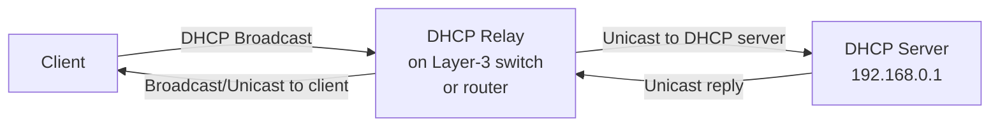

# How to Set Up a DHCP Relay Agent

Author: [nawazdhandala](https://www.github.com/nawazdhandala)

Tags: DHCP, Networking, DHCP Relay, DHCP Agent, Multi-VLAN, Sysadmin

Description: A DHCP relay agent forwards DHCP broadcast messages from clients on one subnet to a DHCP server on another, enabling a single DHCP server to serve multiple VLANs across a routed network.

## Why You Need a DHCP Relay

DHCP clients use broadcasts such as 255.255.255.255 during address acquisition, and routers typically don't forward those broadcasts. A relay agent (also called DHCP Helper) receives the broadcast and sends a relay message, usually as a unicast, to the DHCP server:



## Linux: dhcrelay (ISC DHCP Relay)

ISC DHCP Relay is end-of-life upstream, but it may still be packaged and supported by your Linux distribution.

```bash
# Install

sudo apt install isc-dhcp-relay

# Configure /etc/default/isc-dhcp-relay
# SERVERS="192.168.0.1"                    # DHCP server IP
# INTERFACES="eth0 eth1 eth2"              # Client- and server-facing interfaces
# OPTIONS=""

sudo systemctl enable --now isc-dhcp-relay
```

Or run directly:
```bash
# Relay DHCP requests from clients on eth1 and eth2 to server at 192.168.0.1 via eth0
sudo dhcrelay -id eth1 -id eth2 -iu eth0 192.168.0.1
```

## Cisco IOS: ip helper-address

On a Cisco router or Layer-3 switch, configure the helper address on each VLAN interface:

```text
! VLAN 10 interface
interface Vlan10
  ip address 10.0.10.1 255.255.255.0
  ip helper-address 10.0.0.53

! VLAN 20 interface
interface Vlan20
  ip address 10.0.20.1 255.255.255.0
  ip helper-address 10.0.0.53
```

## Linux Router: Use a DHCP Relay, Not iptables

If `dhcrelay` is not available, use another DHCP relay agent. An iptables DNAT rule can rewrite the packet destination, but it does not set `giaddr` or generate a new DHCP relay message, so the DHCP server cannot reliably choose the client subnet or send replies through the relay.

## Verifying Relay Operation

```bash
# On the relay, watch for DHCP relayed packets
tcpdump -i eth1 'port 67 or port 68'

# On the DHCP server, check for relayed requests
tcpdump -i eth0 'port 67'
# Relayed packets have giaddr (relay interface IP) set in the DHCP header

# ISC dhcpd logs
journalctl -u isc-dhcp-server | grep relay
```

## The giaddr Field

When a relay agent forwards a DHCP Discover with `giaddr` set to zero, it sets the `giaddr` (Gateway IP Address) field in the DHCP packet to the IP address of the interface that received the request. The DHCP server uses this to:
1. Select the appropriate scope (subnet matching the relay interface's IP)
2. Know where to send the reply

## Key Takeaways

- DHCP relay agents forward DHCP client broadcasts as relay messages, usually unicasts, to the DHCP server.
- On Linux, use `dhcrelay` with the client-facing and server-facing interfaces plus `<server-ip>`.
- On Cisco, configure `ip helper-address <server-ip>` on each VLAN SVI.
- The `giaddr` field in the DHCP packet identifies the originating subnet to the server.
