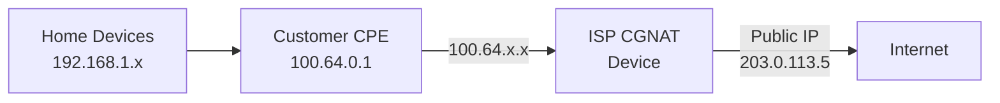

# How to Understand the Shared Address Space (100.64.0.0/10)

Author: [nawazdhandala](https://www.github.com/nawazdhandala)

Tags: IPv4, CGNAT, Networking, RFC 6598, Shared Address Space, ISP

Description: The 100.64.0.0/10 block (RFC 6598) is the Shared Address Space reserved for use between ISP customer routers and ISP carrier-grade NAT (CGNAT) infrastructure, distinct from both public and RFC...

## What Is 100.64.0.0/10?

RFC 6598 (2012) defined the `100.64.0.0/10` block (100.64.0.0 – 100.127.255.255, ~4 million addresses) for use in Carrier-Grade NAT (CGNAT) deployments. ISPs commonly assign addresses from this range on links between subscriber CPE (Customer Premises Equipment) WAN interfaces and the ISP's CGNAT infrastructure.

## Why It Exists

Before RFC 6598, some ISPs used RFC 1918 space (10.x.x.x, etc.) internally. This caused conflicts when customers also used RFC 1918 internally. The shared address space provides a neutral block that:
- Is not routable on the public internet
- Is not intended for home or enterprise private networks
- Is reserved for service-provider shared address space, primarily for CGNAT use

## Network Topology with CGNAT



Customers see a double NAT:
1. Home router NAT: 192.168.1.x → 100.64.x.x
2. CGNAT: 100.64.x.x → public IP

## Detecting If You Are Behind CGNAT

```bash
# Compare your local gateway IP with your public IP

# If your router's WAN address or WAN-side gateway is in 100.64.0.0/10,
# you are likely behind CGNAT
ip route show default
# If the WAN-side gateway IP is e.g. 100.64.1.1, you are likely behind CGNAT

# Also check: traceroute may show a 100.64.x hop near the start of the path
traceroute 8.8.8.8 | head -n 5
```

Python check:

```python
import ipaddress

def is_cgnat(ip: str) -> bool:
    """Return True if the IP is in the CGNAT shared address space."""
    return ipaddress.IPv4Address(ip) in ipaddress.IPv4Network("100.64.0.0/10")

# Test
print(is_cgnat("100.64.5.1"))   # True
print(is_cgnat("10.0.0.1"))     # False (RFC 1918, not CGNAT)
print(is_cgnat("100.128.0.1"))  # False (outside 100.64/10)
```

## Impact of CGNAT on Applications

- **Port forwarding**: Not possible without ISP cooperation.
- **P2P/gaming**: NAT traversal can be broken or limited.
- **Logging and attribution**: The same public IP can be shared by many customers; ISP must maintain logs to identify the specific customer.
- **IPv6 is the real fix**: Deploying IPv6 reduces reliance on CGNAT and can eliminate it for IPv6-capable traffic.

## Key Takeaways

- `100.64.0.0/10` is reserved as Shared Address Space for service-provider use, primarily CGNAT (RFC 6598).
- It is not RFC 1918 - should not be used in enterprise or home networks.
- Seeing `100.64.x.x` on your router's WAN side usually means you are behind double NAT (CGNAT).
- CGNAT prevents customer-controlled port forwarding without ISP support and complicates P2P; IPv6 is the long-term solution.
