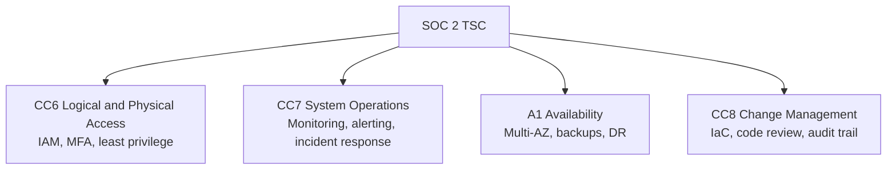

# How to Implement SOC 2-Compliant Infrastructure with OpenTofu

Author: [nawazdhandala](https://www.github.com/nawazdhandala)

Tags: OpenTofu, SOC2, Compliance, Security, Availability, Confidentiality, Infrastructure as Code

Description: Learn how to provision SOC 2-compliant AWS infrastructure using OpenTofu, covering the Trust Services Criteria for Security, Availability, and Confidentiality.

---

SOC 2 audits assess controls across five Trust Services Criteria: Security, Availability, Processing Integrity, Confidentiality, and Privacy. For cloud infrastructure, Security and Availability are commonly in scope. OpenTofu can codify many technical controls and produce repeatable evidence for auditors.

## SOC 2 Trust Services Criteria Coverage



## CC6: Logical and Physical Access Controls

```hcl
# iam_soc2.tf

# Require strong console passwords

resource "aws_iam_account_password_policy" "soc2" {
  minimum_password_length        = 14
  require_symbols                = true
  require_numbers                = true
  require_uppercase_characters   = true
  require_lowercase_characters   = true
  max_password_age               = 90
  password_reuse_prevention      = 12
  allow_users_to_change_password = true
}

# Deny most actions without MFA
resource "aws_iam_policy" "require_mfa" {
  name = "require-mfa"

  policy = jsonencode({
    Version = "2012-10-17"
    Statement = [{
      Sid    = "DenyWithoutMFA"
      Effect = "Deny"
      NotAction = [
        "iam:CreateVirtualMFADevice",
        "iam:EnableMFADevice",
        "iam:GetUser",
        "iam:ListMFADevices",
        "iam:ListVirtualMFADevices",
        "iam:ResyncMFADevice",
        "sts:GetSessionToken"
      ]
      Resource = "*"
      Condition = {
        BoolIfExists = { "aws:MultiFactorAuthPresent" = "false" }
      }
    }]
  })
}

resource "aws_iam_group" "console_users" {
  name = "console-users"
}

resource "aws_iam_group_policy_attachment" "require_mfa_console_users" {
  group      = aws_iam_group.console_users.name
  policy_arn = aws_iam_policy.require_mfa.arn
}
```

## CC7: System Operations and Monitoring

```hcl
# monitoring_soc2.tf
resource "aws_securityhub_account" "enabled" {}

resource "aws_guardduty_detector" "enabled" {
  enable = true
}

resource "aws_config_configuration_recorder_status" "enabled" {
  name       = aws_config_configuration_recorder.main.name
  is_enabled = true

  depends_on = [aws_config_delivery_channel.main]
}

# Alert on root account usage (AWS security best practice and common audit evidence)
resource "aws_cloudwatch_log_metric_filter" "root_account_usage" {
  name           = "root-account-usage"
  pattern        = "{$.userIdentity.type=\"Root\" && $.userIdentity.invokedBy NOT EXISTS && $.eventType !=\"AwsServiceEvent\"}"
  log_group_name = aws_cloudwatch_log_group.cloudtrail.name

  metric_transformation {
    name          = "RootAccountUsage"
    namespace     = "LogMetrics"
    value         = "1"
    default_value = "0"
  }
}

resource "aws_cloudwatch_metric_alarm" "root_account_usage" {
  alarm_name          = "root-account-usage"
  comparison_operator = "GreaterThanOrEqualToThreshold"
  evaluation_periods  = 1
  metric_name         = "RootAccountUsage"
  namespace           = "LogMetrics"
  period              = 300
  statistic           = "Sum"
  threshold           = 1
  alarm_description   = "Root account was used - investigate immediately"
  alarm_actions       = [aws_sns_topic.security_alerts.arn]
}
```

## A1: Availability Controls

```hcl
# availability_soc2.tf
resource "aws_db_instance" "main" {
  identifier                  = "${var.company}-main"
  engine                      = "postgres"
  engine_version              = "16"
  instance_class              = "db.m7g.large"
  allocated_storage           = 100
  username                    = var.db_username
  manage_master_user_password = true
  multi_az                    = true   # High availability
  backup_retention_period     = 35     # 35 days of automated backups
  deletion_protection         = true
  storage_encrypted           = true
  auto_minor_version_upgrade  = true

  # Enable enhanced monitoring
  monitoring_interval = 60
  monitoring_role_arn = aws_iam_role.rds_monitoring.arn
}

# Auto-scaling for availability
resource "aws_autoscaling_policy" "target_tracking" {
  name                   = "cpu-target-tracking"
  policy_type            = "TargetTrackingScaling"
  autoscaling_group_name = aws_autoscaling_group.app.name

  target_tracking_configuration {
    predefined_metric_specification {
      predefined_metric_type = "ASGAverageCPUUtilization"
    }
    target_value = 60.0
  }
}
```

## CC8: Change Management

```hcl
# All infrastructure changes go through code review
# This is enforced via GitHub branch protection and Atlantis
# Document this control for auditors

output "change_management_controls" {
  description = "Evidence of change management controls for SOC 2 auditors"
  value = {
    iac_tool          = "OpenTofu 1.x (pin exact version in CI)"
    code_review       = "Required via GitHub pull requests (branch protection enabled)"
    approval_required = "Minimum 2 approvals from infrastructure-team"
    audit_trail       = "All changes in git history with author, timestamp, and PR reference"
    state_storage     = "S3 backend with versioning and CloudTrail data event logging"
  }
}
```

## Audit Evidence Collection

```hcl
# SOC 2 auditors need evidence of controls operating effectively
# Store evidence in S3 with versioning
resource "aws_s3_bucket" "audit_evidence" {
  bucket = "${var.company}-soc2-audit-evidence"
}

resource "aws_s3_bucket_versioning" "evidence" {
  bucket = aws_s3_bucket.audit_evidence.id

  versioning_configuration {
    status = "Enabled"
  }
}

resource "aws_s3_bucket_public_access_block" "evidence" {
  bucket = aws_s3_bucket.audit_evidence.id

  block_public_acls       = true
  block_public_policy     = true
  ignore_public_acls      = true
  restrict_public_buckets = true
}

# Grant read-only access to auditors
resource "aws_iam_role" "external_auditor" {
  name = "external-auditor-readonly"

  assume_role_policy = jsonencode({
    Version = "2012-10-17"
    Statement = [{
      Effect = "Allow"
      Principal = {
        AWS = var.auditor_account_id
      }
      Action = "sts:AssumeRole"
      Condition = {
        Bool = { "aws:MultiFactorAuthPresent" = "true" }
      }
    }]
  })
}

resource "aws_iam_role_policy" "external_auditor_readonly" {
  name = "audit-evidence-readonly"
  role = aws_iam_role.external_auditor.id

  policy = jsonencode({
    Version = "2012-10-17"
    Statement = [
      {
        Effect = "Allow"
        Action = [
          "s3:GetBucketVersioning",
          "s3:ListBucket",
          "s3:ListBucketVersions"
        ]
        Resource = aws_s3_bucket.audit_evidence.arn
      },
      {
        Effect = "Allow"
        Action = [
          "s3:GetObject",
          "s3:GetObjectVersion"
        ]
        Resource = "${aws_s3_bucket.audit_evidence.arn}/*"
      }
    ]
  })
}
```

## Best Practices

- Enable AWS Security Hub, GuardDuty, and Config before your SOC 2 audit period begins so evidence is available throughout the audit period.
- Store CloudTrail and Config logs in a separate, locked-down audit account so production engineers cannot modify evidence.
- Enable root account alerts - auditors commonly ask for evidence that root account usage is detected and responded to.
- Document OpenTofu as your change management control - it's strong evidence of formal change procedures.
- Test incident response procedures quarterly and document the tests - SOC 2 requires evidence of incident response capability, not just policies.
