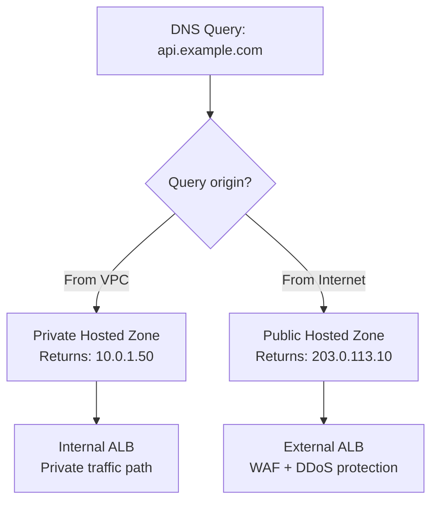

# How to Set Up Split-Horizon DNS with OpenTofu

Author: [nawazdhandala](https://www.github.com/nawazdhandala)

Tags: OpenTofu, DNS, Route53, Split-Horizon, Private DNS, VPC, Infrastructure as Code

Description: Learn how to implement split-horizon DNS using AWS Route 53 with OpenTofu, serving different DNS responses to internal and external clients for the same domain name.

---

Split-horizon DNS (also called split-brain DNS) serves different answers for the same hostname depending on where the query originates. Internal clients get private IP addresses; external clients get public IPs. OpenTofu manages both the public and private hosted zones so you can keep the records synchronized in code.

## Split-Horizon DNS Architecture



## Public Hosted Zone

```hcl
# public_dns.tf

resource "aws_route53_zone" "public" {
  name    = var.domain_name
  comment = "Public zone - internet-facing records"

  tags = {
    Environment = var.environment
    Type        = "public"
    ManagedBy   = "opentofu"
  }
}

# Public record points to external ALB
resource "aws_route53_record" "api_public" {
  zone_id = aws_route53_zone.public.zone_id
  name    = "api.${var.domain_name}"
  type    = "A"

  alias {
    name                   = aws_lb.external.dns_name
    zone_id                = aws_lb.external.zone_id
    evaluate_target_health = true
  }
}

resource "aws_route53_record" "app_public" {
  zone_id = aws_route53_zone.public.zone_id
  name    = "app.${var.domain_name}"
  type    = "A"

  alias {
    name                   = aws_lb.external.dns_name
    zone_id                = aws_lb.external.zone_id
    evaluate_target_health = true
  }
}
```

## Private Hosted Zone

```hcl
# private_dns.tf

# Private zone uses same domain - VPC association makes it authoritative internally
resource "aws_route53_zone" "private" {
  name    = var.domain_name
  comment = "Private zone - VPC-only records"

  # The associated VPC must have enable_dns_support and enable_dns_hostnames set to true
  vpc {
    vpc_id = aws_vpc.main.id
  }

  tags = {
    Environment = var.environment
    Type        = "private"
    ManagedBy   = "opentofu"
  }

  # Avoid plan conflicts when additional VPCs are managed with aws_route53_zone_association
  lifecycle {
    ignore_changes = [vpc]
  }
}

# Private record points to internal ALB
resource "aws_route53_record" "api_private" {
  zone_id = aws_route53_zone.private.zone_id
  name    = "api.${var.domain_name}"
  type    = "A"

  alias {
    name                   = aws_lb.internal.dns_name
    zone_id                = aws_lb.internal.zone_id
    evaluate_target_health = true
  }
}

# Mirror public records that VPC clients still need; private zones do not fall back to the public zone
resource "aws_route53_record" "app_private" {
  zone_id = aws_route53_zone.private.zone_id
  name    = "app.${var.domain_name}"
  type    = "A"

  alias {
    name                   = aws_lb.internal.dns_name
    zone_id                = aws_lb.internal.zone_id
    evaluate_target_health = true
  }
}

# Internal database endpoint - only resolvable within VPC
resource "aws_route53_record" "db_private" {
  zone_id = aws_route53_zone.private.zone_id
  name    = "db.${var.domain_name}"
  type    = "CNAME"
  ttl     = 60
  records = [aws_db_instance.main.address]
}

# Internal cache endpoint
resource "aws_route53_record" "cache_private" {
  zone_id = aws_route53_zone.private.zone_id
  name    = "cache.${var.domain_name}"
  type    = "CNAME"
  ttl     = 60
  records = [aws_elasticache_replication_group.main.primary_endpoint_address]
}
```

## Associating Additional VPCs

```hcl
# Associate additional same-account VPCs with the private zone
resource "aws_route53_zone_association" "peer" {
  vpc_id  = var.peer_vpc_id
  zone_id = aws_route53_zone.private.zone_id
}
```

## Shared Private Zone Module

```hcl
# When multiple environments share a VPC, use a single private zone
module "private_dns" {
  source = "./modules/private-dns"

  domain_name = var.domain_name
  vpc_id      = module.vpc.vpc_id

  records = {
    "api"   = { type = "CNAME", value = module.alb_internal.dns_name, ttl = 60 }
    "db"    = { type = "CNAME", value = module.rds.address, ttl = 60 }
    "cache" = { type = "CNAME", value = module.elasticache.primary_endpoint_address, ttl = 60 }
    "queue" = { type = "CNAME", value = module.sqs_vpc_endpoint.dns_name, ttl = 300 }
  }
}
```

## Outputs

```hcl
output "public_zone_id" {
  description = "Public hosted zone ID"
  value       = aws_route53_zone.public.zone_id
}

output "private_zone_id" {
  description = "Private hosted zone ID"
  value       = aws_route53_zone.private.zone_id
}

output "public_name_servers" {
  description = "Configure these at your domain registrar"
  value       = aws_route53_zone.public.name_servers
}
```

## Best Practices

- Use the same domain name for both zones, and mirror every public record that VPC clients still need in the private zone. Route 53 Resolver uses the matching private hosted zone for queries from associated VPCs and does not fall back to the public zone when a record is missing.
- Never put sensitive internal records (database endpoints, admin UIs) in the public zone - they will be publicly resolvable even if the ports are firewalled.
- Enable `enable_dns_support` and `enable_dns_hostnames` on VPCs associated with private hosted zones.
- Use `lifecycle { ignore_changes = [vpc] }` on the private zone to avoid OpenTofu plan conflicts when associating additional VPCs using separate `aws_route53_zone_association` resources.
- Keep TTLs low (60s) on non-alias private records for services that may change IPs during deployments.
- Test split-horizon behavior by querying from inside and outside the VPC: `dig api.example.com` should return different IPs from each location.
