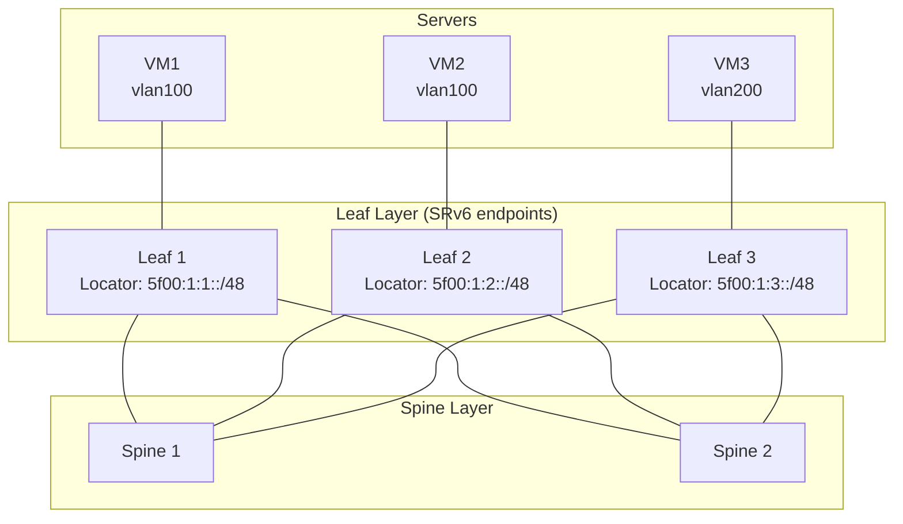

# How to Understand SRv6 in Data Center Fabrics - A Practical Guide

Author: [nawazdhandala](https://www.github.com/nawazdhandala)

Tags: SRv6, Data Center, EVPN, BGP, Fabric, Networking

Description: Understand how SRv6 is deployed in data center fabric architectures to replace VXLAN and MPLS for L2/L3 overlay services using EVPN SRv6.

## Introduction

Data centers traditionally use VXLAN with BGP EVPN for overlay services. SRv6 with EVPN offers an IPv6-native alternative: SRv6 service SIDs carry the service context that VXLAN VNIs or MPLS labels normally identify, providing similar L2/L3 services over an IPv6 underlay.

## SRv6 Data Center Architecture



## SRv6 EVPN: L2VPN (E-LAN/VPWS)

SRv6 EVPN uses End.DX2 SIDs for point-to-point L2 cross-connect services, and End.DT2U/End.DT2M SIDs for EVPN E-LAN unicast and BUM traffic.

```bash
# Leaf 1: configure End.DX2 SID for a VLAN 100 L2 handoff

# End.DX2 decapsulates SRv6 and forwards the Ethernet frame to the L2 interface

ip -6 route add 5f00:1:1:0:e010::/128 \
  encap seg6local action End.DX2 \
  oif bridge100 \
  dev lo   # local SID route; bridge100 is the L2 output interface

# Configure BGP EVPN to advertise MAC/IP routes with SRv6 SID
# (control-plane syntax is vendor-specific)
```

Cisco IOS XR EVPN with SRv6:

```bash
! IOS XR - EVPN SRv6 L2VPN
evpn
 segment-routing srv6
  locator LEAF1
 !
 evi 100 segment-routing srv6
  locator LEAF1
 !
!
router bgp 65000
 bgp router-id 192.0.2.1
 address-family l2vpn evpn
 !
 neighbor 2001:db8:12::2
  remote-as 65000
  update-source Loopback0
  address-family l2vpn evpn
  !
 !
!
l2vpn
 bridge group bg1
  bridge-domain vlan100
   interface Bundle-Ether100.100
   !
   evi 100 segment-routing srv6
  !
 !
!
```

## SRv6 EVPN: L3VPN (IP VRF)

For L3 routing, SRv6 uses End.DT6 (IPv6) or End.DT4 (IPv4) SIDs.

```bash
# Configure End.DT6 for tenant VRF
ip link add TENANT_A type vrf table 100
ip link set TENANT_A up
sysctl -w net.vrf.strict_mode=1

ip -6 route add 5f00:1:1:0:e000::/128 \
  encap seg6local action End.DT6 \
  vrftable 100 \
  dev TENANT_A

# Configure End.DT4 for IPv4 tenant traffic
ip -6 route add 5f00:1:1:0:e001::/128 \
  encap seg6local action End.DT4 \
  vrftable 100 \
  dev TENANT_A
```

## BGP EVPN Route Types with SRv6

SRv6 service SIDs are carried in the BGP Prefix-SID attribute. For some EVPN routes, the existing MPLS label fields can carry all or part of the SID function when the RFC 9252 transposition scheme is used.

| EVPN Route Type | Function | SRv6 SID Used |
|---|---|---|
| Type 2 (MAC/IP) | L2 forwarding, with optional IRB routing | End.DX2 or End.DT2U for L2; optional End.DT4, End.DT6, End.DT46, End.DX4, or End.DX6 for L3 |
| Type 3 (Inclusive Multicast) | BUM traffic | End.DT2M |
| Type 5 (IP Prefix) | L3 routing | End.DT4, End.DT6, End.DT46, End.DX4, or End.DX6 |

## Underlay Requirements

The SRv6 data center underlay needs:

```bash
# 1. IPv6 reachability to each leaf's SRv6 locator
# 2. An underlay protocol, such as IS-IS, to advertise SRv6 locators
# 3. SRv6-capable transit nodes only when SR policies steer through transit SIDs

# Configure IS-IS on leaf with SRv6 locator advertisement
# (FRR)
segment-routing
 srv6
  locators
   locator LEAF1
    prefix 5f00:1:1::/48
   !
  !
 !
!
interface eth0
 ip router isis FABRIC
 ipv6 router isis FABRIC
!
router isis FABRIC
 net 49.0001.0000.0000.0001.00
 is-type level-2-only
 metric-style wide
 topology ipv6-unicast
 segment-routing srv6
  locator LEAF1
  !
 !
!
```

## Advantages Over VXLAN

| Aspect | VXLAN + BGP EVPN | SRv6 + BGP EVPN |
|---|---|---|
| Overhead | 36 bytes above L2 for VXLAN over IPv4, or 56 bytes over IPv6 | 40 bytes above L2 for reduced single-SID IPv6 encapsulation; SRH adds 8 + 16 bytes per listed segment when present |
| Hardware requirements | VTEP support | SRv6 data-plane support |
| TE integration | Separate mechanism | Via SR policies and SRH |
| VPN type | VNI-based | Service SID-based |
| Visibility | VNI opaque to IP tools | SIDs are IPv6 addresses routed inside the SR domain |

## Monitoring SRv6 DC Fabric

```bash
# Check locator reachability (FRR IS-IS)
show isis segment-routing srv6 node
show segment-routing srv6 locator

# Check EVPN routes with SRv6 SIDs (Cisco IOS XR)
show evpn evi vpn-id 100 detail
show evpn evi vpn-id 100 mac
show segment-routing srv6 sid

# Verify end-to-end VM connectivity from a Linux tenant VRF
ip vrf exec TENANT_A ping -6 2001:db8:100::2
```

## Conclusion

SRv6 EVPN simplifies data center fabrics by carrying L2/L3 overlay services over an IPv6 underlay. Service SIDs carry the service context otherwise supplied by VNIs or MPLS labels while adding traffic engineering capabilities through SR policies. Use OneUptime to monitor tenant L3VPN reachability and EVPN control plane health across your data center fabric.
