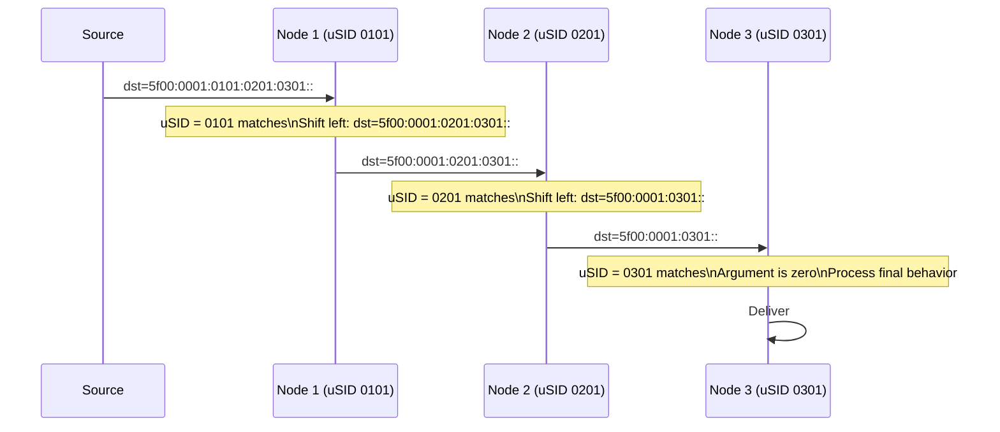

# How to Understand SRv6 micro-SID (uSID) Compression

Author: [nawazdhandala](https://www.github.com/nawazdhandala)

Tags: SRv6, USID, Micro-SID, Compression, RFC 9631, Networking

Description: Understand SRv6 micro-SID (uSID) compression that packs multiple node identifiers into a single 128-bit SID, drastically reducing SRv6 header overhead.

## Introduction

Standard SRv6 uses one full 128-bit SID per network function. For paths with many hops, this creates large SRH headers. RFC 9800 defines compressed SRv6 segment list encoding with NEXT-CSID and REPLACE-CSID flavors, commonly used for micro-SID (uSID) deployments. These flavors pack multiple compressed SIDs into a single 128-bit SID container, reducing SID-list overhead by up to 6x with a 32-bit block and 16-bit uSID IDs.

## The Overhead Problem

```text
Standard SRv6 path: 4 waypoints
  Outer IPv6 header: 40 bytes
  SRH:               8 + (4 x 16) = 72 bytes
  Total overhead:    112 bytes per packet

SRv6 with uSID: 4 waypoints in one container
  Outer IPv6 header: 40 bytes
  SRH:               8 + 16 = 24 bytes  (single 128-bit container)
  Total overhead:    64 bytes per packet
  Reduced case:      40 bytes if the single container is only in the IPv6 DA
```

## uSID Structure

A uSID container is a single 128-bit IPv6 address that encodes multiple micro-SIDs.

```text
uSID format (F3216, 16-bit micro-SIDs):
128 bits = 32-bit uSID block + 6 x 16-bit uSID slots

Example container: 5f00:0001:0101:0201:0301::
  5f00:0001 = 32-bit SRv6 uSID block
  0101 = uSID for node 1 (hop 1)
  0201 = uSID for node 2 (hop 2)
  0301 = uSID for node 3 (hop 3)
  ::   = End-of-Carrier / unused slots (zero)
```

## How uSID Processing Works



## Configuring uSID on Linux

```bash
# Enable SRv6 processing on Linux.
sysctl -w net.ipv6.conf.all.seg6_enabled=1
sysctl -w net.ipv6.conf.lo.seg6_enabled=1

# Configure a uSID/NEXT-C-SID End behavior on Linux kernels and
# iproute2 builds that support the NEXT-C-SID flavor.

# Add End with the NEXT-C-SID flavor. F3216 uses a 32-bit block and
# a 16-bit Locator-Node Function.
ip -6 route add 5f00:1:0101::/48 \
  encap seg6local action End flavors next-csid lblen 32 nflen 16 \
  dev lo

# The kernel will process uSID: shift next uSID to front
# when a packet arrives with 5f00:1:0101:XXXX:YYYY::
```

## Configuring uSID on Cisco IOS-XR

```text
! Enable micro-SID on locator
segment-routing srv6
 locators
  locator MAIN
   micro-segment behavior unode psp-usd ! uN with PSP/USD variant
   prefix 5f00:1:0101::/48
   !
  !
 !
!
```

## uSID Encoding Formats

### F3216 Format (32-bit Block, 16-bit uSIDs)

Packs up to 6 micro-SIDs per 128-bit container.

```text
Format: 5f00:0001:NNNN:NNNN:NNNN:NNNN:NNNN:NNNN
  Where 5f00:0001 = 32-bit uSID block
  Each NNNN = one 16-bit uSID ID
  0000 = End-of-Carrier / unused slot

Container: 5f00:0001:0101:0201:0301::
  Node 1, Node 2, Node 3, then End-of-Carrier zeros
```

### 16-bit Micro-SIDs (Most Common)

```python
def pack_usids(block: str, usids: list) -> str:
    """
    Pack multiple 16-bit micro-SIDs into an F3216 uSID container.

    block: first 32 bits (e.g., "5f00:0001")
    usids: list of 16-bit uSID values (up to 6)
    """
    import ipaddress

    if len(usids) > 6:
        raise ValueError("Maximum 6 micro-SIDs per F3216 container")

    for usid in usids:
        if usid < 0 or usid > 0xffff:
            raise ValueError("uSID values must be 16-bit integers")

    # Pad unused slots with End-of-Carrier zeros.
    slots = usids + [0] * (6 - len(usids))

    # Build 128-bit address from a 32-bit block and six 16-bit slots.
    addr_int = int(ipaddress.IPv6Address(f"{block}::"))
    for i, usid in enumerate(slots):
        addr_int |= (usid << (80 - i * 16))

    return str(ipaddress.IPv6Address(addr_int))

# Example: pack 3 uSIDs into one container
container = pack_usids("5f00:0001", [0x0101, 0x0201, 0x0301])
print(f"uSID container: {container}")
# Output: 5f00:1:101:201:301::
```

## Benefits of uSID

| Metric | Standard SRv6 | SRv6 uSID |
|---|---|---|
| SIDs per packet | 1 per 128-bit entry | Up to 6 per 128-bit entry in F3216 |
| Overhead for 4 hops | 112 bytes | 64 bytes with SRH, 40 bytes if the single container is only in the IPv6 DA |
| Hardware requirements | SRv6-capable endpoint behavior | SRv6 endpoint with NEXT-CSID/uSID behavior support |
| MTU impact | High | Low |

## Conclusion

uSID compression makes SRv6 competitive with MPLS on header overhead while retaining IPv6 programmability. Packing up to 6 micro-SIDs per F3216 128-bit container is sufficient for many TE and service chaining scenarios. uSID adoption is growing rapidly as a path to practical SRv6 deployment. Monitor uSID path latency with OneUptime to validate compression doesn't introduce processing delays.
