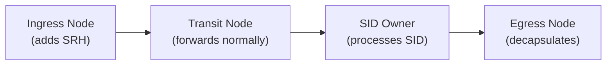

# How to Understand SRv6 Transit Functions

Author: [nawazdhandala](https://www.github.com/nawazdhandala)

Tags: SRv6, Transit Functions, Segment Routing, IPv6, Forwarding, RFC 8986

Description: Understand SRv6 transit node behaviors for routers that are in the SRv6 path but do not own the current SID, including T, T.Insert, T.Encaps, and T.Encaps.L2.

## Introduction

Plain SRv6 transit applies to nodes that are in the path of an SRv6 packet but are not the owner of the current active SID. These nodes forward transparently. When a node steers matching transit traffic into an SR policy, it is acting as an SR policy headend and can insert or encapsulate SRv6 headers.

## Transit Node Categories



- **Ingress**: Creates the SRv6 encapsulation
- **Transit**: Forwards based on IPv6 destination (the active SID) without SRH processing
- **Endpoint**: Owns the SID, executes the End function
- **Egress**: Final decapsulation

## Plain Transit

A transit node simply forwards the packet based on the IPv6 destination address (the current SID), without any SRH processing.

```text
IPv6 packet with SRH:
  dst = 5f00:1:2:0:e001::  (owned by Router 2)
  SRH: [5f00:3:1::, 5f00:2:1::, 5f00:1:2:0:e001::], SL=2

Transit Router 1 (does not own 5f00:1:2:0:e001::):
  1. Looks up 5f00:1:2:0:e001:: in FIB
  2. Finds route pointing toward Router 2
  3. Forwards the packet unchanged
  (No SRH modification)
```

No SRv6-specific configuration is needed on transit nodes - they just forward IPv6 normally.

## H.Insert - Insert an SRH at a Headend Node

H.Insert inserts a new SRH into an IPv6 packet without adding an outer IPv6 header, enabling midpoint traffic engineering.

H.Insert is described in the SRv6 insertion draft and may be implementation dependent; Linux exposes this behavior as `seg6` inline mode.

```bash
# Linux: insert SRH inline for matching IPv6 traffic

ip -6 route add 2001:db8:100::/48 \
  encap seg6 mode inline \
  segs 2001:db8:1:2::,2001:db8:2:3:: \
  dev eth0

# Note: "inline" mode adds the SRH without encapsulation
# The source address of the original packet is preserved
```

**Use case**: Policy-based routing at a midpoint without full encapsulation.

## H.Encaps - Encapsulate with SRH at a Headend

```bash
# Encap mode: creates a new outer IPv6 header + SRH
ip -6 route add 2001:db8:100::/48 \
  encap seg6 mode encap \
  segs 2001:db8:1:2:0:e001::,2001:db8:2:3:0:e000:: \
  dev eth0

# The original packet becomes the inner payload
# Useful for color-based TE (BGP Color community → SRv6 policy)
```

## H.Encaps.L2 - L2 Frame Encapsulation

Encapsulates an entire L2 frame in an SRv6 packet (L2 VPN over SRv6).

```bash
# Encapsulate Ethernet frames in SRv6 (EVPN use case)
ip -6 route add 2001:db8:200::/48 \
  encap seg6 mode l2encap \
  segs 2001:db8:1:2:0:e010:: \
  dev eth0
```

## H.Encaps.Red - Reduced Encapsulation

When using reduced encapsulation, the first segment of the SR policy is placed only in the outer IPv6 destination address and omitted from the SRH to save 16 bytes.

```text
SR policy: <S1=FW, S2=LB, S3=Egress>

Standard H.Encaps:
  Outer dst = S1
  SRH: [S3=Egress, S2=LB, S1=FW], SL=2

Reduced H.Encaps.Red:
  Outer dst = S1
  SRH: [S3=Egress, S2=LB], SL=2
  (S1 is omitted from the SRH because it is already in the outer destination address)
```

```bash
# Linux supports reduced encapsulation explicitly with mode encap.red
# The configured SID list is reduced by the kernel when building the SRH
ip -6 route add 2001:db8:100::/48 \
  encap seg6 mode encap.red \
  segs 2001:db8:1:2:0:e001::,2001:db8:2:3:0:e000:: \
  dev eth0
```

## Combining Transit and Endpoint Functions

```text
Example full packet lifecycle:

Packet: src=client, dst=server
Goal: route via FW (2001:db8:10::1) → LB (2001:db8:20::1) → DT6 (2001:db8:30:0:e000::)

At ingress node (H.Encaps):
  Outer: src=ingress, dst=2001:db8:10::1
  SRH: [2001:db8:30:0:e000::, 2001:db8:20::1, 2001:db8:10::1], SL=2

At FW (End.X):
  SL-- → 1, dst=2001:db8:20::1, forward via FW's inspection path

At LB (End.X):
  SL-- → 0, dst=2001:db8:30:0:e000::, forward via the configured L3 adjacency

At Egress (End.DT6):
  Decap outer IPv6, route inner packet in VRF table 200
```

## Conclusion

SRv6 transit forwarding keeps transit nodes simple - they forward based on IPv6 destination addresses without inspecting the SRH. Policy insertion via H.Insert and encapsulation via H.Encaps enable midpoint traffic engineering. Understanding transit vs endpoint roles is key to SRv6 topology planning. Use OneUptime to monitor each hop in your SRv6 path for latency and availability.
