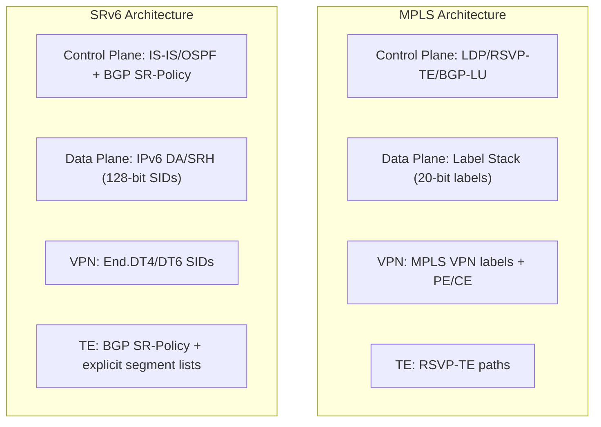

# How to Understand SRv6 vs MPLS Comparison

Author: [nawazdhandala](https://www.github.com/nawazdhandala)

Tags: SRv6, MPLS, Comparison, Segment Routing, Networking, Migration

Description: Compare SRv6 and MPLS architectures across dimensions of protocol complexity, hardware requirements, operational simplicity, and migration path for enterprise and ISP networks.

## Introduction

MPLS has been the workhorse of service provider networks for 25 years. SRv6 offers a modern alternative that leverages IPv6 forwarding infrastructure. Understanding their trade-offs helps make informed migration decisions.

## Protocol Architecture Comparison



## Feature Comparison Table

| Feature | MPLS | SRv6 |
|---|---|---|
| Label/SID size | 20 bits | 128 bits |
| Header overhead | ~4 bytes/label | 40 bytes outer IPv6 + 8 bytes SRH + 16 bytes/SID when SRH is used; single-SID paths can omit SRH |
| Protocol stack | LDP/RSVP-TE/BGP-LU (traditional MPLS) | IS-IS/OSPF/BGP extensions |
| L3VPN | MPLS VPN (RFC 4364) | SRv6 BGP VPN (RFC 9252) |
| L2VPN | MPLS EVPN/VPLS | SRv6 EVPN |
| Traffic engineering | RSVP-TE (stateful) | SR Policy (state at the headend; no per-flow state in the core) |
| OAM/BFD | MPLS LSP Ping/BFD | SRv6 OAM (ICMPv6/UDP ping/traceroute; BFD applicable) |
| Visibility | Labels opaque | SIDs are IPv6 addresses |
| Hardware support | Ubiquitous | Growing |
| Path MTU | 1500 - label stack | 1500 - 40 bytes for single-SID encapsulation; less when SRH is used |

## Header Overhead Analysis

```python
# Calculate SRv6 vs MPLS overhead for typical scenarios

def mpls_overhead(num_labels: int) -> int:
    """MPLS overhead: 4 bytes per label."""
    return num_labels * 4

def srv6_overhead(num_srh_sids: int) -> int:
    """
    SRv6 full-SRH overhead:
    - Outer IPv6 header: 40 bytes
    - SRH fixed fields: 8 bytes
    - Each SID carried in the SRH Segment List: 16 bytes
    """
    return 40 + 8 + (num_srh_sids * 16)

# Example MPLS VPN/service stack with 3 label entries

mpls_vpn = mpls_overhead(3)  # Three 4-byte MPLS label stack entries = 12 bytes

# SRv6 L3VPN with a full SRH carrying 2 waypoints + End.DT6.
# A single-SID SRv6 service can omit the SRH and use 40 bytes of outer IPv6 overhead.
srv6_vpn = srv6_overhead(3)  # 40 + 8 + 48 = 96 bytes

print(f"MPLS service-stack overhead: {mpls_vpn} bytes")
print(f"SRv6 L3VPN full-SRH overhead: {srv6_vpn} bytes")
print(f"SRv6 extra overhead: {srv6_vpn - mpls_vpn} bytes per packet")

# On a 1500-byte MTU path:
print(f"MPLS efficiency: {(1500-mpls_vpn)/1500*100:.1f}%")
print(f"SRv6 efficiency: {(1500-srv6_vpn)/1500*100:.1f}%")
```

## When to Choose SRv6

**Choose SRv6 when:**
- Building a new greenfield network
- IPv6-only core is the goal
- Simplified operations is a priority
- SRv6-capable hardware is available
- Programmable network behaviors are needed

**Stick with MPLS when:**
- Legacy PE routers without SRv6 hardware support
- Extremely high packet rates where tens of bytes of SRv6 encapsulation overhead matter
- Team expertise and tooling is deep in MPLS

## Migration Strategy: SR-MPLS → SRv6

```text
Phase 1: Deploy SR-MPLS (Segment Routing with MPLS labels)
  - Simpler migration from traditional MPLS
  - Similar control-plane model to SRv6 (IS-IS, OSPF, BGP SR-Policy), with data-plane-specific SID advertisements

Phase 2: Parallel SRv6 deployment
  - Enable IPv6 forwarding in underlay
  - Configure SRv6 locators alongside MPLS

Phase 3: Migrate services to SRv6
  - Move L3VPN from MPLS VPN to SRv6 End.DT4/DT6
  - Move L2VPN from MPLS EVPN to SRv6 EVPN

Phase 4: Decommission MPLS
  - Remove LDP/RSVP-TE after all services migrated
```

## uSID Compression (Closing the Overhead Gap)

uSID/NEXT-CSID compression reduces SRv6 overhead by packing multiple compressed SIDs into a single 128-bit SID.

```text
Standard SRv6 SID: 5f00:1:2:0:e001::   (1 node per SID)
uSID container:    5f00:0101:0201:0301:: (3 nodes in one SID)
```

With uSID/NEXT-CSID, 3 hops can fit in a single 16-byte SID instead of three 16-byte SID entries.

## Conclusion

SRv6 offers compelling advantages in protocol simplicity, programmability, and end-to-end visibility. MPLS remains more hardware-efficient for high-scale deployments. For many greenfield deployments, SRv6 with uSID/NEXT-CSID compression is a strong architectural choice. Use OneUptime to monitor both MPLS and SRv6 services during parallel deployment to validate equivalent performance before MPLS decommission.
