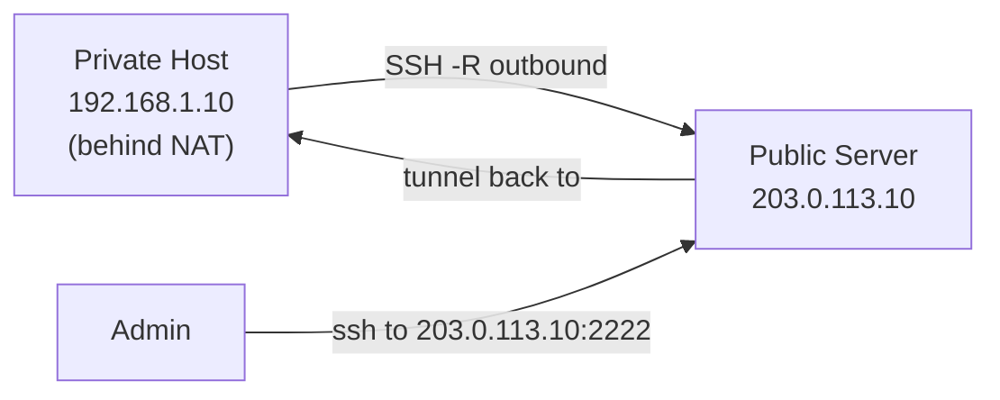

# How to Create a Reverse SSH Tunnel to Access IPv4 Hosts Behind NAT

Author: [nawazdhandala](https://www.github.com/nawazdhandala)

Tags: SSH, Reverse Tunnel, IPv4, NAT, Remote Access, Networking

Description: Create a reverse SSH tunnel from a NAT-ed IPv4 host to a public server, enabling inbound access to machines that have no public IPv4 address.

## Introduction

Machines behind NAT have no public IPv4 address and cannot be reached directly from the internet. A reverse SSH tunnel solves this: the private machine initiates an outbound SSH connection to a public server, creating a port on that server that tunnels back into the private network.

## Architecture



## Creating the Reverse Tunnel

On the private host behind NAT:

```bash
# Open loopback port 2222 on the public server that tunnels back to port 22 here

ssh -4 -fN \
  -R 2222:localhost:22 \
  -o "ServerAliveInterval 30" \
  -o "ServerAliveCountMax 3" \
  user@203.0.113.10

# Port 2222 on the public server's loopback interface now reaches port 22 on the private host
```

On the public server, enable `GatewayPorts` if you need external access and specify a non-loopback bind address in the `-R` option:

```bash
# /etc/ssh/sshd_config (on public server)
GatewayPorts clientspecified    # Allow client to specify a non-loopback bind address
AllowTcpForwarding yes
```

## Accessing the Private Host Through the Tunnel

From the public server itself:

```bash
# Connect to private host via the loopback reverse tunnel
ssh -p 2222 -o "NoHostAuthenticationForLocalhost yes" private-user@127.0.0.1
```

From any machine after binding the tunnel to the public address as shown in the next section:

```bash
ssh -p 2222 private-user@203.0.113.10
```

## Creating the Tunnel Key

The systemd service below authenticates with a dedicated SSH key at `/home/tunnel-user/.ssh/reverse_tunnel_key`. That file does not exist yet, so create it before enabling the service. A dedicated key keeps the tunnel's credentials separate from any human login key and lets you lock the key down to reverse-forwarding only.

### 1. Generate the keypair

Run this on the private host as `root` (or with `sudo`), then hand ownership back to `tunnel-user`:

```bash
# Create the .ssh directory for the local tunnel-user if it does not exist
sudo -u tunnel-user mkdir -p /home/tunnel-user/.ssh

# Generate a dedicated ed25519 keypair with no passphrase
# (no passphrase is required because the service starts unattended)
sudo -u tunnel-user ssh-keygen -t ed25519 \
  -f /home/tunnel-user/.ssh/reverse_tunnel_key \
  -N "" \
  -C "reverse-tunnel@private-host"
```

This writes the private key to `/home/tunnel-user/.ssh/reverse_tunnel_key` and the public key to `/home/tunnel-user/.ssh/reverse_tunnel_key.pub`.

### 2. Fix ownership and permissions

OpenSSH refuses to use a private key or an `authorized_keys` file that is readable or writable by other users. Confirm the directory and key have the correct ownership and modes:

```bash
# Everything under .ssh must be owned by tunnel-user
sudo chown -R tunnel-user:tunnel-user /home/tunnel-user/.ssh

# .ssh directory: read/write/execute for owner only
sudo chmod 700 /home/tunnel-user/.ssh

# Private key: read/write for owner only
sudo chmod 600 /home/tunnel-user/.ssh/reverse_tunnel_key

# Public key may be world-readable
sudo chmod 644 /home/tunnel-user/.ssh/reverse_tunnel_key.pub
```

`ssh-keygen` already creates the private key with mode `600`, but setting it explicitly avoids surprises if the file was copied around.

### 3. Install the public key on the public server

The reverse forward authenticates as `tunnel@203.0.113.10`, so the public key must be added to that remote account's `~/.ssh/authorized_keys`. Print the public key on the private host:

```bash
sudo cat /home/tunnel-user/.ssh/reverse_tunnel_key.pub
```

If the remote `tunnel` account currently allows password login, you can push the key with `ssh-copy-id`:

```bash
# Run on the private host; -i points at the matching public key
sudo -u tunnel-user ssh-copy-id \
  -i /home/tunnel-user/.ssh/reverse_tunnel_key.pub \
  tunnel@203.0.113.10
```

Otherwise, log in to the public server through another route and append the line manually. Restrict the key to reverse forwarding only by prefixing it with `authorized_keys` options. The `restrict` option disables everything (PTY, agent, X11, and port forwarding), then `port-forwarding` re-enables forwarding and `permitlisten` limits it to the single tunnel port:

```text
# /home/tunnel/.ssh/authorized_keys on the public server (203.0.113.10)
# Paste the contents of reverse_tunnel_key.pub after the options, on one line.

restrict,port-forwarding,permitlisten="127.0.0.1:2222",command="/usr/sbin/nologin" ssh-ed25519 AAAA...reverse-tunnel@private-host
```

These options pair with the server-side `Match User tunnel` block in the hardening section: even if that block were missing, the key itself could only open the reverse forward on port 2222 and could not get a shell. Make sure the remote `~/.ssh` is mode `700` and `authorized_keys` is mode `600`, both owned by `tunnel`.

### 4. Pre-seed the public server's host key

The service runs with `StrictHostKeyChecking=yes`, which means the connection fails if the public server's host key is not already trusted by `tunnel-user`. Because the service runs unattended as `tunnel-user`, there is no interactive prompt to accept the key the first time. Seed it ahead of time.

The safest option is one interactive connection so you can verify and accept the fingerprint:

```bash
# Connect once as tunnel-user; accept the host key after verifying the fingerprint
sudo -u tunnel-user ssh \
  -i /home/tunnel-user/.ssh/reverse_tunnel_key \
  tunnel@203.0.113.10
```

That records the host key in `/home/tunnel-user/.ssh/known_hosts`. The login itself will be closed immediately by the `command="/usr/sbin/nologin"` restriction, which is expected; the goal is only to record the host key.

If you have verified the public server's host key fingerprint through a trusted channel and prefer a non-interactive step, use `ssh-keyscan` instead:

```bash
# Append the public server's host key to tunnel-user's known_hosts
sudo -u tunnel-user sh -c \
  'ssh-keyscan -H 203.0.113.10 >> /home/tunnel-user/.ssh/known_hosts'
```

Only trust a `ssh-keyscan` result after confirming the fingerprint out of band; otherwise you are exposed to a man-in-the-middle on first connect.

With the key generated, permissioned, authorized on the remote account, and the host key trusted, the service below can start cleanly.

## Persistent Reverse Tunnel with autossh

On the private host, create a systemd service:

```ini
# /etc/systemd/system/reverse-tunnel.service

[Unit]
Description=Reverse SSH Tunnel to Public Server
After=network-online.target
Wants=network-online.target

[Service]
User=tunnel-user
ExecStart=/usr/bin/autossh -M 0 -4 -N \
    -o "ServerAliveInterval=30" \
    -o "ServerAliveCountMax=3" \
    -o "ExitOnForwardFailure=yes" \
    -o "StrictHostKeyChecking=yes" \
    -i /home/tunnel-user/.ssh/reverse_tunnel_key \
    -R 127.0.0.1:2222:localhost:22 \
    tunnel@203.0.113.10

Restart=always
RestartSec=15

[Install]
WantedBy=multi-user.target
```

```bash
sudo systemctl daemon-reload
sudo systemctl enable reverse-tunnel
sudo systemctl start reverse-tunnel
```

## Exposing the Reverse Tunnel on a Public IP

To make the tunnel accessible from the internet (not just localhost on the public server):

On the private host (with `GatewayPorts clientspecified` on public server):

```bash
# Bind to public server's external IP
autossh -M 0 -4 -fN \
  -R 203.0.113.10:2222:localhost:22 \
  tunnel@203.0.113.10
```

Add firewall rule on public server:

```bash
# Allow inbound to tunnel port
sudo iptables -A INPUT -p tcp --dport 2222 -j ACCEPT
```

## Security Hardening

```bash
# On the public server: restrict what the tunnel user can do
# /etc/ssh/sshd_config

Match User tunnel
    AllowTcpForwarding remote
    PermitTTY no           # No shell for tunnel user
    X11Forwarding no
    PermitListen 2222      # Only allow remote forwards listening on port 2222
    ForceCommand /usr/sbin/nologin
```

## Monitoring the Reverse Tunnel

```bash
# On public server: verify tunnel port is open
ss -tlnp | grep :2222

# Test connectivity
ssh -p 2222 private-user@127.0.0.1

# On private host: view autossh logs
sudo journalctl -u reverse-tunnel -f
```

## Conclusion

Reverse SSH tunnels enable IPv4 access to machines behind NAT by having them dial out to a public server. Use `autossh` with systemd for reliable persistence, set `GatewayPorts clientspecified` on the public server for internet-accessible tunnels, and lock down the tunnel user with `PermitTTY no` and `PermitListen` restrictions to minimize the attack surface on the public server.
