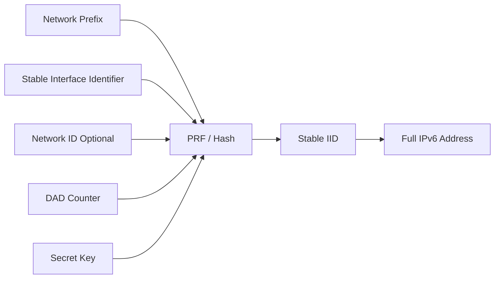

# How to Configure Stable Privacy Addresses (RFC 7217) on Linux

Author: [nawazdhandala](https://www.github.com/nawazdhandala)

Tags: IPv6, Privacy, RFC7217, Linux, Networking, SLAAC

Description: Configure RFC 7217 stable privacy addresses on Linux to prevent cross-network tracking while maintaining consistent addresses per network interface.

## Introduction

RFC 7217 defines a method for generating semantically opaque Interface Identifiers (IIDs) that remain stable within a network but change when moving between networks. Unlike EUI-64 (which exposes your MAC address) or RFC 4941 temporary addresses (which change too frequently), RFC 7217 addresses strike a balance between privacy and stability.

## How RFC 7217 Works

The IID is derived from a pseudorandom function, often implemented with a cryptographic hash, that combines:
- The network prefix
- A stable interface identifier, such as the interface name or another implementation-specific stable value
- A network ID (optional)
- A DAD counter for resolving duplicate-address conflicts
- A secret key (generated once and kept stable)

This means the same device gets the same address on the same network, but a different address on a different network - so cross-network tracking via the IID is much harder.



## Enabling RFC 7217 on Linux with NetworkManager

Modern NetworkManager (v1.2+) supports RFC 7217 via the `addr-gen-mode` setting.

The following commands find the NetworkManager connection profile active on `eth0` and set its address generation mode to `stable-privacy`:

```bash
# Set stable privacy address generation for eth0
CONNECTION=$(nmcli -g GENERAL.CONNECTION device show eth0)

nmcli connection modify "$CONNECTION" ipv6.addr-gen-mode stable-privacy

# Apply the change
nmcli connection up "$CONNECTION" ifname eth0
```

To verify the setting is active:

```bash
# Check the connection profile for addr-gen-mode
CONNECTION=$(nmcli -g GENERAL.CONNECTION device show eth0)
nmcli connection show "$CONNECTION" | grep ipv6.addr-gen-mode
```

## Configuring via NetworkManager Config File

For a system-wide default for profiles that use NetworkManager defaults, edit or create a file in `/etc/NetworkManager/conf.d/`:

```ini
# /etc/NetworkManager/conf.d/ipv6-privacy.conf
# Default to stable privacy addresses for matching connections

[connection]
ipv6.addr-gen-mode=stable-privacy
```

Reload NetworkManager, then reconnect affected active profiles to regenerate addresses:

```bash
sudo systemctl reload NetworkManager
```

## Verifying the Generated Address

After configuration, check that the IID is no longer based on the MAC address:

```bash
# Show IPv6 addresses on eth0
ip -6 addr show eth0

# The IID (last 64 bits) should NOT match the EUI-64 derived from your MAC
# Example: 2001:db8:1::/64 -> 2001:db8:1::a3f2:1b4e:7c9d:2e50
```

The MAC address of `00:11:22:33:44:55` would produce EUI-64 IID `0211:22ff:fe33:4455`. If you see a different IID that stays consistent across reboots, RFC 7217 is working correctly.

## Checking the Secret Key

NetworkManager stores the host-specific secret key that participates in address generation:

```bash
# Location of the secret key file
sudo cat /var/lib/NetworkManager/secret_key
```

This key is machine-specific and should not be shared. If it is regenerated (e.g., after a reinstall), all stable privacy addresses will change.

## Manual Configuration with `ip` Command

For testing without NetworkManager:

```bash
# Generate a per-host secret for testing and configure eth0 to use it
SECRET=$(openssl rand -hex 16 | sed 's/..../&:/g;s/:$//')
sudo sysctl -w "net.ipv6.conf.eth0.stable_secret=$SECRET"

# Enable stable privacy in the kernel for eth0
sudo ip link set dev eth0 addrgenmode stable_secret

# eui64 = EUI-64, none = disable automatic address generation,
# stable_secret = stable privacy using stable_secret (RFC 7217),
# random = stable privacy with a random secret if stable_secret is unset
```

To make this persistent across reboots:

```bash
# Generate a persistent per-host secret and write /etc/sysctl.d/99-ipv6-privacy.conf
SECRET=$(openssl rand -hex 16 | sed 's/..../&:/g;s/:$//')
printf 'net.ipv6.conf.default.stable_secret = %s\nnet.ipv6.conf.default.addr_gen_mode = 2\nnet.ipv6.conf.all.addr_gen_mode = 2\n' "$SECRET" | sudo tee /etc/sysctl.d/99-ipv6-privacy.conf
```

Apply immediately:

```bash
sudo sysctl -p /etc/sysctl.d/99-ipv6-privacy.conf
```

## Conclusion

RFC 7217 stable privacy addresses give Linux systems a strong privacy posture without the instability of purely random temporary addresses. They are the recommended default for most modern Linux deployments and are supported natively by the Linux kernel and NetworkManager. Enable them system-wide via sysctl or per-connection via NetworkManager to reduce IID-based tracking across different networks.
