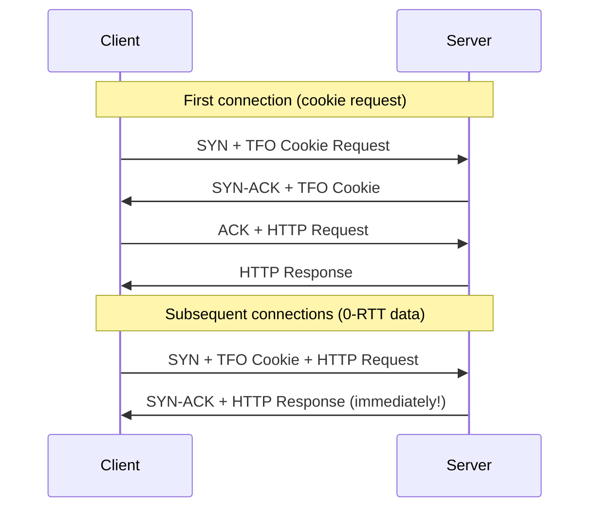

# How to Reduce TCP Connection Latency with TCP Fast Open

Author: [nawazdhandala](https://www.github.com/nawazdhandala)

Tags: TCP, Fast Open, TFO, Linux, Latency, Performance

Description: Learn how to enable TCP Fast Open (TFO) on Linux to eliminate the round-trip latency of the TCP handshake for repeat connections, reducing connection establishment time.

## What Is TCP Fast Open?

Standard TCP requires a full 3-way handshake (SYN → SYN-ACK → ACK) before application data is exchanged. For short-lived connections (HTTP, DNS over TCP), this handshake adds one full RTT of latency per connection.

TCP Fast Open (RFC 7413) allows data to be sent in the SYN packet on repeat connections using a cookie cached from a previous handshake:



## Step 1: Check TFO Support

```bash
# Check if TFO is supported and current setting

sysctl net.ipv4.tcp_fastopen

# Common bitmask values:
# 0 = disabled
# 1 = client-side support (send data in SYN when the application requests TFO)
# 2 = server-side support (accept data in SYN when the listener enables TFO)
# 3 = both client and server

# Upstream Linux default: 1
```

## Step 2: Enable TFO on Server and Client

```bash
# Enable TFO for both client and server roles
sudo sysctl -w net.ipv4.tcp_fastopen=3

# Make persistent
sudo tee /etc/sysctl.d/99-tcp-fastopen.conf > /dev/null << 'EOF'
# TCP Fast Open - enable for both client and server
net.ipv4.tcp_fastopen = 3
EOF

sudo sysctl -p /etc/sysctl.d/99-tcp-fastopen.conf
```

## Step 3: Configure Applications to Use TFO

### Nginx (server-side TFO)

```nginx
# /etc/nginx/nginx.conf
http {
    server {
        # Enable TFO on listening sockets
        # Only use this for handlers that tolerate duplicate SYN data.
        listen 80 fastopen=256;
        listen 443 ssl fastopen=256;
    }
}
```

### Python (client using TFO)

```python
import socket

# Create a TCP socket
sock = socket.socket(socket.AF_INET, socket.SOCK_STREAM)
sock.setsockopt(socket.SOL_SOCKET, socket.SO_REUSEADDR, 1)

# Enable TFO (Linux constant: TCP_FASTOPEN_CONNECT = 30)
TCP_FASTOPEN_CONNECT = getattr(socket, "TCP_FASTOPEN_CONNECT", 30)
sock.setsockopt(socket.IPPROTO_TCP, TCP_FASTOPEN_CONNECT, 1)

# With a cached cookie, the write after connect triggers SYN + data
sock.connect(('192.168.1.100', 80))
sock.sendall(b'GET / HTTP/1.1\r\nHost: 192.168.1.100\r\n\r\n')
```

### curl (TFO support)

```bash
# Check if curl supports the TFO option
curl --help all | grep -- --tcp-fastopen

# Enable TFO for this request
curl --tcp-fastopen -v http://192.168.1.100/
```

## Step 4: Verify TFO Is Working

```bash
# Capture TFO negotiation
sudo tcpdump -i any -c 20 -w /tmp/tfo-test.pcap 'tcp[tcpflags] & tcp-syn != 0'

# Analyze for TFO cookie options
tshark -r /tmp/tfo-test.pcap -T fields \
  -e tcp.options.tfo.request \
  -e tcp.options.tfo.cookie \
  -e tcp.analysis.tfo_syn \
  -Y "tcp.flags.syn == 1 && (tcp.options.tfo.request || tcp.options.tfo.cookie)"

# Check TFO statistics
nstat -az 'TcpExtTCPFastOpen*'
```

## Step 5: Measure Latency Improvement

```bash
# Time connection to an endpoint - first connection (no cookie)
time curl --tcp-fastopen -s -o /dev/null http://192.168.1.100/

# Second connection (TFO cookie available) - should be faster
time curl --tcp-fastopen -s -o /dev/null http://192.168.1.100/

# More precise measurement with curl timing
for i in 1 2 3; do
  curl --tcp-fastopen -s -o /dev/null \
    -w "connect=%{time_connect} starttransfer=%{time_starttransfer} total=%{time_total}\n" \
    http://192.168.1.100/
done
# TFO can reduce starttransfer/total time for repeat connections
```

## Step 6: TFO Blackhole Detection

Some middleboxes (firewalls, NAT devices) drop TFO SYN packets. Linux can temporarily disable active-side TFO when blackhole detection is enabled:

```bash
# Check whether TFO blackhole detection is enabled
sysctl net.ipv4.tcp_fastopen_blackhole_timeout_sec
# 0 disables blackhole detection; a non-zero value is the initial disable period in seconds.

# Check detected blackhole events
nstat -az TcpExtTCPFastOpenBlackhole

# Enable detection with an initial 1-hour disable period
sudo sysctl -w net.ipv4.tcp_fastopen_blackhole_timeout_sec=3600
```

## Conclusion

TCP Fast Open reduces connection latency by allowing data to be sent in the initial SYN packet on repeat connections. Enable it system-wide with `sysctl net.ipv4.tcp_fastopen=3`, configure your server application to accept TFO connections only where duplicate SYN data is safe, and verify with tcpdump that TFO cookie options appear in SYN packets. TFO provides the greatest benefit for short-lived TCP connections with measurable RTT, such as API calls to remote services.
