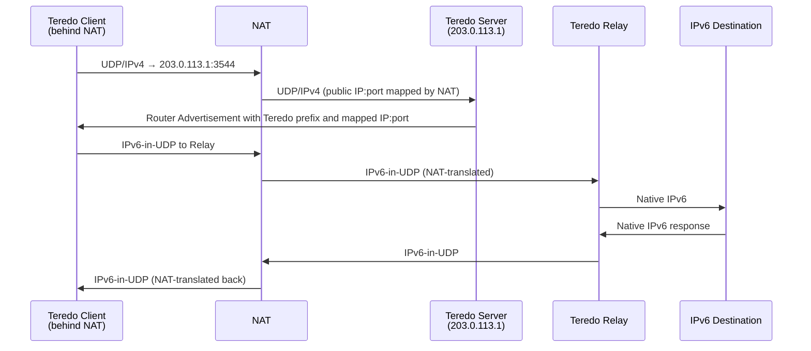

# How to Understand Teredo Tunneling Through NAT

Author: [nawazdhandala](https://www.github.com/nawazdhandala)

Tags: IPv6, Teredo, NAT, Tunneling, RFC 4380

Description: Learn how Teredo provides IPv6 connectivity through NAT using UDP encapsulation, how Teredo addresses work, and why it is deprecated and should be disabled.

## Overview

Teredo (RFC 4380) was designed to provide IPv6 connectivity for hosts behind IPv4 NAT, where other tunneling mechanisms like 6in4 (protocol 41) are blocked. It encapsulates IPv6 in UDP/IPv4, which traverses NAT. It was widely deployed in Windows Vista, 7, and 8, enabling IPv6 in homes and offices that didn't have native IPv6 or IPv6-capable routers. Teredo is now deprecated in Windows and disabled by default in modern Windows versions.

## How Teredo Works

```text
[Client behind NAT]                [Teredo Server]
  Private IPv4: 192.168.1.10         Public IPv4: 203.0.113.1
  Mapped IPv4:  203.0.113.50         UDP port: 3544
  NAT type: full cone

Step 1: Client sends UDP 3544 to Teredo Server
Step 2: Server learns client's mapped public IPv4:port
Step 3: Client configures a Teredo IPv6 address from the advertised prefix and mapped address
Step 4: Client uses the Server for qualification/relay discovery and Relays for data traffic

Teredo Relay: decapsulates UDP and forwards to IPv6 internet
```

## Teredo Address Structure

Teredo addresses use the `2001::/32` prefix:

```text
2001:0000:SSSS:SSSS:FFFF:PPPP:CCCC:CCCC
         │         │    │    │
         │         │    │    └─ client IPv4 XOR 0xffffffff
         │         │    └─ client port XOR 0xffff
         │         └─ flags (cone bit plus RFC 5991 random bits)
         └─ Teredo server IPv4 (hex)

Example:
  Server: 203.0.113.1  = cb00:7101
  Flags: 2155 (example RFC 5991 random flags, cone bit clear)
  Client mapped IP: 192.0.2.100 = NOT(c000:0264) = 3fff:fd9b
  Client mapped port: 32000 = NOT(7d00) = 82ff

  Teredo address: 2001:0:cb00:7101:2155:82ff:3fff:fd9b
```

## Teredo Components

| Component | Role |
|---|---|
| Teredo Server | Helps the client learn its mapped public IP/port and configure its address |
| Teredo Relay | Decapsulates UDP, forwards to IPv6 internet |
| Teredo Client | Host behind NAT using Teredo |

Microsoft operated the primary Teredo servers (`teredo.ipv6.microsoft.com`). Third-party servers exist but quality varies.

## Packet Flow



## Security Problems with Teredo

Teredo created serious security risks in enterprise environments:

### 1. Firewall Bypass

```text
Enterprise IPv4 firewall blocks most outbound ports
But allows UDP port 3544 (or unrestricted outbound UDP)

Attacker uses Teredo to:
  1. Establish IPv6 tunnel over UDP 3544
  2. Communicate with C2 server via IPv6
  3. Tunneled IPv6 bypasses IPv4-only firewall policy controls
  4. IPv6 firewall may not exist or may not inspect UDP payloads
```

### 2. Unexpected Inbound Connectivity

Teredo provides a globally reachable IPv6 address - subject to host firewall policy, hosts that were considered "behind NAT" and unreachable can become reachable via IPv6 through Teredo relays.

### 3. No Enterprise Control

Unlike brokered tunnels where you configure a specific provider, Teredo clients use configured/default servers and discover relays through the protocol and IPv6 routing - the enterprise may not control which external relay is used.

## Why Teredo Is Deprecated

- Many modern ISPs provide native IPv6 - Teredo's last-resort NAT traversal is less needed
- Windows 10 version 1803 and later, including Windows 11, disable Teredo by default
- Security tools cannot reliably inspect IPv6-in-UDP payloads
- IETF operational security guidance recommends blocking Teredo where it would bypass IPv4-only security policy

## Checking Teredo Status

```powershell
# Windows - check Teredo state

netsh interface teredo show state

# Example output:
# Type              : client
# Server Name       : teredo.ipv6.microsoft.com
# Mapped Address    : 203.0.113.50:32000
# State             : qualified
# Network           : unmanaged
# NAT               : cone

# If state is "dormant" or "offline" - Teredo is inactive
```

## Summary

Teredo was an ingenious NAT-traversal mechanism that embedded IPv6 in UDP/IPv4 packets and used servers for qualification and relay discovery, and relays for data forwarding. Teredo addresses use the `2001::/32` prefix and encode the Teredo server and client's NAT-mapped address. It is now deprecated in Windows and discouraged operationally because native IPv6 is widely available and Teredo creates security risks by bypassing IPv4 firewalls with IPv6-over-UDP. Block UDP port 3544 at enterprise perimeters and disable Teredo on Windows with `netsh interface teredo set state disabled`.
