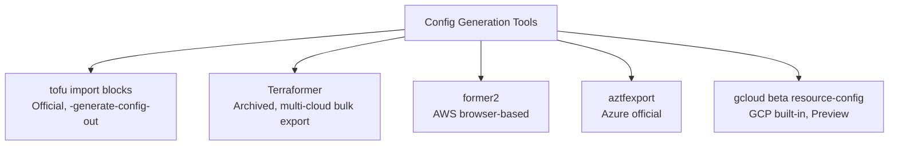

# How to Use Third-Party Tools for Config Generation with OpenTofu

Author: [nawazdhandala](https://www.github.com/nawazdhandala)

Tags: OpenTofu, Config Generation, Former, Terraformer, Migration, Infrastructure as Code

Description: Learn how to use third-party tools like Terraformer, former2, and cloud-native export tools to generate OpenTofu configurations from existing cloud infrastructure.

---

Beyond the built-in `import` block, several third-party and cloud-native tools can scan existing cloud infrastructure and generate OpenTofu/Terraform configuration automatically. These tools are especially useful when migrating large, undocumented environments.

## Tool Comparison



## Terraformer - Archived Multi-Cloud Bulk Export

Terraformer is archived and deprecated as of March 16, 2026. Use it only for one-time exports where the archived release still supports your providers; prefer maintained cloud-native exporters or OpenTofu import blocks when they fit.

```bash
# Install Terraformer

brew install terraformer

# Or download the all-providers binary
curl -LO "https://github.com/GoogleCloudPlatform/terraformer/releases/latest/download/terraformer-all-darwin-amd64"
chmod +x terraformer-all-darwin-amd64
mv terraformer-all-darwin-amd64 /usr/local/bin/terraformer

# Run from a directory with the relevant Terraform provider requirements initialized
terraform init

# Export AWS resources by type
terraformer import aws \
  --resources=ec2_instance,s3,rds,vpc,subnet,sg \
  --regions=us-east-1 \
  --profile=production \
  --path-output=./generated

# Export GCP resources
terraformer import google \
  --resources=instances,networks,subnetworks,firewall \
  --projects=my-gcp-project \
  --regions=us-central1 \
  --path-output=./generated

# Export Azure resources
terraformer import azure \
  --resources=resource_group,virtual_network,subnet,virtual_machine \
  --resource-group=my-resource-group \
  --path-output=./generated
```

## former2 - AWS Browser-Based Export

```bash
# former2 is a web app at https://former2.com
# It runs in your browser and uses AWS credentials from CloudShell or local config

# Alternative: Use former2 CLI
npm install -g former2

# Set up credentials
export AWS_PROFILE=production

# Scan and generate
former2 generate \
  --services EC2,S3,RDS,VPC \
  --region us-east-1 \
  --output-terraform ./former2-output.tf
```

## Processing Generated Output

```bash
# Terraformer generates files under {output}/{provider}/{service}/ by default
ls generated/aws/
# ec2_instance/
#   ├── instance.tf
#   ├── outputs.tf
#   └── provider.tf
# subnet/
#   └── subnet.tf
# vpc/
#   └── vpc.tf

# Combine and clean up
cat generated/aws/vpc/vpc.tf >> infrastructure.tf
cat generated/aws/ec2_instance/instance.tf >> infrastructure.tf

# Replace hardcoded IDs with references
sed -i.bak 's/vpc_id = "vpc-12345"/vpc_id = aws_vpc.main.id/g' infrastructure.tf
rm infrastructure.tf.bak
```

## Post-Generation Cleanup Script

```bash
#!/bin/bash
# cleanup_generated.sh

INPUT_FILE="$1"
OUTPUT_FILE="${INPUT_FILE%.tf}-clean.tf"

# Remove Terraformer-generated name prefixes
sed 's/tfer--//g' "$INPUT_FILE" > "$OUTPUT_FILE"

# Remove computed attributes that cause drift
sed -i.bak '/arn = /d' "$OUTPUT_FILE"
sed -i.bak '/owner_id = /d' "$OUTPUT_FILE"
sed -i.bak '/tags_all = /d' "$OUTPUT_FILE"

# Replace hardcoded account IDs in ARN strings
ACCOUNT_ID=$(aws sts get-caller-identity --query Account --output text)
sed -i.bak "s/:${ACCOUNT_ID}:/:\${var.account_id}:/g" "$OUTPUT_FILE"
rm -f "${OUTPUT_FILE}.bak"

echo "Cleaned config written to $OUTPUT_FILE"
```

## Validating Generated Configuration

```bash
# After cleanup and after the matching resources are imported into state, validate the configuration
tofu fmt -recursive .
tofu init
tofu validate
tofu plan

# If plan shows changes after import, review the diff; it can indicate
# that the generated config or state doesn't match reality
# Review changes and either:
# 1. Update the config to match reality
# 2. Use ignore_changes to suppress expected differences
```

## Best Practices

- Prefer maintained cloud-native exporters such as `aztfexport` or `gcloud beta resource-config bulk-export` where available; use Terraformer only for legacy bulk exports where its archived provider support fits; use `tofu import` blocks for targeted imports of specific resources.
- Always run `tofu plan` after importing generated configs - non-empty plans mean OpenTofu sees a difference between configuration, state, and remote objects that you must review.
- Clean up Terraformer output before committing - it includes auto-generated names like `tfer--`, hardcoded ARNs, and redundant computed attributes.
- Do generated configuration migrations environment by environment, starting with dev - apply and validate before moving to production.
- Treat generated configuration as a starting point, not a finished product - it always requires cleanup and refactoring to follow your team's conventions.
