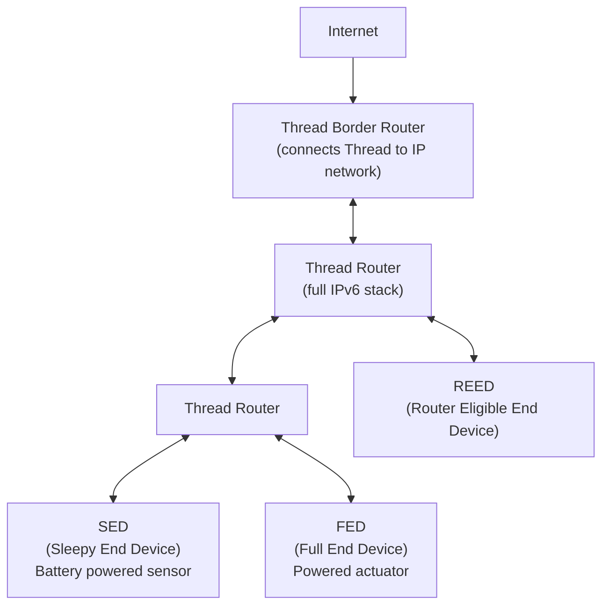

# How to Understand Thread Protocol for IoT IPv6

Author: [nawazdhandala](https://www.github.com/nawazdhandala)

Tags: IPv6, Thread, IoT, 6LoWPAN, Matter, Networking

Description: Understand the Thread protocol's use of IPv6 and 6LoWPAN to create self-healing mesh networks for IoT devices, including device roles and border router connectivity.

## Introduction

Thread is an IPv6-based mesh networking protocol designed specifically for smart home and building automation IoT devices. It is one of the IP network transports used by Matter (formerly Project CHIP), alongside Wi-Fi and Ethernet. Thread uses IEEE 802.15.4 radio with 6LoWPAN to provide full IPv6 connectivity to constrained devices.

## Thread Network Architecture



## Thread Device Roles

| Role | Abbreviation | Description |
|---|---|---|
| Thread Leader | Leader | Manages router set, one per partition |
| Router | Router | Forwards packets, always on |
| Router Eligible End Device | REED | Can become a router if needed |
| Full End Device | FED | Always on, cannot route |
| Sleepy End Device | SED | Battery-powered, polls parent |
| Minimal End Device | MED | Always on, does not route or poll parent |

## IPv6 Address Types in Thread

Thread assigns multiple IPv6 address types to each device:

1. **Link-Local Address (LLA)**: `fe80::/10` - interface ID based on the IEEE 802.15.4 Extended Address
2. **Mesh-Local EID**: `fdXX:XXXX:XXXX::/64` - topology-independent ULA address with a random interface ID, unique within the mesh
3. **RLOC (Routing Locator)**: `fdXX:XXXX:XXXX:0:0:ff:fe00:XXXX` - contains the 16-bit RLOC16
4. **Global Unicast Address**: Configured from a routable IPv6 prefix when one is available through a border router

```bash
# Example Thread device addresses

# Link-local:      fe80::1122:3344:5566:7788
# Mesh-local EID:  fd11:2233:4455:0:416:993c:8399:35ab
# RLOC:            fd11:2233:4455::ff:fe00:9c00
# Global:          2001:db8:1:1::416:993c:8399:35ab (documentation prefix; real prefix comes via border router)
```

## Thread Border Router

The Thread Border Router (TBR) connects the Thread mesh to the broader IP network:

```bash
# OpenThread Border Router daemon setup (on a Linux host with 802.15.4 radio)
# Build and install otbr-agent (OpenThread Border Router) from the official source
sudo apt install git
git clone --depth=1 https://github.com/openthread/ot-br-posix
cd ot-br-posix
./script/bootstrap
INFRA_IF_NAME=eth0 ./script/setup

# Example otbr-agent parameters (wpan0 = Thread interface, eth0 = upstream)
sudo otbr-agent -I wpan0 -B eth0 spinel+hdlc+uart:///dev/ttyACM0

# Depending on build and configuration, the TBR handles:
# 1. Border routing: advertises Thread routes and prefixes between Thread and the upstream IPv6 network
# 2. NAT64: for Thread devices to reach IPv4 services
# 3. DNS forwarding and DNS64 support: for Thread devices to resolve IPv4-only hostnames
```

## Thread Network Formation

```bash
# Using the OpenThread CLI (ot-cli) to form a Thread network

# Initialize the Thread stack
> dataset init new
> dataset
# Shows: Active Timestamp, Channel, Network Name, PAN ID, PSKc, Network Key, etc.

# Set dataset and commit
> dataset commit active

# Start the Thread interface
> ifconfig up
> thread start

# Check the device state
> state
# Should show: leader (or router after a few seconds)

# Show IPv6 addresses
> ipaddr
# Shows: fe80::, mesh-local EID, RLOC
```

## Security in Thread

Thread uses IEEE 802.15.4 security with AES-CCM encryption for all frame-level security, plus:
- **Network Key**: Shared secret for all devices in the Thread network (rotatable)
- **PSKc / PSKd**: PSKc authenticates the Commissioner; PSKd is the joiner credential used by a joining device
- **DTLS**: For commissioning handshake (Joiner ↔ Commissioner)

```bash
# Set network key before starting Thread (do not use this example key in production)
> networkkey 00112233445566778899aabbccddeeff

# Start commissioner to allow new devices to join
> commissioner start
Commissioner: petitioning
Done
Commissioner: active

# Add a new device's EUI-64 and joiner credential (PSKd)
> commissioner joiner add 1122334455667788 J01NU5
```

## Conclusion

Thread provides a fully IPv6-based mesh networking solution for IoT devices, using 6LoWPAN for header compression on IEEE 802.15.4 links and a Border Router for connectivity to broader IP networks. Every Thread device has unique IPv6 addresses; mesh-local addresses stay inside the Thread mesh, while routable addresses can be reached end-to-end when the Border Router and upstream IPv6 network advertise the needed routes. Thread's self-healing mesh topology and built-in security make it a common low-power network layer for Matter smart home devices.
