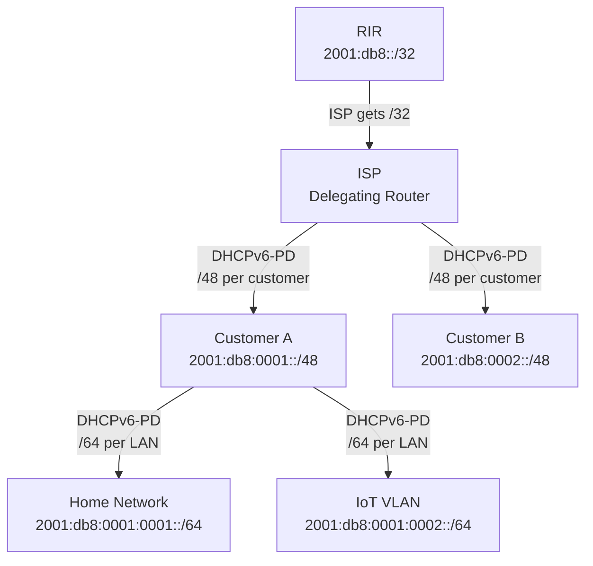

# How to Track IPv6 Prefix Delegations in IPAM

Author: [nawazdhandala](https://www.github.com/nawazdhandala)

Tags: IPv6, IPAM, Prefix Delegation, DHCPv6-PD, Network Management

Description: Track IPv6 prefix delegations (DHCPv6-PD) from ISP to CPE devices and within an organization, recording delegation relationships and validating prefix usage in IPAM.

## Introduction

IPv6 prefix delegation (DHCPv6-PD, currently specified in RFC 9915 and originally defined by RFC 3633) enables a delegating router to assign a prefix to a requesting router for downstream use. In enterprise and ISP environments, tracking these delegations in IPAM ensures the address plan reflects actual assignments and enables detection of unauthorized delegation.

## Delegation Chain Structure



## Step 1: Monitor DHCPv6-PD Leases from Kea

```python
#!/usr/bin/env python3
# track_pd_leases.py

# Monitor Kea DHCPv6 prefix delegation leases

import json
import urllib.request
from datetime import datetime

KEA_URL = "http://[::1]:8000/"

def kea_command(command: str, service: str = "dhcp6") -> dict:
    payload = json.dumps({
        "command": command,
        "service": [service]
    }).encode()
    req = urllib.request.Request(KEA_URL, data=payload,
                                  headers={"Content-Type": "application/json"})
    with urllib.request.urlopen(req, timeout=10) as resp:
        response = json.load(resp)

    if isinstance(response, list):
        response = response[0] if response else {}
    if response.get("result") not in (0, 3):
        raise RuntimeError(response.get("text", "Kea command failed"))
    return response

# Get all active DHCPv6-PD leases (requires the Kea lease_cmds hook)
pd_leases = kea_command("lease6-get-all", "dhcp6")

print("Active DHCPv6-PD Delegations:")
print(f"{'Prefix':<35} {'Client DUID':<40} {'Expires'}")
print("-" * 90)

for lease in pd_leases.get("arguments", {}).get("leases", []):
    if lease.get("type") == "IA_PD":
        prefix = f"{lease['ip-address']}/{lease['prefix-len']}"
        duid = lease.get("duid", "unknown")
        expires = datetime.fromtimestamp(
            lease.get("cltt", 0) + lease.get("valid-lft", 0)
        ).strftime("%Y-%m-%d %H:%M")
        print(f"{prefix:<35} {duid:<40} {expires}")
```

## Step 2: Sync Delegations to NetBox

```python
#!/usr/bin/env python3
# sync_pd_to_netbox.py

import pynetbox
from datetime import datetime

nb = pynetbox.api("http://netbox.internal", token="your-token")

PD_TAG_SLUG = "dhcpv6-pd"

def ensure_tag(slug: str, name: str) -> dict:
    """Return a NetBox tag reference, creating the tag if needed."""
    tag = nb.extras.tags.get(slug=slug)
    if tag is None:
        tag = nb.extras.tags.create({"name": name, "slug": slug})
    return {"slug": tag.slug}

def record_delegation(parent_prefix: str, delegated_prefix: str,
                       duid: str, expires: datetime):
    """Record a DHCPv6-PD delegation in NetBox."""

    pd_tag = ensure_tag(PD_TAG_SLUG, "DHCPv6-PD")
    expires_value = expires.isoformat(sep=" ")
    prefix_data = {
        "description": f"PD from {parent_prefix} | DUID: {duid} | Expires: {expires_value}",
        # These custom fields must already be defined for Prefix objects.
        "custom_fields": {
            "delegation_source": parent_prefix,
            "client_duid": duid,
            "delegation_expires": expires_value
        }
    }

    # Check if prefix already exists
    existing = list(nb.ipam.prefixes.filter(prefix=delegated_prefix))
    if existing:
        prefix_obj = existing[0]
        tags = [
            {"slug": tag.slug}
            for tag in getattr(prefix_obj, "tags", [])
            if getattr(tag, "slug", None)
        ]
        if not any(tag["slug"] == PD_TAG_SLUG for tag in tags):
            tags.append(pd_tag)

        # Update expiry and delegation metadata
        nb.ipam.prefixes.update([{
            "id": prefix_obj.id,
            **prefix_data,
            "tags": tags
        }])
    else:
        # Create new prefix record
        nb.ipam.prefixes.create({
            "prefix": delegated_prefix,
            "status": "active",
            **prefix_data,
            "tags": [pd_tag]
        })

    print(f"Recorded: {delegated_prefix} (delegated from {parent_prefix})")

# Example: record a delegation
record_delegation(
    "2001:db8::/32",
    "2001:db8:0001::/48",
    "00:03:00:01:aa:bb:cc:dd:ee:ff",
    datetime(2026, 4, 20, 10, 30, 0)
)
```

## Step 3: ISC DHCP Delegation Lease File Parser

```python
#!/usr/bin/env python3
# parse_isc_dhcpv6_pd_leases.py
import re

# ISC DHCPv6 lease-file format for prefix delegation
# ia_pd IAID_DUID { ... iaprefix 2001:db8:1::/48 { binding state active; } }
LEASE_FILE = "/var/lib/dhcp/dhcpd6.leases"

IA_PD_RE = re.compile(r'^\s*ia_pd\s+(?P<iaid_duid>\S+)\s+\{')
IAPREFIX_RE = re.compile(r'^\s*iaprefix\s+(?P<prefix>[0-9a-fA-F:]+/\d+)\s+\{')
STATE_RE = re.compile(r'^\s*binding state (?P<state>\w+);')
END_RE = re.compile(r'^\s*}\s*$')

active = {}  # prefix -> IAID+DUID
current_iaid_duid = None
current_prefix = None

with open(LEASE_FILE) as f:
    for line in f:
        m = IA_PD_RE.match(line)
        if m:
            current_iaid_duid = m.group("iaid_duid")
            current_prefix = None
            continue

        if current_iaid_duid:
            m = IAPREFIX_RE.match(line)
            if m:
                current_prefix = m.group("prefix")
                continue

            if current_prefix:
                m = STATE_RE.match(line)
                if m:
                    if m.group("state") == "active":
                        active[current_prefix] = current_iaid_duid
                    else:
                        active.pop(current_prefix, None)
                    continue

            if END_RE.match(line):
                if current_prefix:
                    current_prefix = None
                else:
                    current_iaid_duid = None

print(f"Active PD delegations: {len(active)}")
for prefix, iaid_duid in sorted(active.items()):
    print(f"  {prefix:<35} -> IAID+DUID: {iaid_duid}")
```

## Step 4: Validate Delegated Prefixes

Ensure delegated prefixes are still present in lease or binding data and have not expired:

```bash
#!/bin/bash
# validate_delegations.sh

echo "=== Prefix Delegation Validation ==="
# Check current delegated prefix bindings
# (requires access to delegating router)

# On Cisco IOS/IOS-XE:
# show ipv6 dhcp pool
# show ipv6 dhcp binding

# On Linux with Kea:
KEA_URL=${KEA_URL:-http://[::1]:8000/}
curl -s -X POST -H 'Content-Type: application/json' \
  -d '{"command":"lease6-get-all","service":["dhcp6"]}' \
  "$KEA_URL" | python3 -c "
import json, sys, datetime
data = json.load(sys.stdin)
if isinstance(data, list):
    data = data[0] if data else {}
if data.get('result') not in (0, 3):
    raise SystemExit(data.get('text', 'Kea command failed'))
now = datetime.datetime.now().timestamp()
for lease in data.get('arguments', {}).get('leases', []):
    if lease.get('type') == 'IA_PD':
        expires = lease.get('cltt', 0) + lease.get('valid-lft', 0)
        status = 'ACTIVE' if expires > now else 'EXPIRED'
        prefix = f\"{lease['ip-address']}/{lease['prefix-len']}\"
        print(f'{status} {prefix}')
"
```

## Conclusion

Tracking IPv6 prefix delegations in IPAM requires synchronizing DHCPv6-PD lease data from the delegating router into the IPAM database. Use Kea's management API or parse ISC DHCPv6 lease files to extract active delegations, then create or update prefix records in NetBox with delegation metadata (source prefix, client DUID, expiry). Add a `dhcpv6-pd` tag to delegated prefixes to distinguish them from manually assigned static prefixes. Run periodic validation to detect expired delegations that should be reclaimed or stale IPAM records that no longer match active leases.
