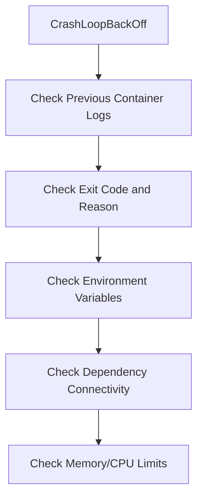

# How to Troubleshoot CrashLoopBackOff Errors in Portainer - Troubleshoot

Author: [nawazdhandala](https://www.github.com/nawazdhandala)

Tags: Portainer, Kubernetes, CrashLoopBackOff, Troubleshooting, Debugging

Description: Debug and fix CrashLoopBackOff errors in Kubernetes containers using Portainer's log viewer, pod events, and console access.

---

CrashLoopBackOff means your container is starting, failing, and Kubernetes is backing off before retrying. The container is usually exiting with a non-zero exit code, being killed by the system, or failing a liveness/startup probe. Portainer provides the log access and event view needed to find the root cause.

## Diagnostic Steps



## Step 1: View Previous Container Logs

In Portainer, open the pod's **Logs** view and, if available, select the previous or terminated container instance. This shows the stdout/stderr from the instance that crashed:

```bash
## kubectl equivalent
kubectl logs <pod-name> --previous -n <namespace>
```

For multi-container pods, add `-c <container-name>` to select the crashed container.

Common crash messages and status reasons to look for:
- \`Error: cannot find module\` - missing dependency in image
- \`connection refused\` - database or service not available
- \`invalid value for environment variable\` - misconfigured env
- \`OOMKilled\` in the container status - ran out of memory

## Step 2: Check the Exit Code

In the container's terminated status, visible in pod details or `kubectl describe pod`, the exit code and reason help narrow down what went wrong:

| Exit Code | Meaning |
|---|---|
| 1 | General application error |
| 137 | SIGKILL; often OOMKilled when the reason is `OOMKilled` |
| 139 | Segmentation fault |
| 143 | SIGTERM (graceful termination request) |

## Step 3: Verify Environment Variables

Missing or wrong environment variables are a common crash cause. Use Portainer's pod detail to inspect configured env vars, or add a debug init container with the same Kubernetes `env` or `envFrom` entries:

```yaml
initContainers:
  - name: debug-env
    image: busybox
    command: ["env"]
```

## Step 4: Use a Debug Container

Temporarily override the failing container with a long-running command that exists in the image to inspect the environment:

```yaml
## Temporarily replace the command to prevent crash
command: ["sleep", "3600"]
```

Deploy this version, exec into the container via Portainer's Console, and run the original startup command manually to see its output.

## Step 5: Increase Memory Limits

If the terminated reason is `OOMKilled` (often exit code 137), consider increasing the memory limit:

```yaml
resources:
  limits:
    memory: "1Gi"   # Increase from previous value
  requests:
    memory: "512Mi"
```

## Summary

CrashLoopBackOff troubleshooting usually starts with reading application logs from the crashed instance. Portainer's log view can make this accessible without kubectl. Start with logs, check the exit code and reason, verify environment variables, and test dependency connectivity to resolve the majority of crash cases.
