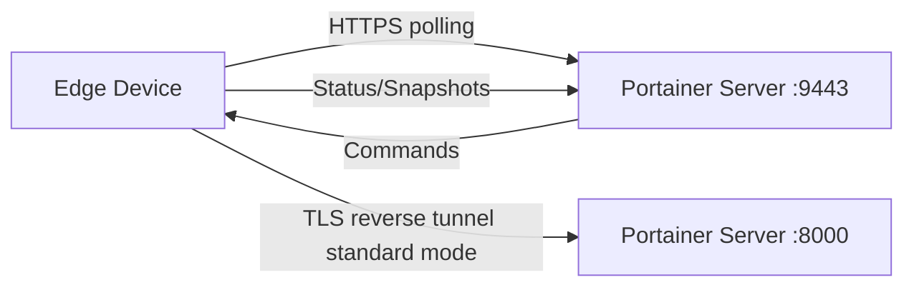

# How to Troubleshoot Edge Agent Connection Issues - Agent

Author: [nawazdhandala](https://www.github.com/nawazdhandala)

Tags: Portainer, Edge Agent, Troubleshooting, Connectivity, Debugging

Description: Diagnose and resolve common Edge Agent connection problems including tunnel issues, certificate errors, and network problems.

---

Portainer Edge Agents enable management of remote environments that are behind NAT, firewalls, or have limited connectivity. The Edge Agent establishes an outbound connection to the Portainer server, eliminating the need for inbound firewall rules.

## How Edge Agent Works



The Edge Agent polls the Portainer API over HTTPS on port 9443. In standard mode, it also establishes an outbound TLS reverse tunnel to the Portainer tunnel server on port 8000 when interactive management is required. In async mode, the tunnel is not used, so only the API port is required. No inbound ports need to be opened on the edge network.

## Create Edge Environment via API

```bash
TOKEN=$(curl -s -X POST \
  https://portainer.example.com:9443/api/auth \
  -H "Content-Type: application/json" \
  -d '{"username":"admin","password":"yourpassword"}' \
  --insecure | python3 -c "import sys,json; print(json.load(sys.stdin)['jwt'])")

# Create a Docker Edge environment and print values for the deployment command

ENVIRONMENT=$(curl -s -X POST \
  https://portainer.example.com:9443/api/endpoints \
  -H "Authorization: Bearer $TOKEN" \
  -F "Name=edge-site-01" \
  -F "EndpointCreationType=4" \
  -F "ContainerEngine=docker" \
  -F "URL=https://portainer.example.com:9443" \
  -F "EdgeTunnelServerAddress=portainer.example.com:8000" \
  -F "EdgeCheckinInterval=30" \
  --insecure)

EDGE_KEY=$(printf '%s' "$ENVIRONMENT" | python3 -c "import sys,json; print(json.load(sys.stdin)['EdgeKey'])")
EDGE_ID=$(printf '%s' "$ENVIRONMENT" | python3 -c "import sys,json,uuid; env=json.load(sys.stdin); print(env.get('EdgeID') or uuid.uuid4())")

printf 'EDGE_ID=%s\nEDGE_KEY=%s\n' "$EDGE_ID" "$EDGE_KEY"
```

## Standard Mode Installation

```bash
# Standard mode - agent polls frequently (real-time management)
docker run -d \
  --name portainer_edge_agent \
  --restart=always \
  -v /var/run/docker.sock:/var/run/docker.sock \
  -v /var/lib/docker/volumes:/var/lib/docker/volumes \
  -v /:/host \
  -v portainer_agent_data:/data \
  -e EDGE=1 \
  -e EDGE_ID="${EDGE_ID}" \
  -e EDGE_KEY="${EDGE_KEY}" \
  -e EDGE_INSECURE_POLL=0 \
  portainer/agent:latest
```

## Async Mode Installation

```bash
# Async mode is available in Portainer Business Edition. Create the environment
# as Edge Agent Async in Portainer first, or add -F "EdgeAsyncMode=true" to the
# API request above.
# Async mode - uses Portainer-configured ping, snapshot, and command intervals
docker run -d \
  --name portainer_edge_agent \
  --restart=always \
  -v /var/run/docker.sock:/var/run/docker.sock \
  -v /var/lib/docker/volumes:/var/lib/docker/volumes \
  -v /:/host \
  -v portainer_agent_data:/data \
  -e EDGE=1 \
  -e EDGE_ID="${EDGE_ID}" \
  -e EDGE_KEY="${EDGE_KEY}" \
  -e EDGE_ASYNC=1 \
  portainer/agent:latest
```

## ARM / Windows Variations

```bash
# ARM64 (Raspberry Pi 4, Apple M1)
docker pull portainer/agent:latest  # Multi-arch: automatically uses ARM64
```

```powershell
# Windows WCS / Windows containers
docker run -d `
  --name portainer_edge_agent `
  --restart always `
  --mount type=npipe,src=\\.\pipe\docker_engine,dst=\\.\pipe\docker_engine `
  --mount type=bind,src=C:\ProgramData\docker\volumes,dst=C:\ProgramData\docker\volumes `
  --mount type=volume,src=portainer_agent_data,dst=C:\data `
  -e EDGE=1 `
  -e EDGE_ID="$Env:EDGE_ID" `
  -e EDGE_KEY="$Env:EDGE_KEY" `
  -e EDGE_INSECURE_POLL=0 `
  portainer/agent:latest
```

## Verify Edge Agent Connection

```bash
# Check agent is running
docker logs portainer_edge_agent 2>&1 | tail -20

# On Portainer server, check if environment shows as connected
curl -s https://portainer.example.com:9443/api/endpoints \
  -H "Authorization: Bearer $TOKEN" \
  --insecure | python3 -c "
import sys, json
envs = json.load(sys.stdin)
for e in envs:
    if e.get('EdgeID'):
        print(f'Edge: {e[\"Name\"]}, Status: {\"Online\" if e.get(\"Status\")==1 else \"Offline\"}')
"
```

---

*Monitor edge device health and connectivity with [OneUptime](https://oneuptime.com).*
