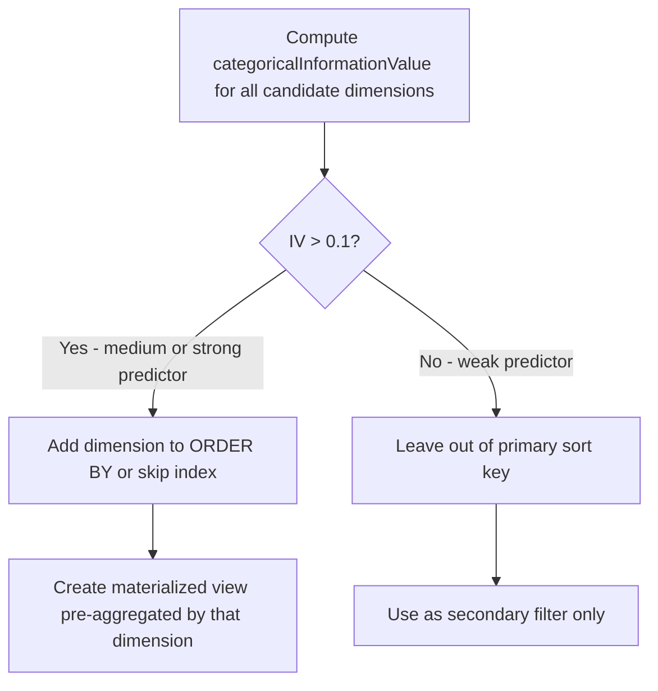

# How to Use categoricalInformationValue() in ClickHouse

Author: [nawazdhandala](https://www.github.com/nawazdhandala)

Tags: ClickHouse, SQL, Aggregate Function, Statistics, Feature Selection

Description: Learn how to use categoricalInformationValue() in ClickHouse to measure how much a categorical variable predicts a binary outcome, enabling feature selection and root-cause analysis.

---

`categoricalInformationValue(category1[, category2, ...], tag)` computes the information value (IV) of one or more categorical predictors with respect to a binary outcome. Information value is a statistical measure borrowed from credit scoring and feature selection: a higher IV indicates that the categorical variable is a stronger predictor of the binary outcome. ClickHouse exposes this as a native aggregate function, making it straightforward to run across large event tables.

## Concept

Information value is derived from the Weight of Evidence (WoE) formula. For each category `c`, ClickHouse computes:

```text
contribution(c) = (P(tag=1) - P(tag=0)) * (log(P(tag=1)) - log(P(tag=0)))
```

evaluated within rows belonging to that category, and the function returns one IV per category column passed in.

A common rule of thumb:
- IV < 0.02: not predictive
- 0.02 to 0.1: weak predictor
- 0.1 to 0.3: medium predictor
- > 0.3: strong predictor

## Syntax

```sql
-- All category arguments and the tag must be UInt8.
-- The tag column must contain only 0 or 1.
-- The function returns Array(Float64) with one IV per category column.
SELECT categoricalInformationValue(category1, category2, tag_column) AS iv
FROM table_name;
```

Because the arguments must be `UInt8`, string-valued categorical features need to be encoded first — typically by mapping known values to small integers, or by hashing them into a bounded numeric range (e.g. `toUInt8(cityHash64(col) % 200)`).

## Basic Example

```sql
-- Does browser type predict whether a user converts?
-- browser is a string, so we hash it into UInt8 range first; converted is already UInt8 (0/1).
SELECT
    categoricalInformationValue(
        toUInt8(cityHash64(browser) % 200),
        toUInt8(converted)
    ) AS iv_browser
FROM user_sessions
WHERE session_date >= today() - 30;
```

The result is `Array(Float64)`; with a single category column it is a one-element array, so use `arrayElement(iv_browser, 1)` (or `iv_browser[1]`) to extract the scalar IV.

## Comparing Multiple Features

```sql
-- Rank features by their predictive power for churn.
-- A single call accepts multiple categories and returns one IV per column,
-- in the order: [plan_tier, country, signup_channel, device_type].
SELECT
    categoricalInformationValue(
        toUInt8(cityHash64(plan_tier)      % 200),
        toUInt8(cityHash64(country)        % 200),
        toUInt8(cityHash64(signup_channel) % 200),
        toUInt8(cityHash64(device_type)    % 200),
        toUInt8(churned)
    ) AS ivs
FROM user_profiles
WHERE cohort_month >= '2025-01-01';
```

## Root-Cause Analysis: Which Dimension Best Predicts Errors?

```sql
-- Find which categorical dimension best predicts HTTP 5xx errors.
-- Returned IVs are in the same order as the category arguments:
-- [service_name, region, endpoint_group, host_name].
SELECT
    categoricalInformationValue(
        toUInt8(cityHash64(service_name)   % 200),
        toUInt8(cityHash64(region)         % 200),
        toUInt8(cityHash64(endpoint_group) % 200),
        toUInt8(cityHash64(host_name)      % 200),
        toUInt8(status_code >= 500)
    ) AS iv_dimensions
FROM request_logs
WHERE log_date = today();
```

## Segmented Analysis Per Product Area

```sql
-- Run IV analysis per product area to find area-specific predictors.
-- The returned array holds [iv_error_type, iv_user_tier].
SELECT
    product_area,
    categoricalInformationValue(
        toUInt8(cityHash64(error_type) % 200),
        toUInt8(cityHash64(user_tier)  % 200),
        toUInt8(ticket_created)
    ) AS ivs,
    count() AS total_events
FROM support_events
WHERE event_date >= today() - 90
GROUP BY product_area
ORDER BY ivs[1] DESC;
```

## Handling Low-Cardinality vs High-Cardinality Categories

For high-cardinality categories (like `user_id`), IV will be inflated due to overfitting on individual rows. Group high-cardinality columns into buckets first.

```sql
-- Bucket response times into a small UInt8 range before computing IV.
SELECT
    categoricalInformationValue(
        toUInt8(multiIf(
            response_time_ms < 100,  0,
            response_time_ms < 500,  1,
            response_time_ms < 2000, 2,
            3
        )),
        toUInt8(status_code >= 500)
    ) AS iv_latency_bucket
FROM request_logs
WHERE log_date = today();
```

## Using IV Results to Guide Index and Materialized View Design



## Time-Series IV: Tracking Feature Importance Over Time

```sql
-- Has the predictive power of 'region' for errors changed over time?
SELECT
    toStartOfWeek(log_date) AS week,
    categoricalInformationValue(
        toUInt8(cityHash64(region) % 200),
        toUInt8(status_code >= 500)
    )[1] AS iv_region
FROM request_logs
WHERE log_date >= today() - 90
GROUP BY week
ORDER BY week;
```

## Summary

`categoricalInformationValue(category, outcome)` computes the information value of a categorical predictor relative to a binary target variable. Higher IV means the category is more predictive of the outcome. Use it in ClickHouse for feature selection in ML pipelines, root-cause analysis of errors or churn, A/B test dimension scoring, and guiding schema design decisions such as choosing ORDER BY keys. Always bucket high-cardinality raw identifiers before computing IV to avoid inflated scores from sparse categories.
