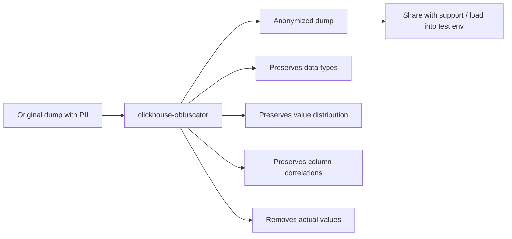

# How to Use clickhouse-obfuscator for Data Anonymization

Author: [nawazdhandala](https://www.github.com/nawazdhandala)

Tags: ClickHouse, Data Anonymization, Privacy, CLI, GDPR, Developer Tool

Description: Use clickhouse-obfuscator to anonymize ClickHouse table dumps by replacing sensitive values with statistically similar but fake data, safe for sharing with support or testing.

---

## Introduction

`clickhouse-obfuscator` is a tool that takes ClickHouse data dumps and replaces sensitive values with statistically similar but anonymized values. String columns are replaced using a trained Markov model that preserves length distribution and character patterns. Numeric columns are permuted within the same order of magnitude. The result looks like real data but contains no actual PII, making it safe to share with the ClickHouse support team or use in test environments.

## How Obfuscation Works



## Installation

`clickhouse-obfuscator` ships with ClickHouse:

```bash
which clickhouse-obfuscator
# /usr/bin/clickhouse-obfuscator

# Or via unified binary
clickhouse obfuscator --help
```

## Basic Workflow

**Step 1: Export a table dump**

```bash
clickhouse-client \
    --query "SELECT * FROM orders FORMAT Native" \
    > /tmp/orders.native
```

**Step 2: Obfuscate the dump**

```bash
clickhouse-obfuscator \
    --input-format Native \
    --output-format Native \
    --seed 'my_secret_seed_value' \
    < /tmp/orders.native \
    > /tmp/orders_obfuscated.native
```

**Step 3: Load into a test server**

```bash
clickhouse-client \
    --query "INSERT INTO orders FORMAT Native" \
    < /tmp/orders_obfuscated.native
```

## Obfuscating Multiple Tables

```bash
for table in orders customers events; do
    clickhouse-client \
        --query "SELECT * FROM $table FORMAT Native" \
        > /tmp/${table}.native

    clickhouse-obfuscator \
        --input-format Native \
        --output-format Native \
        --seed 'my_secret_seed_value' \
        < /tmp/${table}.native \
        > /tmp/${table}_obfuscated.native

    echo "Obfuscated $table"
done
```

## Obfuscating TSV Data

```bash
# Export as TSV
clickhouse-client \
    --query "
        SELECT
            order_id,
            customer_email,
            amount,
            order_date
        FROM orders
        FORMAT TSV
    " > /tmp/orders.tsv

# Obfuscate TSV
clickhouse-obfuscator \
    --input-format TSV \
    --output-format TSV \
    --seed 'my_secret_seed_value' \
    --structure "order_id UInt64, customer_email String, amount Float64, order_date Date" \
    < /tmp/orders.tsv \
    > /tmp/orders_obfuscated.tsv
```

## Key Obfuscation Behaviors

| Column Type | Obfuscation Behavior |
|---|---|
| `String` | Markov-model-generated string preserving length distribution and character patterns |
| `UInt*` / `Int*` | Pseudorandom permutation within the same order of magnitude (log2 class); 0 and 1 are preserved |
| `Float*` | Mantissa is permuted while sign and exponent (magnitude) are preserved |
| `Date` | Passed through unchanged (not obfuscated) |
| `DateTime` | Date part is preserved as-is; time-of-day component is permuted |
| `FixedString(N)` | N-byte string with word characters (alphanumeric, underscore) preserved in their class |
| `UUID` | Pseudorandom UUID preserving version and variant bits |

## Preserving Seed Consistency

Use the same `--seed` value to produce the same obfuscated output from the same input. The seed must be an arbitrary string of at least 10 bytes. This ensures that if you share an obfuscated dump and a colleague re-runs obfuscation, they get the same results:

```bash
clickhouse-obfuscator \
    --seed 'my_secret_seed_value' \
    --input-format Native \
    --output-format Native \
    < orders.native \
    > orders_anon.native
```

## Obfuscating Specific Columns Only

The obfuscator transforms all columns in its input — there is no flag to skip specific columns. To keep some columns unchanged, export and obfuscate only the sensitive columns, then join them back:

```bash
# Export only sensitive columns
clickhouse-client \
    --query "SELECT customer_email, customer_phone FROM orders FORMAT TSV" \
    > /tmp/sensitive.tsv

# Obfuscate the sensitive columns
clickhouse-obfuscator \
    --input-format TSV \
    --output-format TSV \
    --seed 'my_secret_seed_value' \
    --structure "customer_email String, customer_phone String" \
    < /tmp/sensitive.tsv \
    > /tmp/sensitive_obfuscated.tsv

# Export non-sensitive columns separately
clickhouse-client \
    --query "SELECT order_id FROM orders FORMAT TSV" \
    > /tmp/nonsensitive.tsv

# Combine using paste
paste /tmp/nonsensitive.tsv /tmp/sensitive_obfuscated.tsv > /tmp/orders_combined.tsv
```

## Verifying Obfuscation

Check that emails no longer appear in the output:

```bash
clickhouse-client \
    --query "SELECT customer_email FROM orders FORMAT TSV" \
    > /tmp/original_emails.txt

clickhouse-obfuscator \
    --input-format TSV \
    --output-format TSV \
    --seed 'my_secret_seed_value' \
    --structure "customer_email String" \
    < /tmp/original_emails.txt \
    > /tmp/obfuscated_emails.txt

# Verify no original email appears in the obfuscated output
grep -f /tmp/original_emails.txt /tmp/obfuscated_emails.txt | wc -l
# Expected: 0
```

## GDPR Use Cases

- **Test environment seeding**: populate a staging ClickHouse with production-scale data shapes without PII.
- **Support tickets**: share reproducible data dumps with the ClickHouse team without exposing customer data.
- **Developer datasets**: give developers a realistic dataset that matches production cardinality and distribution.

## Summary

`clickhouse-obfuscator` takes ClickHouse data in Native or TSV format and produces an anonymized version where string values are replaced using a trained Markov model, numeric values are permuted within the same order of magnitude, and DateTime time-of-day components are permuted (note that Date values pass through unchanged). The statistical shape of the data is preserved but actual values are replaced. Use it to safely share data with support teams, create test datasets from production dumps, and comply with data minimization requirements.
