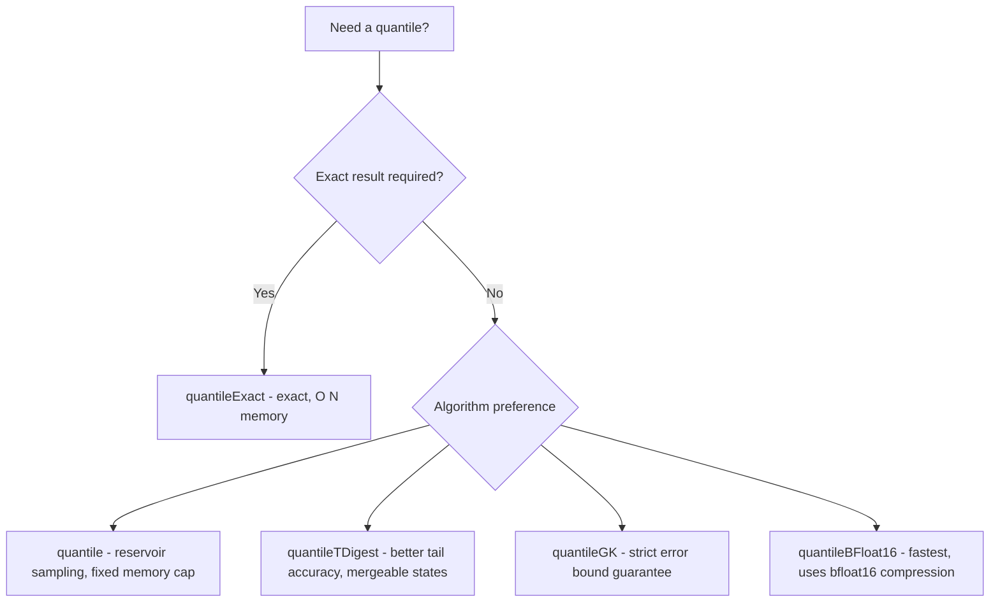

# How to Use quantileApprox() in ClickHouse

Author: [nawazdhandala](https://www.github.com/nawazdhandala)

Tags: ClickHouse, SQL, Aggregate Function, Quantile, Statistics

Description: Learn how to use quantileApprox() in ClickHouse to compute fast approximate quantiles using reservoir sampling, with configurable sample size for accuracy control.

---

`quantile(level)(expr)` computes approximate quantiles using reservoir sampling with a reservoir size of up to 8192. It maintains a random sample of the data and computes the quantile from that sample, making it memory-bounded and fast for interactive queries on very large tables. The result is non-deterministic. This is distinct from the GK and T-Digest algorithms: reservoir sampling is simple, predictable in memory, and well-suited for exploratory analysis.

## Syntax

```sql
-- Basic usage: approximate quantile using reservoir sampling
SELECT quantile(level)(expr) FROM table_name;

-- level is a Float64 from 0 to 1 (recommended range: 0.01 to 0.99, default: 0.5)
-- The reservoir size is fixed at 8192 internally
```

## Basic Example

```sql
-- Approximate p95 latency - fast and memory efficient
SELECT quantile(0.95)(response_time_ms) AS approx_p95_ms
FROM request_logs
WHERE log_date = today();
```

## Reservoir Sampling Details

The `quantile` function uses a fixed reservoir size of up to 8192 internally. There is no configurable accuracy parameter. If you need control over approximation accuracy, consider `quantileGK(accuracy, level)(expr)` which offers a strict error bound, or `quantileDD(relative_accuracy, level)(expr)` which uses the DDSketch algorithm.

```sql
-- Compare approximate vs exact quantile
SELECT
    quantile(0.95)(response_time_ms)      AS p95_approx,
    quantileExact(0.95)(response_time_ms) AS p95_exact,
    count()                               AS total_rows
FROM request_logs
WHERE log_date = today();
```

## Multiple Quantiles in One Query

```sql
SELECT
    service_name,
    quantile(0.50)(response_time_ms) AS approx_p50,
    quantile(0.75)(response_time_ms) AS approx_p75,
    quantile(0.90)(response_time_ms) AS approx_p90,
    quantile(0.95)(response_time_ms) AS approx_p95,
    quantile(0.99)(response_time_ms) AS approx_p99,
    count()                          AS total_requests
FROM request_logs
WHERE log_date >= today() - 7
GROUP BY service_name
ORDER BY approx_p95 DESC;
```

## Choosing Between Approximate Quantile Functions



## Hourly Percentile Trends

```sql
-- Hourly p95 and p99 for dashboards using fast approximate function
SELECT
    toStartOfHour(timestamp) AS hour,
    service_name,
    quantile(0.95)(response_time_ms) AS p95_ms,
    quantile(0.99)(response_time_ms) AS p99_ms,
    count() AS request_count
FROM request_logs
WHERE timestamp >= now() - INTERVAL 48 HOUR
GROUP BY hour, service_name
ORDER BY hour DESC;
```

## Comparing Response Time Distributions Across Regions

```sql
SELECT
    region,
    quantile(0.50)(response_time_ms) AS median_ms,
    quantile(0.95)(response_time_ms) AS p95_ms,
    quantile(0.99)(response_time_ms) AS p99_ms,
    count() AS requests
FROM request_logs
WHERE log_date >= today() - 14
GROUP BY region
ORDER BY p95_ms DESC;
```

## Incremental Aggregation with -State and -Merge

```sql
CREATE TABLE hourly_approx_quantiles
(
    stat_hour  DateTime,
    service    String,
    p95_state  AggregateFunction(quantile(0.95), Float64),
    p99_state  AggregateFunction(quantile(0.99), Float64)
)
ENGINE = AggregatingMergeTree()
ORDER BY (stat_hour, service);

CREATE MATERIALIZED VIEW mv_hourly_approx_quantiles
TO hourly_approx_quantiles
AS
SELECT
    toStartOfHour(timestamp)                              AS stat_hour,
    service_name                                          AS service,
    quantileState(0.95)(toFloat64(response_time_ms))     AS p95_state,
    quantileState(0.99)(toFloat64(response_time_ms))     AS p99_state
FROM request_logs
GROUP BY stat_hour, service;

-- Query merged percentiles
SELECT
    stat_hour,
    service,
    quantileMerge(0.95)(p95_state) AS p95_ms,
    quantileMerge(0.99)(p99_state) AS p99_ms
FROM hourly_approx_quantiles
WHERE stat_hour >= now() - INTERVAL 24 HOUR
GROUP BY stat_hour, service
ORDER BY stat_hour DESC;
```

## Error Estimation

```sql
-- Measure how far quantile deviates from exact on a sample
SELECT
    quantile(0.99)(response_time_ms)                         AS approx_p99,
    quantileExact(0.99)(response_time_ms)                    AS exact_p99,
    abs(quantile(0.99)(response_time_ms)
        - quantileExact(0.99)(response_time_ms))             AS abs_error_ms,
    count()                                                  AS n
FROM request_logs
WHERE log_date = today();
```

## Summary

`quantile(level)(expr)` computes approximate quantiles using reservoir sampling with a fixed reservoir of up to 8192 samples. It is memory-bounded and predictable, making it suitable for exploratory analysis and dashboard queries where a best-effort approximation is acceptable. The result is non-deterministic. For strict error guarantees, use `quantileGK`; for better tail accuracy, use `quantileTDigest`; for exact results regardless of memory, use `quantileExact`. All quantile functions in ClickHouse support the `-State` and `-Merge` suffix pattern for materialized view incremental aggregation.
