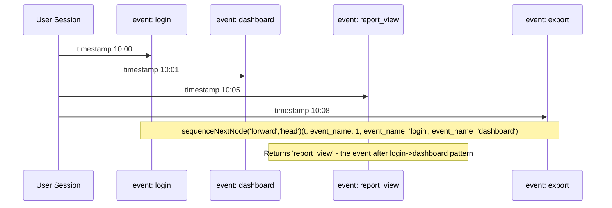

# How to Use sequenceNextNode() in ClickHouse

Author: [nawazdhandala](https://www.github.com/nawazdhandala)

Tags: ClickHouse, SQL, Aggregate Function, Sequence Analysis, User Behavior

Description: Learn how to use sequenceNextNode() in ClickHouse to find the next event a user visits after matching a sequence pattern, enabling path analysis and funnel drop-off investigation.

---

`sequenceNextNode()` is a powerful aggregate function for path analysis. Given a sequence of user events ordered by time, it finds the first event that occurs after a specified pattern match, telling you what users did next. This is invaluable for funnel analysis, drop-off investigation, and understanding what paths users take after a key action.

Note: This function is experimental. You must enable it before use:

```sql
SET allow_experimental_funnel_functions = 1;
```

## Syntax

```sql
sequenceNextNode(direction, base)(timestamp, event_column, base_condition, event1, event2, ...)
```

Parameters:
- `direction`: `'forward'` (look for next event after pattern) or `'backward'` (look for previous event before pattern)
- `base`: `'head'` (pattern starts at first event), `'tail'` (pattern starts at last event), or `'first_match'` / `'last_match'`
- `timestamp`: the time column (must be sortable)
- `event_column`: the column whose value the function returns (must be `String` or `Nullable(String)`)
- `base_condition`: a condition the base point event must satisfy
- `event1...N`: conditions that define the sequence to match, in order

## Basic Example: What Do Users Do After Login?

```sql
-- Find the next page users visit after a successful login
SELECT
    user_id,
    sequenceNextNode('forward', 'first_match')(
        event_time,
        event_name,                         -- column whose value is returned
        1,                                  -- base_condition: any event qualifies
        event_name = 'login_success'        -- pattern: match login event
    ) AS next_page_after_login
FROM user_events
WHERE event_date >= today() - 7
GROUP BY user_id;
```

## Funnel Drop-off: What Happens After Users Reach the Cart?

```sql
-- What do users do after adding to cart but NOT checking out?
SELECT
    next_event,
    count() AS user_count
FROM (
    SELECT
        user_id,
        sequenceNextNode('forward', 'first_match')(
            event_time,
            event_name,
            1,
            event_name = 'add_to_cart'
        ) AS next_event
    FROM user_events
    WHERE event_date >= today() - 30
    GROUP BY user_id
    HAVING countIf(event_name = 'checkout_complete') = 0  -- users who did NOT convert
)
WHERE next_event IS NOT NULL
GROUP BY next_event
ORDER BY user_count DESC
LIMIT 20;
```

## Multi-Step Pattern: Next Action After a Two-Step Sequence

```sql
-- Users who viewed a product then added to cart - what did they do next?
SELECT
    next_event,
    count() AS user_count
FROM (
    SELECT
        user_id,
        sequenceNextNode('forward', 'first_match')(
            event_time,
            event_name,
            1,
            event_name = 'product_view',
            event_name = 'add_to_cart'
        ) AS next_event
    FROM user_events
    WHERE event_date >= today() - 30
    GROUP BY user_id
)
WHERE next_event IS NOT NULL
GROUP BY next_event
ORDER BY user_count DESC;
```

## Using 'backward' Direction: What Led to an Error?

```sql
-- What did users do immediately before encountering an error?
SELECT
    prev_event,
    count() AS occurrence_count
FROM (
    SELECT
        user_id,
        sequenceNextNode('backward', 'last_match')(
            event_time,
            event_name,
            1,
            event_name = 'error_page'
        ) AS prev_event
    FROM user_events
    WHERE event_date >= today() - 7
    GROUP BY user_id
    HAVING countIf(event_name = 'error_page') > 0
)
WHERE prev_event IS NOT NULL
GROUP BY prev_event
ORDER BY occurrence_count DESC
LIMIT 15;
```

## Path Analysis: What Do Users Do After Visiting a Specific Page?

```sql
-- Find the most common next events after visiting the homepage
SELECT
    next_event,
    count() AS transitions
FROM (
    SELECT
        user_id,
        sequenceNextNode('forward', 'first_match')(
            event_time,
            event_name,
            1,
            event_name = 'homepage'
        ) AS next_event
    FROM user_events
    WHERE event_date >= today() - 30
    GROUP BY user_id
)
WHERE next_event IS NOT NULL
GROUP BY next_event
ORDER BY transitions DESC;
```

## Workflow Diagram



## Comparing Paths Across User Segments

```sql
-- Compare what premium vs free users do after viewing pricing page
SELECT
    user_tier,
    next_event,
    count() AS user_count
FROM (
    SELECT
        u.user_tier,
        sequenceNextNode('forward', 'first_match')(
            e.event_time,
            e.event_name,
            1,
            e.event_name = 'pricing_page_view'
        ) AS next_event
    FROM user_events e
    JOIN users u USING (user_id)
    WHERE e.event_date >= today() - 30
    GROUP BY u.user_tier, e.user_id
)
WHERE next_event IS NOT NULL
GROUP BY user_tier, next_event
ORDER BY user_tier, user_count DESC;
```

## Summary

`sequenceNextNode()` returns the value of the specified event column at the position immediately after (or before, with `backward` direction) a matched multi-step pattern in a user's event stream. It is ideal for path analysis, funnel drop-off investigation, and understanding what users do after key events. The `forward`/`backward` direction and `head`/`tail`/`first_match`/`last_match` base parameter give flexible control over which end of the session the pattern anchors to. Combine it with `GROUP BY user_id` and aggregate over result values to understand population-level behavior after key events.
