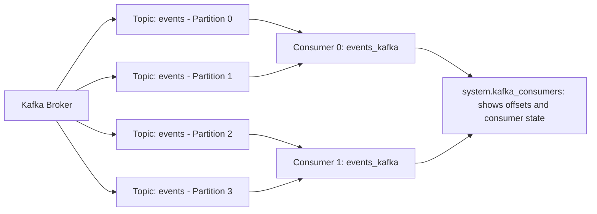

# How to Use system.kafka_consumers in ClickHouse

Author: [nawazdhandala](https://www.github.com/nawazdhandala)

Tags: ClickHouse, System, Kafka, Consumer, Monitoring

Description: Learn how to use system.kafka_consumers in ClickHouse to monitor Kafka engine consumer state, track partition offsets, and diagnose consumer lag and errors.

---

`system.kafka_consumers` provides a real-time view into the state of all active Kafka engine consumers in ClickHouse. When you create a table using the `Kafka` engine, ClickHouse creates one or more consumer threads that continuously read from Kafka topics. This table shows each consumer's current partition assignments, offsets, lag, and error state.

## Prerequisites: Kafka Engine Table

```sql
CREATE TABLE events_kafka
(
    ts         DateTime,
    user_id    UInt64,
    event_type String,
    payload    String
)
ENGINE = Kafka
SETTINGS
    kafka_broker_list = 'kafka:9092',
    kafka_topic_list  = 'events',
    kafka_group_name  = 'clickhouse_events_consumer',
    kafka_format      = 'JSONEachRow',
    kafka_num_consumers = 4;
```

## Key Columns

| Column | Type | Description |
|--------|------|-------------|
| `database` | String | Database of the Kafka table |
| `table` | String | Kafka table name |
| `consumer_id` | String | Unique consumer instance identifier |
| `assignments.topic` | Array(String) | Assigned Kafka topics |
| `assignments.partition_id` | Array(Int32) | Assigned partition numbers |
| `assignments.current_offset` | Array(Int64) | Current committed offset per partition |
| `assignments.intent_size` | Array(Nullable(Int64)) | Messages pushed but not yet committed |
| `exceptions.time` | Array(DateTime) | Timestamps of the 10 most recent errors |
| `exceptions.text` | Array(String) | Messages of the 10 most recent errors |
| `num_messages_read` | UInt64 | Total messages read by this consumer |
| `num_commits` | UInt64 | Total number of commits by this consumer |
| `last_poll_time` | DateTime | Most recent polling timestamp |
| `last_commit_time` | DateTime | Most recent commit timestamp |
| `rdkafka_stat` | String | Internal librdkafka statistics as JSON |

## Viewing Active Consumers

```sql
SELECT
    database,
    table,
    consumer_id,
    length(assignments.topic)            AS assigned_partitions,
    arraySum(assignments.current_offset) AS total_current_offset,
    num_messages_read,
    exceptions.time[-1]                  AS last_exception_time,
    exceptions.text[-1]                  AS last_exception
FROM system.kafka_consumers
WHERE table = 'events_kafka'
ORDER BY consumer_id;
```

## Viewing Current Offsets Per Partition

`system.kafka_consumers` exposes `current_offset` per partition but does not provide end-of-partition offsets directly. To view current offsets per partition:

```sql
SELECT
    table,
    consumer_id,
    t.1 AS partition,
    t.2 AS current_offset
FROM system.kafka_consumers
ARRAY JOIN
    arrayZip(
        assignments.partition_id,
        assignments.current_offset
    ) AS t
WHERE table = 'events_kafka'
ORDER BY partition;
```

Per-partition consumer lag is available in the `rdkafka_stat` JSON column, which contains internal librdkafka statistics including `consumer_lag` for each partition:

```sql
SELECT
    consumer_id,
    JSONExtractInt(partition_stat, 'consumer_lag') AS lag,
    JSONExtractInt(partition_stat, 'partition')    AS partition
FROM system.kafka_consumers
ARRAY JOIN
    JSONExtractArrayRaw(
        JSONExtractRaw(
            JSONExtractRaw(rdkafka_stat, 'topics'),
            'events'
        ),
        'partitions'
    ) AS partition_stat
WHERE table = 'events_kafka'
ORDER BY lag DESC;
```

## Consumer Architecture



## Detecting Consumers with Errors

Exceptions are stored as arrays (up to the 10 most recent). Use array indexing to access the latest exception:

```sql
SELECT
    table,
    consumer_id,
    exceptions.time[-1]  AS last_exception_time,
    exceptions.text[-1]  AS last_exception
FROM system.kafka_consumers
WHERE length(exceptions.text) > 0
  AND exceptions.time[-1] > now() - INTERVAL 1 HOUR
ORDER BY last_exception_time DESC;
```

## Total Messages and Commits Across All Consumers

```sql
SELECT
    table,
    count()                AS consumer_count,
    sum(num_messages_read) AS total_messages_read,
    sum(num_commits)       AS total_commits
FROM system.kafka_consumers
WHERE database = currentDatabase()
GROUP BY table
ORDER BY total_messages_read DESC;
```

## Messages Read per Consumer

```sql
SELECT
    consumer_id,
    num_messages_read
FROM system.kafka_consumers
WHERE table = 'events_kafka'
ORDER BY num_messages_read DESC;
```

An imbalanced distribution (some consumers reading far more than others) indicates uneven partition assignment or a hotspot partition.

## Checking Partition Assignment Balance

```sql
SELECT
    consumer_id,
    length(assignments.partition_id) AS partitions_assigned
FROM system.kafka_consumers
WHERE table = 'events_kafka'
ORDER BY consumer_id;
```

For `kafka_num_consumers = 4` and 8 partitions, each consumer should have 2 partitions. If assignment is uneven, it may indicate a rebalance is in progress.

## Monitoring Consumer Activity Over Time

Create a table to track consumer activity snapshots:

```sql
CREATE TABLE kafka_consumer_activity_history
(
    ts                DateTime DEFAULT now(),
    table_name        String,
    consumer_id       String,
    num_messages_read UInt64,
    num_commits       UInt64
)
ENGINE = MergeTree()
ORDER BY (table_name, consumer_id, ts)
TTL ts + INTERVAL 7 DAY;

-- Periodically insert activity snapshots via a scheduled query or external script
INSERT INTO kafka_consumer_activity_history
SELECT
    now(),
    table,
    consumer_id,
    num_messages_read,
    num_commits
FROM system.kafka_consumers
WHERE database = currentDatabase();
```

## Summary

`system.kafka_consumers` is the primary tool for monitoring Kafka engine consumer health in ClickHouse. Use it to check partition assignments, detect consumers with errors, view message throughput, and verify balanced load distribution across consumer threads. Per-partition consumer lag is available through the `rdkafka_stat` JSON column. Track consumer activity over time by periodically snapshotting this view into a history table, enabling alerting when throughput drops or errors accumulate.
