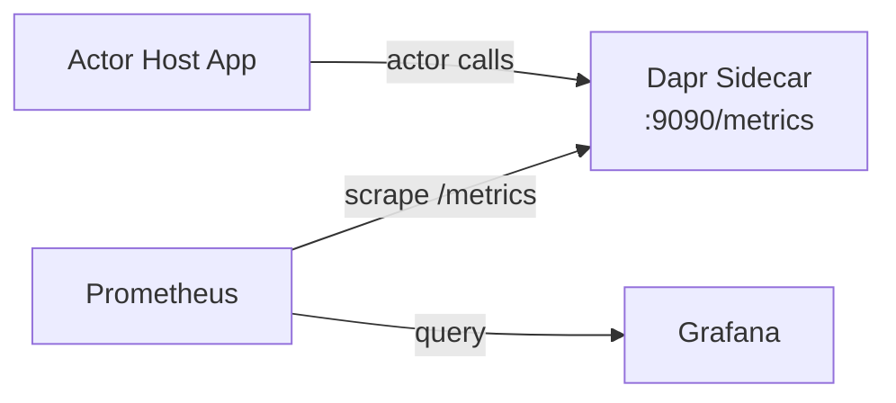

# How to Monitor Dapr Actor Metrics and Runtime State

Author: [nawazdhandala](https://www.github.com/nawazdhandala)

Tags: Dapr, Actor, Metric, Monitoring, Prometheus

Description: Monitor Dapr virtual actor runtime state, active actor counts, method call rates, and timer metrics using Prometheus and the Dapr metadata API.

---

## Overview

Dapr emits Prometheus metrics for actor runtime operations including pending actor calls, reminders, timers, deactivation counts, and rebalance operations. You can also query the Dapr metadata API to inspect which actors are currently active on a sidecar.

## Actor Metrics Architecture



## Step 1: Enable Dapr Metrics

Enable metrics on the sidecar:

```bash
# Self-hosted
dapr run \
  --app-id actor-host \
  --app-port 6001 \
  --app-protocol grpc \
  --metrics-port 9090 \
  -- go run main.go
```

On Kubernetes, metrics are enabled by default on port `9090`. Add Prometheus annotations to scrape:

```yaml
# k8s/deployment.yaml
metadata:
  annotations:
    dapr.io/enabled: "true"
    dapr.io/app-id: "order-actor-host"
    dapr.io/app-port: "6001"
    dapr.io/app-protocol: "grpc"
    prometheus.io/scrape: "true"
    prometheus.io/port: "9090"
    prometheus.io/path: "/metrics"
```

## Step 2: Key Actor Prometheus Metrics

### Pending Actor Calls

```promql
# Number of pending actor calls by type
dapr_runtime_actor_pending_actor_calls{app_id="order-actor-host", actor_type="OrderActor"}
```

### Actor Deactivation and Rebalance Rate

```promql
# Rate of actor deactivations per second
rate(dapr_runtime_actor_deactivated_total{app_id="order-actor-host"}[1m])

# Rate of actor rebalance operations
rate(dapr_runtime_actor_rebalanced_total{app_id="order-actor-host"}[1m])
```

### Actor Operation Failures

```promql
# Failed actor deactivation rate
rate(dapr_runtime_actor_deactivated_failed_total{app_id="order-actor-host"}[1m])

# Failed reminder fire rate
rate(dapr_runtime_actor_reminders_fired_total{app_id="order-actor-host", success="false"}[1m])

# Failed timer fire rate
rate(dapr_runtime_actor_timers_fired_total{app_id="order-actor-host", success="false"}[1m])
```

### Actor Timer and Reminder Metrics

```promql
# Active reminders (gauge)
dapr_runtime_actor_reminders{app_id="order-actor-host", actor_type="OrderActor"}

# Active timers (gauge)
dapr_runtime_actor_timers{app_id="order-actor-host", actor_type="OrderActor"}

# Timer fired rate
rate(dapr_runtime_actor_timers_fired_total{app_id="order-actor-host"}[1m])

# Reminder fired rate
rate(dapr_runtime_actor_reminders_fired_total{app_id="order-actor-host"}[1m])
```

### Actor Status Report Operations

```promql
# Status report rate
rate(dapr_runtime_actor_status_report_total{app_id="order-actor-host"}[1m])

# Status report failure rate
rate(dapr_runtime_actor_status_report_fail_total{app_id="order-actor-host"}[1m])
```

## Step 3: Full Metrics Reference

| Metric | Type | Description |
|---|---|---|
| `dapr_runtime_actor_pending_actor_calls` | Gauge | Pending actor calls |
| `dapr_runtime_actor_timers` | Gauge | Active timer count |
| `dapr_runtime_actor_reminders` | Gauge | Active reminder count |
| `dapr_runtime_actor_timers_fired_total` | Counter | Timer fire count |
| `dapr_runtime_actor_reminders_fired_total` | Counter | Reminder fire count |
| `dapr_runtime_actor_deactivated_total` | Counter | Actor deactivation count |
| `dapr_runtime_actor_deactivated_failed_total` | Counter | Failed actor deactivation count |
| `dapr_runtime_actor_rebalanced_total` | Counter | Actor rebalance count |
| `dapr_runtime_actor_status_report_total` | Counter | Status report operation count |
| `dapr_runtime_actor_status_report_fail_total` | Counter | Failed status report count |

## Step 4: Query Dapr Metadata API for Active Actors

The Dapr metadata API exposes the list of actor types registered on a sidecar and their configuration:

```bash
curl http://localhost:3500/v1.0/metadata
```

Example response:

```json
{
  "id": "order-actor-host",
  "actors": [
    {
      "type": "OrderActor",
      "count": 12
    },
    {
      "type": "InventoryActor",
      "count": 5
    }
  ],
  "components": [...],
  "appConnectionProperties": {
    "port": 6001,
    "protocol": "grpc",
    "maxConcurrency": -1
  }
}
```

Poll this endpoint to track active actor counts outside Prometheus:

```bash
# Watch actor counts every 5 seconds
watch -n 5 "curl -s http://localhost:3500/v1.0/metadata | jq '.actors'"
```

## Step 5: Grafana Dashboard

Create panels for actor monitoring:

```yaml
# Example Grafana panel JSON snippet
panels:
  - title: "Pending Actor Calls by Type"
    type: stat
    targets:
      - expr: "sum by (actor_type) (dapr_runtime_actor_pending_actor_calls)"
        legendFormat: "{{actor_type}}"

  - title: "Actor Deactivation Rate"
    type: graph
    targets:
      - expr: "sum(rate(dapr_runtime_actor_deactivated_total[1m])) by (actor_type)"
        legendFormat: "{{actor_type}}"

  - title: "Reminder and Timer Fire Rate"
    type: graph
    targets:
      - expr: "sum(rate(dapr_runtime_actor_reminders_fired_total[1m])) by (actor_type)"
        legendFormat: "reminders {{actor_type}}"
      - expr: "sum(rate(dapr_runtime_actor_timers_fired_total[1m])) by (actor_type)"
        legendFormat: "timers {{actor_type}}"
```

## Step 6: Prometheus Scrape Configuration

```yaml
# prometheus.yml
scrape_configs:
  - job_name: 'dapr-actor-sidecar'
    kubernetes_sd_configs:
      - role: pod
    relabel_configs:
      - source_labels: [__meta_kubernetes_pod_annotation_prometheus_io_scrape]
        action: keep
        regex: "true"
      - source_labels: [__address__, __meta_kubernetes_pod_annotation_prometheus_io_port]
        action: replace
        target_label: __address__
        regex: ([^:]+)(?::\d+)?;(\d+)
        replacement: $1:$2
      - source_labels: [__meta_kubernetes_pod_label_app]
        target_label: app
```

## Step 7: Alerting Rules

```yaml
# alert-rules.yaml
groups:
  - name: dapr-actor-alerts
    rules:
      - alert: HighActorDeactivationFailureRate
        expr: |
          rate(dapr_runtime_actor_deactivated_failed_total[5m]) > 0.1
        for: 2m
        labels:
          severity: warning
        annotations:
          summary: "Dapr actor deactivation failure rate is high"
          description: "Actor {{ $labels.actor_type }} deactivation failure rate > 0.1/s for 2 minutes"

      - alert: HighReminderFireFailureRate
        expr: |
          rate(dapr_runtime_actor_reminders_fired_total{success="false"}[5m]) > 0.1
        for: 5m
        labels:
          severity: critical
        annotations:
          summary: "Actor reminder fire failure rate is high"
          description: "Actor {{ $labels.actor_type }} reminder failures > 0.1/s for 5 minutes"
```

## Summary

Dapr actor metrics are exposed on the sidecar's `/metrics` endpoint (port `9090` by default) and include pending actor calls, timer and reminder gauges, fire counts, deactivation rates, and rebalance operations. The `/v1.0/metadata` API provides a real-time view of active actor types and counts. Use Prometheus to scrape these metrics, Grafana to visualise them, and alerting rules to detect failure rate spikes.
