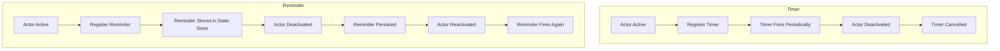
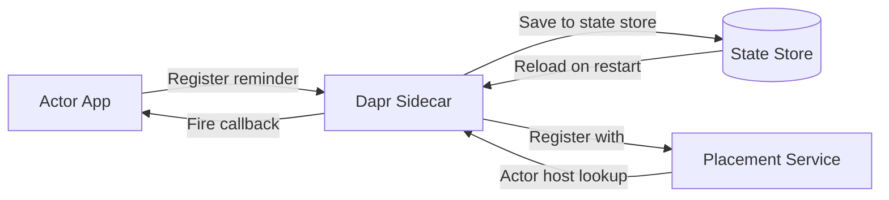

# How to Use Dapr Actor Reminders for Persistent Scheduled Tasks

Author: [nawazdhandala](https://www.github.com/nawazdhandala)

Tags: Dapr, Actor, Reminder, Scheduling, Persistence

Description: Learn how to use Dapr actor reminders to create persistent scheduled tasks that survive actor deactivation and application restarts, with configuration examples.

---

## Introduction

Dapr actor reminders are persistent, durable scheduled callbacks associated with an actor. Unlike timers, reminders are stored in the actor's state store and survive actor deactivation, host failures, and application restarts. When an actor with a pending reminder is reactivated, the reminder fires as soon as the actor comes back online.

Reminders are ideal for:

- Subscription renewal notifications
- Scheduled billing or invoicing
- Deferred processing of business events
- Any task that must happen even if the actor was inactive

## How Reminders Differ from Timers



## Prerequisites

- Dapr initialized locally or on Kubernetes
- State store component with `actorStateStore: "true"`
- An actor application running with Dapr sidecar

## Registering a Reminder

### Via HTTP API

```bash
curl -X POST \
  http://localhost:3500/v1.0/actors/SubscriptionActor/sub-001/reminders/renewalAlert \
  -H "Content-Type: application/json" \
  -d '{
    "dueTime": "72h",
    "period": "24h",
    "data": {"planId": "pro", "userId": "user-42"},
    "ttl": "168h"
  }'
```

Parameters:
- `dueTime` - delay before the first fire (supports ISO 8601 and Go duration strings)
- `period` - interval between subsequent fires (omit for a one-shot reminder)
- `data` - arbitrary JSON payload passed to the callback
- `ttl` - optional time-to-live after which the reminder expires

### Via Go SDK

```go
package main

import (
    "context"
    "encoding/json"
    "fmt"

    dapr "github.com/dapr/go-sdk/client"
    "github.com/dapr/go-sdk/actor"
)

type SubscriptionActorImpl struct {
    actor.ServerImplBaseCtx
    daprClient dapr.Client
}

func (a *SubscriptionActorImpl) Type() string { return "SubscriptionActor" }

// Register reminder on activation
func (a *SubscriptionActorImpl) Activate(ctx context.Context) error {
    data, _ := json.Marshal(map[string]string{
        "planId": "pro",
        "userId": "user-42",
    })
    return a.daprClient.RegisterActorReminder(ctx, &dapr.RegisterActorReminderRequest{
        ActorType: "SubscriptionActor",
        ActorID:   a.ID(),
        Name:      "renewalAlert",
        DueTime:   "72h",
        Period:    "24h",
        Data:      data,
    })
}

// Reminder callback - Dapr calls ReminderCall for all reminders
func (a *SubscriptionActorImpl) ReminderCall(reminderName string, state []byte, dueTime string, period string) {
    if reminderName == "renewalAlert" {
        var payload map[string]string
        json.Unmarshal(state, &payload)
        planId := payload["planId"]
        userId := payload["userId"]
        // Send renewal notification logic
        fmt.Printf("Renewal reminder for user %s, plan %s\n", userId, planId)
    }
}
```

### Via Python SDK

```python
import json
from datetime import timedelta
from typing import Optional

from dapr.actor import Actor, Remindable, ActorInterface, actormethod

class SubscriptionActorInterface(ActorInterface):
    @actormethod(name="ReceiveReminder")
    async def receive_reminder(self, name: str, state: bytes,
                               due_time: timedelta, period: timedelta,
                               ttl: Optional[timedelta] = None) -> None: ...

class SubscriptionActor(Actor, SubscriptionActorInterface, Remindable):
    async def _on_activate(self) -> None:
        state_bytes = json.dumps({"planId": "pro", "userId": "user-42"}).encode("utf-8")
        await self.register_reminder(
            name="renewalAlert",
            state=state_bytes,
            due_time=timedelta(hours=72),
            period=timedelta(hours=24)
        )

    async def receive_reminder(self, name: str, state: bytes,
                               due_time: timedelta, period: timedelta,
                               ttl: Optional[timedelta] = None) -> None:
        if name == "renewalAlert":
            payload = json.loads(state)
            plan_id = payload.get("planId")
            user_id = payload.get("userId")
            print(f"Sending renewal notice to user {user_id} for plan {plan_id}")
```

## Handling Reminder Callbacks (HTTP, No SDK)

When using a raw HTTP server, Dapr calls the reminder as a PUT to your actor's `remind` endpoint:

```javascript
// Node.js Express
app.put('/actors/SubscriptionActor/:actorId/method/remind/:reminderName', (req, res) => {
  const { actorId, reminderName } = req.params;
  const reminderBody = req.body; // Contains data, dueTime, period
  const { data } = reminderBody;
  console.log(`Reminder '${reminderName}' fired for actor ${actorId}`, data);
  res.sendStatus(200);
});
```

## Getting a Reminder

```bash
curl http://localhost:3500/v1.0/actors/SubscriptionActor/sub-001/reminders/renewalAlert
```

Response:

```json
{
  "period": "24h",
  "dueTime": "2026-04-03T10:00:00Z",
  "data": {"planId": "pro", "userId": "user-42"}
}
```

## Deleting a Reminder

```bash
curl -X DELETE \
  http://localhost:3500/v1.0/actors/SubscriptionActor/sub-001/reminders/renewalAlert
```

Reminders can also be deleted from within the actor code using the SDK's `UnregisterActorReminder` (Go) or `unregister_reminder` (Python) methods.

## One-Shot Reminders

To create a reminder that fires only once, omit the `period` field:

```bash
curl -X POST \
  http://localhost:3500/v1.0/actors/OrderActor/order-9900/reminders/shipmentDue \
  -H "Content-Type: application/json" \
  -d '{
    "dueTime": "48h",
    "data": {"orderId": "order-9900", "courier": "FedEx"}
  }'
```

## Reminder Persistence Architecture



## Summary

Dapr actor reminders are durable, persistent scheduled callbacks that survive actor deactivation and application restarts. By storing reminder state in the backing state store, Dapr guarantees that scheduled tasks are not lost. Use reminders for critical business workflows - such as subscription renewals, deferred processing, and deadline management - where missed execution is not acceptable. For transient, non-critical scheduling, prefer the lighter-weight timer mechanism.
