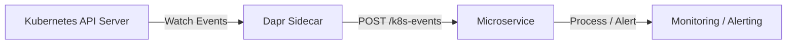

# How to Configure Dapr Binding with Kubernetes Events

Author: [nawazdhandala](https://www.github.com/nawazdhandala)

Tags: Dapr, Binding, Kubernetes, Event, Monitoring

Description: Configure the Dapr Kubernetes Events output binding to create Kubernetes events from microservices for auditing, debugging, and cluster-native operational logging.

---

## Overview

The Dapr Kubernetes Events binding is an input-only binding that watches Kubernetes Event objects in the cluster and delivers them to your application. This enables your microservices to react to cluster-native events visible via `kubectl get events`, useful for operational monitoring, auditing, debugging, and GitOps pipelines.



## Prerequisites

- Dapr running on Kubernetes
- A service account with permission to read Kubernetes events
- Dapr CLI and kubectl configured

## RBAC: Grant Event Read Permission

The Dapr sidecar needs permission to watch events in the namespace:

```yaml
# dapr-events-rbac.yaml
apiVersion: v1
kind: ServiceAccount
metadata:
  name: order-processor
  namespace: default
---
apiVersion: rbac.authorization.k8s.io/v1
kind: Role
metadata:
  name: dapr-events-reader
  namespace: default
rules:
- apiGroups: [""]
  resources: ["events"]
  verbs: ["get", "watch", "list"]
---
apiVersion: rbac.authorization.k8s.io/v1
kind: RoleBinding
metadata:
  name: dapr-events-reader-binding
  namespace: default
subjects:
- kind: ServiceAccount
  name: order-processor
  namespace: default
roleRef:
  kind: Role
  name: dapr-events-reader
  apiGroup: rbac.authorization.k8s.io
```

```bash
kubectl apply -f dapr-events-rbac.yaml
```

## Component Configuration

```yaml
# binding-k8s-events.yaml
apiVersion: dapr.io/v1alpha1
kind: Component
metadata:
  name: k8s-events
  namespace: default
spec:
  type: bindings.kubernetes
  version: v1
  metadata:
  - name: namespace
    value: "default"
  - name: resyncPeriodInSec
    value: "10"
```

Apply:

```bash
kubectl apply -f binding-k8s-events.yaml
```

## How It Works

When a Kubernetes event occurs in the watched namespace, Dapr delivers it to your application by sending a POST request to the endpoint matching the binding name (`/k8s-events`). Each event payload contains:

| Field | Description |
|-------|------------|
| `event` | The event type: `add`, `update`, or `delete` |
| `oldVal` | The previous Event object (populated for `update` and `delete`) |
| `newVal` | The new Event object (populated for `add` and `update`) |

## Event Types

| Event Type | When It Fires |
|------------|--------------|
| `add` | A new Kubernetes event is created (only `newVal` populated) |
| `update` | An existing event is updated (both `oldVal` and `newVal` populated) |
| `delete` | An event is removed (only `oldVal` populated) |

## Python Application: Event Watcher

```python
# event_watcher.py
import json
from flask import Flask, request, jsonify
from datetime import datetime

app = Flask(__name__)

@app.route('/k8s-events', methods=['POST'])
def handle_k8s_event():
    """Handle incoming Kubernetes events from the Dapr binding."""
    event_data = request.get_json()
    event_type = event_data.get('event', 'unknown')

    if event_type == 'add':
        new_val = event_data.get('newVal', {})
        reason = new_val.get('reason', 'Unknown')
        message = new_val.get('message', '')
        k8s_type = new_val.get('type', 'Normal')
        involved = new_val.get('involvedObject', {})
        obj_name = involved.get('name', 'unknown')
        obj_kind = involved.get('kind', 'unknown')

        print(f"[{k8s_type}] New event for {obj_kind}/{obj_name}: {reason} - {message}")

        # React to specific events
        if k8s_type == 'Warning':
            print(f"WARNING detected at {datetime.utcnow().isoformat()}: {message}")
            # Could trigger an alert, send a notification, etc.

    elif event_type == 'update':
        old_val = event_data.get('oldVal', {})
        new_val = event_data.get('newVal', {})
        print(f"Event updated: {new_val.get('reason', 'Unknown')} - {new_val.get('message', '')}")

    elif event_type == 'delete':
        old_val = event_data.get('oldVal', {})
        print(f"Event deleted: {old_val.get('reason', 'Unknown')} - {old_val.get('message', '')}")

    return jsonify({"status": "ok"}), 200

@app.route('/health', methods=['GET'])
def health():
    return jsonify({"status": "healthy"})

if __name__ == '__main__':
    app.run(host='0.0.0.0', port=5001)
```

## Kubernetes Deployment with Service Account

```yaml
# deployment.yaml
apiVersion: apps/v1
kind: Deployment
metadata:
  name: order-processor
  namespace: default
spec:
  replicas: 1
  selector:
    matchLabels:
      app: order-processor
  template:
    metadata:
      labels:
        app: order-processor
      annotations:
        dapr.io/enabled: "true"
        dapr.io/app-id: "order-processor"
        dapr.io/app-port: "5001"
    spec:
      serviceAccountName: order-processor
      containers:
      - name: order-processor
        image: your-registry/order-processor:latest
        ports:
        - containerPort: 5001
```

## Viewing Events

```bash
# List all events in namespace
kubectl get events -n default

# Watch events in real time
kubectl get events -n default --watch

# Filter by reason
kubectl get events -n default \
  --field-selector reason=Scheduled

# Get events for a specific pod
kubectl describe pod order-processor-abc123 -n default | grep -A 20 Events:
```

## Summary

The Dapr Kubernetes Events binding watches native Kubernetes Event objects and delivers them to your application as they occur. Configure the binding with the target namespace, grant the pod's service account permission to read events, and handle incoming `add`, `update`, or `delete` event notifications in your application code. This provides a cluster-native event stream integrated directly into your microservices without polling the Kubernetes API directly.
