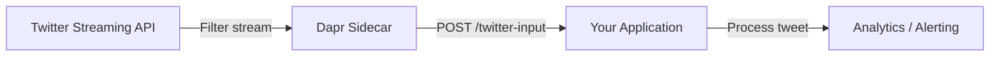

# How to Configure Dapr Binding with Twitter

Author: [nawazdhandala](https://www.github.com/nawazdhandala)

Tags: Dapr, Binding, Twitter, Social Media, Input

Description: Configure the Dapr Twitter input binding to stream real-time tweets matching search queries into your microservices for sentiment analysis, monitoring, and event-driven workflows.

---

## Deprecation Notice

The Dapr Twitter binding (`bindings.twitter`) was deprecated in Dapr v1.10 and removed in Dapr v1.11. It relies on the Twitter v1.1 API, which has been largely replaced by the v2 API. New Twitter/X developer accounts cannot access v1.1 endpoints. This guide is preserved for reference but is not usable with current versions of Dapr.

## Overview

The Dapr Twitter binding connects to the Twitter v1.1 streaming API and supports both input and output operations. The input binding delivers tweets matching a search query to your application — each matching tweet triggers a POST request to your app endpoint. The output binding supports a `get` operation for searching tweets.



## Prerequisites

- Twitter Developer account with a project and app created
- API Key, API Secret, Access Token, and Access Token Secret
- Dapr CLI installed and initialized

## Get Twitter API Credentials

1. Go to [developer.twitter.com](https://developer.twitter.com) and create a project and app.
2. Under **Keys and Tokens**, generate:
   - API Key and Secret (consumer key/secret)
   - Access Token and Secret (for your account)
3. Enable Read permissions for the app.

## Kubernetes Secret

```bash
kubectl create secret generic twitter-secret \
  --from-literal=consumerKey=YOUR_API_KEY \
  --from-literal=consumerSecret=YOUR_API_SECRET \
  --from-literal=accessToken=YOUR_ACCESS_TOKEN \
  --from-literal=accessSecret=YOUR_ACCESS_TOKEN_SECRET \
  --namespace default
```

## Component Configuration

```yaml
# binding-twitter.yaml
apiVersion: dapr.io/v1alpha1
kind: Component
metadata:
  name: twitter-input
  namespace: default
spec:
  type: bindings.twitter
  version: v1
  metadata:
  - name: consumerKey
    secretKeyRef:
      name: twitter-secret
      key: consumerKey
  - name: consumerSecret
    secretKeyRef:
      name: twitter-secret
      key: consumerSecret
  - name: accessToken
    secretKeyRef:
      name: twitter-secret
      key: accessToken
  - name: accessSecret
    secretKeyRef:
      name: twitter-secret
      key: accessSecret
  - name: query
    value: "dapr OR #daprdevs"
```

Apply:

```bash
# Self-hosted
cp binding-twitter.yaml ~/.dapr/components/

# Kubernetes
kubectl apply -f binding-twitter.yaml
```

## Handling the Input Binding

When Dapr finds a tweet matching the query, it POSTs the tweet payload to the endpoint matching the component name:

```python
# twitter_monitor.py
import json
from flask import Flask, request, jsonify

app = Flask(__name__)

@app.route('/twitter-input', methods=['POST'])
def handle_tweet():
    """Called by Dapr for each tweet matching the query."""
    raw_data = request.data.decode('utf-8')

    try:
        tweet = json.loads(raw_data)

        tweet_id = tweet.get('id_str', 'unknown')
        text = tweet.get('text', '')
        user = tweet.get('user', {}).get('screen_name', 'unknown')
        created_at = tweet.get('created_at', '')

        print(f"Tweet from @{user}: {text[:100]}")

        # Route to processing pipeline
        process_tweet(tweet_id, user, text, created_at)

        return jsonify({"status": "processed"})
    except Exception as e:
        print(f"Error processing tweet: {e}")
        return jsonify({"status": "error", "message": str(e)}), 500

def process_tweet(tweet_id: str, user: str, text: str, created_at: str):
    """Business logic for processing a tweet."""
    sentiment = analyze_sentiment(text)
    print(f"Tweet {tweet_id} sentiment: {sentiment}")

    if "outage" in text.lower() or "down" in text.lower():
        alert_on_call(user, text)

def analyze_sentiment(text: str) -> str:
    """Simple keyword-based sentiment analysis."""
    positive_words = ["great", "love", "awesome", "fantastic", "works"]
    negative_words = ["broken", "bug", "error", "crash", "outage", "down"]

    text_lower = text.lower()
    if any(w in text_lower for w in negative_words):
        return "negative"
    if any(w in text_lower for w in positive_words):
        return "positive"
    return "neutral"

def alert_on_call(user: str, text: str):
    print(f"ALERT: Possible outage mention by @{user}: {text[:100]}")

if __name__ == '__main__':
    app.run(host='0.0.0.0', port=5001)
```

## Tweet Object Structure

The tweet payload follows the Twitter v1.1 Tweet object format:

```json
{
  "id_str": "1234567890123456789",
  "text": "Just tried #daprdevs for distributed tracing - it works great!",
  "created_at": "Tue Mar 31 12:00:00 +0000 2026",
  "user": {
    "id_str": "987654321",
    "screen_name": "dev_jane",
    "name": "Jane Developer",
    "followers_count": 1500
  },
  "retweet_count": 5,
  "favorite_count": 12,
  "lang": "en",
  "entities": {
    "hashtags": [
      {"text": "daprdevs", "indices": [14, 23]}
    ],
    "urls": [],
    "user_mentions": []
  }
}
```

## Advanced Filtering in Handler

```python
@app.route('/twitter-input', methods=['POST'])
def handle_tweet():
    tweet = json.loads(request.data.decode('utf-8'))

    # Skip retweets
    if tweet.get('retweeted_status'):
        return jsonify({"status": "skipped", "reason": "retweet"})

    # Skip tweets with fewer than 100 followers
    followers = tweet.get('user', {}).get('followers_count', 0)
    if followers < 100:
        return jsonify({"status": "skipped", "reason": "low_followers"})

    text = tweet.get('text', '')
    user = tweet.get('user', {}).get('screen_name')
    print(f"High-value tweet from @{user} ({followers} followers): {text[:80]}")

    return jsonify({"status": "processed"})
```

## Starting the Application

```bash
dapr run \
  --app-id twitter-monitor \
  --app-port 5001 \
  --dapr-http-port 3500 \
  --components-path ~/.dapr/components \
  -- python twitter_monitor.py
```

## Multiple Queries

To monitor multiple separate topics, create multiple component instances with different queries:

```yaml
# binding-twitter-brand.yaml
metadata:
  name: twitter-brand
spec:
  type: bindings.twitter
  metadata:
  - name: query
    value: "\"your company name\" OR @yourhandle"
```

Each component delivers to the endpoint matching its `name` field (`/twitter-brand`).

## Summary

The Dapr Twitter binding connects to the Twitter v1.1 filtered stream and delivers matching tweets to your application endpoint. Configure the component with OAuth 1.0a credentials and a search query. The tweet payload follows the standard Twitter v1.1 object format. Note that this binding was deprecated in Dapr v1.10 and removed in Dapr v1.11 due to the Twitter v1.1 API being superseded by v2.
