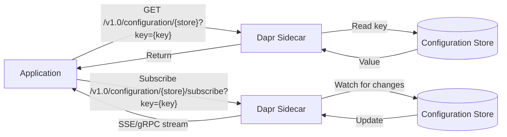

# How to Use Dapr Configuration API for Dynamic Config

Author: [nawazdhandala](https://www.github.com/nawazdhandala)

Tags: Dapr, Configuration, Dynamic Config, API, Microservice

Description: Learn how to use Dapr's Configuration API to read and subscribe to dynamic application configuration, enabling runtime config updates without application restarts.

---

## Introduction

Dapr's Configuration API provides a standardized way for applications to read configuration values from a backing configuration store and subscribe to real-time updates. Unlike static environment variables, Dapr configuration allows you to update values in the store and have your application receive those changes immediately - without redeployment.

Common use cases:
- Feature flags
- Dynamic rate limits or thresholds
- A/B testing parameters
- Per-tenant configuration

## How the Configuration API Works



## Prerequisites

- Dapr v1.11 or later (Configuration API became stable in Dapr 1.11)
- A configuration store component configured (Redis is most common)
- Dapr initialized locally or on Kubernetes

## Step 1: Configure the Configuration Store Component

Create the Dapr configuration store component:

```yaml
apiVersion: dapr.io/v1alpha1
kind: Component
metadata:
  name: configstore
  namespace: default
spec:
  type: configuration.redis
  version: v1
  metadata:
  - name: redisHost
    value: "redis-master:6379"
  - name: redisPassword
    value: ""
  - name: enableTLS
    value: "false"
```

```bash
kubectl apply -f configstore.yaml
```

## Step 2: Seed Configuration Values

Set initial configuration values in Redis:

```bash
redis-cli MSET feature-flags '{"enabled": true, "rollout": 0.5}||1' rate-limits '{"requestsPerSecond": 100}||1' app-settings '{"maintenanceMode": false, "logLevel": "info"}||1'
```

The value format for Dapr Redis configuration is: `{value}||{version}`. The key name is stored as-is.

## Step 3: Read Configuration via HTTP API

Get a single configuration item:

```bash
curl http://localhost:3500/v1.0/configuration/configstore?key=feature-flags
```

Response:

```json
{
  "items": {
    "feature-flags": {
      "value": "{\"enabled\": true, \"rollout\": 0.5}",
      "version": "1",
      "metadata": {}
    }
  }
}
```

Get multiple keys at once:

```bash
curl "http://localhost:3500/v1.0/configuration/configstore?key=feature-flags&key=rate-limits"
```

## Step 4: Read Configuration via SDK

### Go SDK

```go
package main

import (
    "context"
    "encoding/json"
    "fmt"
    "log"

    dapr "github.com/dapr/go-sdk/client"
)

type FeatureFlags struct {
    Enabled bool    `json:"enabled"`
    Rollout float64 `json:"rollout"`
}

func main() {
    client, err := dapr.NewClient()
    if err != nil {
        log.Fatal(err)
    }
    defer client.Close()

    ctx := context.Background()

    items, err := client.GetConfigurationItem(ctx, "configstore", "feature-flags")
    if err != nil {
        log.Fatal(err)
    }

    var flags FeatureFlags
    json.Unmarshal([]byte(items.Value), &flags)
    fmt.Printf("Feature enabled: %v, rollout: %.0f%%\n", flags.Enabled, flags.Rollout*100)
}
```

### Python SDK

```python
from dapr.clients import DaprClient
import json

with DaprClient() as client:
    items = client.get_configuration(
        store_name='configstore',
        keys=['feature-flags', 'rate-limits']
    )
    for key, item in items.items():
        value = json.loads(item.value)
        print(f"{key}: {value}")
```

## Step 5: Subscribe to Configuration Changes

### Via HTTP API (SSE - Server-Sent Events)

```bash
curl -N "http://localhost:3500/v1.0/configuration/configstore/subscribe?key=feature-flags"
```

The response is a streaming SSE connection that sends updates when the value changes.

### Via Go SDK

```go
func watchConfig(client dapr.Client) {
    ctx := context.Background()

    handler := func(id string, items map[string]*dapr.ConfigurationItem) {
        fmt.Printf("Config update (subscription %s): %+v\n", id, items)
    }

    subscriptionID, err := client.SubscribeConfigurationItems(ctx, "configstore",
        []string{"feature-flags", "app-settings"}, handler)
    if err != nil {
        log.Fatal(err)
    }

    fmt.Printf("Subscribed with ID: %s\n", subscriptionID)
    // Block to keep the subscription alive
    select {}
}
```

### Via Python SDK

```python
from dapr.clients import DaprClient

def config_handler(id: str, resp):
    for key, item in resp.items.items():
        print(f"Config changed (subscription {id}): {key} = {item.value}")

def watch_config():
    with DaprClient() as client:
        subscription_id = client.subscribe_configuration(
            store_name='configstore',
            keys=['feature-flags', 'app-settings'],
            handler=config_handler
        )
        print(f"Subscribed with ID: {subscription_id}")
```

## Updating Configuration

Update a value in Redis to trigger subscriptions:

```bash
redis-cli SET feature-flags '{"enabled": false, "rollout": 0}||2'
```

Subscribers will receive the updated value automatically.

## Unsubscribing

### Via HTTP API

```bash
# Get subscription ID from subscribe response, then:
curl -X GET "http://localhost:3500/v1.0/configuration/configstore/abc123/unsubscribe"
```

## Summary

Dapr's Configuration API provides a unified way to read and watch dynamic application configuration from a backing store. Configure a `configuration.redis` or other supported backend, read values via `GET /v1.0/configuration/{store}`, and subscribe to real-time updates via SSE or gRPC streaming. This eliminates the need to restart your application to pick up configuration changes, enabling features like dynamic feature flags, rate limits, and runtime tuning.
