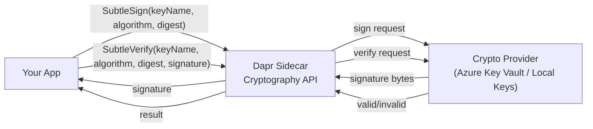

# How to Use Dapr Crypto API for Digital Signatures

Author: [nawazdhandala](https://www.github.com/nawazdhandala)

Tags: Dapr, Cryptography, Digital Signature, Security, API

Description: Use Dapr's Cryptography API to sign data and verify digital signatures using managed asymmetric keys without handling private key material in application code.

---

## Overview

Dapr's Subtle Cryptography API supports digital signature operations (sign and verify) using asymmetric key pairs stored in a crypto provider. Application code never handles the private key material. Supported algorithms include RSA-PSS, RSA-PKCS1, ECDSA, and Ed25519.

> **Note:** The sign/verify operations are part of Dapr's **Subtle Crypto** API, which is an alpha feature that requires the `subtlecrypto` build tag to be enabled on the Dapr sidecar. The subtle API operates on pre-hashed digests, not raw data — your application must hash the data before calling sign, and hash again before calling verify.

## Architecture



## Step 1: Configure a Crypto Component

### Local File-Based Keys (Development)

```yaml
# components/crypto.yaml
apiVersion: dapr.io/v1alpha1
kind: Component
metadata:
  name: localstorecrypto
  namespace: default
spec:
  type: crypto.dapr.localstorage
  version: v1
  metadata:
  - name: path
    value: "./keys"
```

Generate an ECDSA key pair for signing:

```bash
mkdir -p ./keys

# Generate EC private key (P-256 curve)
openssl ecparam -name prime256v1 -genkey -noout -out ./keys/signing-key.pem

# Generate the corresponding public key
openssl ec -in ./keys/signing-key.pem -pubout -out ./keys/signing-key.pub.pem
```

### Azure Key Vault

```yaml
# components/crypto-akv.yaml
apiVersion: dapr.io/v1alpha1
kind: Component
metadata:
  name: akvCrypto
  namespace: default
spec:
  type: crypto.azure.keyvault
  version: v1
  metadata:
  - name: vaultName
    value: "my-keyvault"
  - name: azureClientId
    secretKeyRef:
      name: azure-credentials
      key: clientId
  - name: azureClientSecret
    secretKeyRef:
      name: azure-credentials
      key: clientSecret
  - name: azureTenantId
    secretKeyRef:
      name: azure-credentials
      key: tenantId
```

## Step 2: Sign Data

> **Important:** The Dapr Go SDK and Python SDK do not currently provide high-level wrappers for the subtle crypto sign/verify operations. Use the Dapr HTTP API or gRPC client directly.

### Go (using Dapr HTTP API)

```go
package main

import (
    "bytes"
    "crypto/sha256"
    "encoding/base64"
    "encoding/json"
    "fmt"
    "io"
    "log"
    "net/http"
)

const daprPort = "3500"

type SignRequest struct {
    KeyName   string `json:"keyName"`
    Algorithm string `json:"algorithm"`
    Digest    string `json:"digest"`
}

type SignResponse struct {
    Signature string `json:"signature"`
}

type VerifyRequest struct {
    KeyName   string `json:"keyName"`
    Algorithm string `json:"algorithm"`
    Digest    string `json:"digest"`
    Signature string `json:"signature"`
}

type VerifyResponse struct {
    Valid bool `json:"valid"`
}

func main() {
    payload := []byte(`{"orderId":"order-1","amount":99.95,"timestamp":"2026-03-31T10:00:00Z"}`)

    // Hash the payload first — the subtle API operates on digests
    digest := sha256.Sum256(payload)
    digestB64 := base64.StdEncoding.EncodeToString(digest[:])

    // Sign the digest using the ECDSA key
    signReq := SignRequest{
        KeyName:   "signing-key",
        Algorithm: "ES256",
        Digest:    digestB64,
    }
    signBody, _ := json.Marshal(signReq)

    resp, err := http.Post(
        fmt.Sprintf("http://localhost:%s/v1.0-alpha1/subtlecrypto/localstorecrypto/sign", daprPort),
        "application/json",
        bytes.NewReader(signBody),
    )
    if err != nil {
        log.Fatalf("Sign failed: %v", err)
    }
    defer resp.Body.Close()
    respBody, _ := io.ReadAll(resp.Body)

    var signResp SignResponse
    json.Unmarshal(respBody, &signResp)
    fmt.Printf("Signature (base64): %s\n", signResp.Signature)

    // Verify the signature
    verifyReq := VerifyRequest{
        KeyName:   "signing-key",
        Algorithm: "ES256",
        Digest:    digestB64,
        Signature: signResp.Signature,
    }
    verifyBody, _ := json.Marshal(verifyReq)

    resp2, err := http.Post(
        fmt.Sprintf("http://localhost:%s/v1.0-alpha1/subtlecrypto/localstorecrypto/verify", daprPort),
        "application/json",
        bytes.NewReader(verifyBody),
    )
    if err != nil {
        log.Fatalf("Verify call failed: %v", err)
    }
    defer resp2.Body.Close()
    respBody2, _ := io.ReadAll(resp2.Body)

    var verifyResp VerifyResponse
    json.Unmarshal(respBody2, &verifyResp)

    if verifyResp.Valid {
        fmt.Println("Signature is VALID")
    } else {
        fmt.Println("Signature is INVALID")
    }
}
```

### Python (using Dapr HTTP API)

```python
import hashlib
import base64
import json
import requests

DAPR_PORT = "3500"
BASE_URL = f"http://localhost:{DAPR_PORT}/v1.0-alpha1/subtlecrypto/localstorecrypto"

payload = b'{"orderId":"order-1","amount":99.95}'

# Hash the payload — the subtle API operates on digests
digest = hashlib.sha256(payload).digest()
digest_b64 = base64.b64encode(digest).decode()

# Sign
sign_resp = requests.post(
    f"{BASE_URL}/sign",
    json={
        "keyName": "signing-key",
        "algorithm": "ES256",
        "digest": digest_b64,
    },
)
signature = sign_resp.json()["signature"]
print(f"Signature: {signature}")

# Verify
verify_resp = requests.post(
    f"{BASE_URL}/verify",
    json={
        "keyName": "signing-key",
        "algorithm": "ES256",
        "digest": digest_b64,
        "signature": signature,
    },
)
print(f"Valid: {verify_resp.json()['valid']}")
```

## Step 3: Sign Using HTTP API (curl)

```bash
# Hash and base64-encode the payload — the subtle API expects a digest
DIGEST=$(echo -n '{"orderId":"order-1"}' | openssl dgst -sha256 -binary | base64)

# Sign the digest
curl -X POST http://localhost:3500/v1.0-alpha1/subtlecrypto/localstorecrypto/sign \
  -H "Content-Type: application/json" \
  -d "{
    \"keyName\": \"signing-key\",
    \"algorithm\": \"ES256\",
    \"digest\": \"${DIGEST}\"
  }"
# Response: {"signature":"<base64-signature>"}

# Verify signature
curl -X POST http://localhost:3500/v1.0-alpha1/subtlecrypto/localstorecrypto/verify \
  -H "Content-Type: application/json" \
  -d "{
    \"keyName\": \"signing-key\",
    \"algorithm\": \"ES256\",
    \"digest\": \"${DIGEST}\",
    \"signature\": \"<base64-signature-from-above>\"
  }"
# Response: {"valid":true}
```

## Step 4: Signing JWT Payloads

```go
import (
    "bytes"
    "crypto/sha256"
    "encoding/base64"
    "encoding/json"
    "fmt"
    "io"
    "net/http"
    "strings"
)

type JWTHeader struct {
    Alg string `json:"alg"`
    Typ string `json:"typ"`
}

type JWTClaims struct {
    Sub string `json:"sub"`
    Iss string `json:"iss"`
    Exp int64  `json:"exp"`
    Iat int64  `json:"iat"`
}

func buildJWT(daprPort string, claims JWTClaims) (string, error) {
    headerJSON, _ := json.Marshal(JWTHeader{Alg: "ES256", Typ: "JWT"})
    claimsJSON, _ := json.Marshal(claims)

    headerB64 := base64.RawURLEncoding.EncodeToString(headerJSON)
    claimsB64 := base64.RawURLEncoding.EncodeToString(claimsJSON)
    signingInput := []byte(headerB64 + "." + claimsB64)

    // Hash the signing input — the subtle API expects a digest
    digest := sha256.Sum256(signingInput)

    signReq, _ := json.Marshal(map[string]string{
        "keyName":   "signing-key",
        "algorithm": "ES256",
        "digest":    base64.StdEncoding.EncodeToString(digest[:]),
    })

    resp, err := http.Post(
        fmt.Sprintf("http://localhost:%s/v1.0-alpha1/subtlecrypto/localstorecrypto/sign", daprPort),
        "application/json",
        bytes.NewReader(signReq),
    )
    if err != nil {
        return "", err
    }
    defer resp.Body.Close()
    respBody, _ := io.ReadAll(resp.Body)

    var signResp struct {
        Signature string `json:"signature"`
    }
    json.Unmarshal(respBody, &signResp)

    // Decode the base64 signature and re-encode with RawURLEncoding for JWT
    sigBytes, _ := base64.StdEncoding.DecodeString(signResp.Signature)
    sigB64 := base64.RawURLEncoding.EncodeToString(sigBytes)
    return strings.Join([]string{headerB64, claimsB64, sigB64}, "."), nil
}
```

## Step 5: Supported Algorithms

| Algorithm | Key Type | Use Case |
|---|---|---|
| `ES256` | EC P-256 | ECDSA with SHA-256 (JWT, general signing) |
| `ES384` | EC P-384 | ECDSA with SHA-384 |
| `ES512` | EC P-521 | ECDSA with SHA-512 |
| `PS256` | RSA 2048+ | RSA-PSS with SHA-256 |
| `PS384` | RSA 2048+ | RSA-PSS with SHA-384 |
| `PS512` | RSA 2048+ | RSA-PSS with SHA-512 |
| `RS256` | RSA 2048+ | RSA-PKCS1 with SHA-256 |
| `RS384` | RSA 2048+ | RSA-PKCS1 with SHA-384 |
| `RS512` | RSA 2048+ | RSA-PKCS1 with SHA-512 |
| `EdDSA` | Ed25519 | High-performance signatures |

## Step 6: Signing Dapr State Values (Integrity Protection)

```go
func saveSignedState(daprPort string, stateStore string, key string, value []byte) error {
    // Hash the value — the subtle API expects a digest
    digest := sha256.Sum256(value)

    signReq, _ := json.Marshal(map[string]string{
        "keyName":   "signing-key",
        "algorithm": "ES256",
        "digest":    base64.StdEncoding.EncodeToString(digest[:]),
    })

    resp, err := http.Post(
        fmt.Sprintf("http://localhost:%s/v1.0-alpha1/subtlecrypto/localstorecrypto/sign", daprPort),
        "application/json",
        bytes.NewReader(signReq),
    )
    if err != nil {
        return err
    }
    defer resp.Body.Close()
    respBody, _ := io.ReadAll(resp.Body)

    var signResp struct {
        Signature string `json:"signature"`
    }
    json.Unmarshal(respBody, &signResp)

    // Store value and signature together
    envelope := map[string]string{
        "data":      base64.StdEncoding.EncodeToString(value),
        "signature": signResp.Signature,
    }
    envelopeJSON, _ := json.Marshal(envelope)

    // Save to Dapr state store
    stateReq, _ := json.Marshal([]map[string]interface{}{
        {"key": key, "value": string(envelopeJSON)},
    })
    _, err = http.Post(
        fmt.Sprintf("http://localhost:%s/v1.0/state/%s", daprPort, stateStore),
        "application/json",
        bytes.NewReader(stateReq),
    )
    return err
}
```

## Summary

Dapr's Subtle Cryptography API provides sign and verify operations for digital signatures without exposing private key material to application code. The subtle API operates on pre-hashed digests and is available via the `/v1.0-alpha1/subtlecrypto/` HTTP endpoints or the `SubtleSignAlpha1`/`SubtleVerifyAlpha1` gRPC methods. Keys are managed by a crypto provider (local files for development, Azure Key Vault or HashiCorp Vault for production). Supported algorithms include ECDSA (ES256/384/512), RSA-PSS (PS256/384/512), RSA-PKCS1 (RS256/384/512), and Ed25519. Use the sign/verify API to protect data integrity, sign JWTs, or create audit trails.
