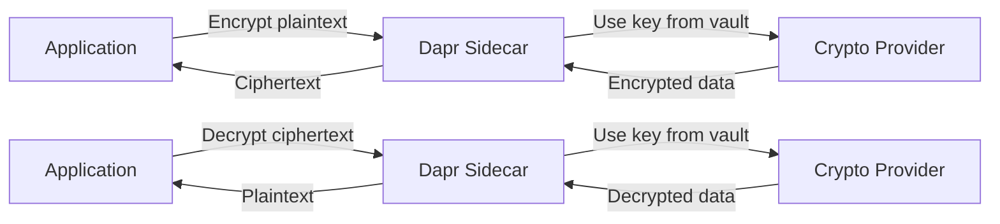

# How to Use Dapr Cryptography API for Encryption

Author: [nawazdhandala](https://www.github.com/nawazdhandala)

Tags: Dapr, Cryptography, Encryption, Security, API

Description: Learn how to use Dapr's Cryptography API to encrypt and decrypt data using managed keys stored in a crypto provider, without handling key material in your application code.

---

## Introduction

Dapr's Cryptography API (alpha) provides a building block for encrypting and decrypting data using keys managed by a backing crypto provider (such as Azure Key Vault or a local key store). Your application never handles raw key material - it sends plaintext to the Dapr sidecar, which performs the cryptographic operation using the managed key and returns the result.

Benefits:
- No key material in application code
- Consistent encryption API across providers
- Key rotation without application changes
- Audit trail in the key management service

## How the Cryptography API Works



## Prerequisites

- Dapr v1.11 or later (Cryptography API is alpha)
- A supported crypto provider (Azure Key Vault or local key store)
- Keys pre-created in the provider

## Step 1: Configure the Crypto Provider Component

### Azure Key Vault Crypto Provider

```yaml
apiVersion: dapr.io/v1alpha1
kind: Component
metadata:
  name: myvault
  namespace: default
spec:
  type: crypto.azure.keyvault
  version: v1
  metadata:
  - name: vaultName
    value: "my-crypto-vault"
  - name: azureTenantId
    value: "<tenant-id>"
  - name: azureClientId
    value: "<client-id>"
  - name: azureClientSecret
    secretKeyRef:
      name: azure-sp-creds
      key: clientSecret
```

Create a key in Azure Key Vault:

```bash
az keyvault key create \
  --vault-name my-crypto-vault \
  --name my-encryption-key \
  --kty RSA \
  --size 2048
```

### Local File-Based Crypto Provider (Development)

```yaml
apiVersion: dapr.io/v1alpha1
kind: Component
metadata:
  name: localcrypto
  namespace: default
spec:
  type: crypto.dapr.localstorage
  version: v1
  metadata:
  - name: path
    value: "./keys"
```

Generate a local key:

```bash
# Install dapr crypto tool or use openssl
openssl genrsa -out ./keys/my-key.pem 2048
```

## Step 2: Encrypt Data

### Via HTTP API

Encrypt a string value:

```bash
curl -X PUT \
  "http://localhost:3500/v1.0-alpha1/crypto/myvault/encrypt" \
  -H "dapr-key-name: my-encryption-key" \
  -H "dapr-key-wrap-algorithm: RSA-OAEP-256" \
  --data-binary "Hello, secret world!" \
  -o encrypted.out
```

The response body is the raw encrypted bytes (`application/octet-stream`). Use `-o` to save to a file.
```text

### Via Go SDK

```go
package main

import (
    "bytes"
    "context"
    "fmt"
    "io"
    "log"

    dapr "github.com/dapr/go-sdk/client"
)

func main() {
    client, err := dapr.NewClient()
    if err != nil {
        log.Fatal(err)
    }
    defer client.Close()

    ctx := context.Background()
    plaintext := []byte("Hello, secret world!")

    // Encrypt
    encryptedReader, err := client.Encrypt(ctx,
        bytes.NewReader(plaintext),
        dapr.EncryptOptions{
            ComponentName:    "myvault",
            KeyName:          "my-encryption-key",
            KeyWrapAlgorithm: "RSA-OAEP-256",
        },
    )
    if err != nil {
        log.Fatalf("Encryption failed: %v", err)
    }

    ciphertext, err := io.ReadAll(encryptedReader)
    if err != nil {
        log.Fatalf("Failed to read encrypted data: %v", err)
    }
    fmt.Printf("Encrypted (%d bytes)\n", len(ciphertext))

    // Decrypt
    decryptedReader, err := client.Decrypt(ctx,
        bytes.NewReader(ciphertext),
        dapr.DecryptOptions{
            ComponentName: "myvault",
            KeyName:       "my-encryption-key",
        },
    )
    if err != nil {
        log.Fatalf("Decryption failed: %v", err)
    }

    decrypted, err := io.ReadAll(decryptedReader)
    if err != nil {
        log.Fatalf("Failed to read decrypted data: %v", err)
    }
    fmt.Printf("Decrypted: %s\n", string(decrypted))
}
```

### Via Python SDK

```python
from dapr.clients import DaprClient
from dapr.clients.grpc._crypto import EncryptOptions, DecryptOptions
import base64

with DaprClient() as client:
    plaintext = b"Hello, secret world!"

    # Encrypt
    encrypt_response = client.encrypt(
        data=plaintext,
        options=EncryptOptions(
            component_name='myvault',
            key_name='my-encryption-key',
            key_wrap_algorithm='RSA-OAEP-256',
        ),
    )
    ciphertext = encrypt_response.read()
    print(f"Encrypted: {base64.b64encode(ciphertext).decode()}")

    # Decrypt
    decrypt_response = client.decrypt(
        data=ciphertext,
        options=DecryptOptions(
            component_name='myvault',
            key_name='my-encryption-key',
        ),
    )
    recovered = decrypt_response.read()
    print(f"Decrypted: {recovered.decode()}")
```

## Supported Algorithms

**Key Wrap Algorithms** (used to wrap the data encryption key):

| Algorithm | Type | Use Case |
|---|---|---|
| `RSA-OAEP-256` | Asymmetric | Wrap key using RSA-OAEP with SHA-256 |
| `A256KW` | Symmetric | Wrap key using AES-256 Key Wrap |
| `A128CBC` | Symmetric | Wrap key using AES-128-CBC |
| `A192CBC` | Symmetric | Wrap key using AES-192-CBC |

**Data Encryption Ciphers** (used to encrypt the actual data):

| Cipher | Description |
|---|---|
| `aes-gcm` (default) | AES-GCM authenticated encryption |
| `chacha20-poly1305` | ChaCha20-Poly1305 authenticated encryption |

## Stream Encryption for Large Data

The Go SDK's `Encrypt` and `Decrypt` methods already support streaming via `io.Reader`. For large files, pass a file reader directly:

```go
// Go - streaming encrypt from a file
inputFile, _ := os.Open("largefile.dat")
defer inputFile.Close()

encryptedReader, err := client.Encrypt(ctx, inputFile, dapr.EncryptOptions{
    ComponentName:       "myvault",
    KeyName:             "my-encryption-key",
    KeyWrapAlgorithm:    "RSA-OAEP-256",
    DataEncryptionCipher: "aes-gcm",
})
if err != nil {
    log.Fatal(err)
}

outputFile, _ := os.Create("largefile.dat.enc")
defer outputFile.Close()
io.Copy(outputFile, encryptedReader)
```

## Step 3: Decrypt Data

```bash
curl -X PUT \
  "http://localhost:3500/v1.0-alpha1/crypto/myvault/decrypt" \
  -H "dapr-key-name: my-encryption-key" \
  --data-binary @encrypted.out \
  -o decrypted.out
```

## Summary

Dapr's Cryptography API provides a key-management-as-a-service approach to encryption. Your application sends plaintext and receives ciphertext - it never touches the actual key material. Configure a crypto provider component pointing to Azure Key Vault or a local key store, create your keys in the provider, and use the `encrypt`/`decrypt` API endpoints or SDK methods. This is ideal for applications that need to encrypt sensitive data (PII, payment info) without the complexity of managing cryptographic keys directly.
