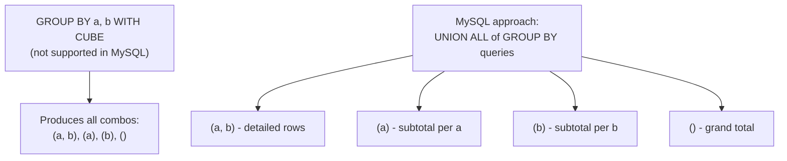

# How to Use GROUP BY with CUBE in MySQL 8.0+

Author: [nawazdhandala](https://www.github.com/nawazdhandala)

Tags: MySQL, SQL, GROUP BY, CUBE, Aggregation, Analytics

Description: Learn how to use GROUP BY WITH ROLLUP to simulate CUBE-style cross-tabulated subtotals in MySQL 8.0, generating all combinations of dimension aggregations.

---

## What Is CUBE in SQL

`CUBE` is a GROUP BY extension that generates subtotals for all possible combinations of the grouping columns. For N dimensions, CUBE produces 2^N grouping sets, including the grand total and every combination of partial aggregations.

MySQL 8.0 does not support `GROUP BY WITH CUBE` or `GROUPING SETS` syntax directly. However, you can simulate CUBE behavior using `UNION ALL` of multiple `GROUP BY` queries. MySQL 8.0 does natively support `WITH ROLLUP` for hierarchical subtotals and the `GROUPING()` function (since 8.0.1) to identify subtotal rows.



## Syntax Approaches in MySQL

```sql
-- MySQL: Simulate CUBE with UNION ALL
SELECT col1, col2, SUM(col3) FROM table GROUP BY col1, col2
UNION ALL
SELECT col1, NULL, SUM(col3) FROM table GROUP BY col1
UNION ALL
SELECT NULL, col2, SUM(col3) FROM table GROUP BY col2
UNION ALL
SELECT NULL, NULL, SUM(col3) FROM table;

-- MySQL 8.0: WITH ROLLUP (hierarchical, not all combinations)
SELECT col1, col2, SUM(col3)
FROM table
GROUP BY col1, col2 WITH ROLLUP;
```

## Examples

### Setup: Sales Data by Region and Product

```sql
CREATE TABLE sales_data (
    id       INT PRIMARY KEY AUTO_INCREMENT,
    region   VARCHAR(50),
    product  VARCHAR(50),
    quarter  VARCHAR(5),
    revenue  DECIMAL(12,2)
);

INSERT INTO sales_data (region, product, quarter, revenue) VALUES
    ('North', 'Widget', 'Q1', 12000),
    ('North', 'Widget', 'Q2', 14000),
    ('North', 'Gadget', 'Q1', 9000),
    ('North', 'Gadget', 'Q2', 11000),
    ('South', 'Widget', 'Q1', 8000),
    ('South', 'Widget', 'Q2', 9500),
    ('South', 'Gadget', 'Q1', 7500),
    ('South', 'Gadget', 'Q2', 8800),
    ('East',  'Widget', 'Q1', 15000),
    ('East',  'Widget', 'Q2', 16500),
    ('East',  'Gadget', 'Q1', 10000),
    ('East',  'Gadget', 'Q2', 12000);
```

### Simulating CUBE with UNION ALL

This is the primary approach for achieving full CUBE behavior in MySQL. Each `SELECT` covers one grouping combination:

```sql
-- Detailed rows (region + product)
SELECT region, product, SUM(revenue) AS total_revenue FROM sales_data GROUP BY region, product
UNION ALL
-- Subtotal by region only
SELECT region, NULL AS product, SUM(revenue) FROM sales_data GROUP BY region
UNION ALL
-- Subtotal by product only
SELECT NULL AS region, product, SUM(revenue) FROM sales_data GROUP BY product
UNION ALL
-- Grand total
SELECT NULL, NULL, SUM(revenue) FROM sales_data
ORDER BY region, product;
```

```text
+--------+---------+---------------+
| region | product | total_revenue |
+--------+---------+---------------+
| NULL   | NULL    |     133300.00 |
| NULL   | Gadget  |      58300.00 |
| NULL   | Widget  |      75000.00 |
| East   | NULL    |      53500.00 |
| East   | Gadget  |      22000.00 |
| East   | Widget  |      31500.00 |
| North  | NULL    |      46000.00 |
| North  | Gadget  |      20000.00 |
| North  | Widget  |      26000.00 |
| South  | NULL    |      33800.00 |
| South  | Gadget  |      16300.00 |
| South  | Widget  |      17500.00 |
+--------+---------+---------------+
```

To replace NULLs with readable labels, wrap with a subquery:

```sql
SELECT
    IFNULL(region, '(All Regions)')   AS region,
    IFNULL(product, '(All Products)') AS product,
    total_revenue
FROM (
    SELECT region, product, SUM(revenue) AS total_revenue FROM sales_data GROUP BY region, product
    UNION ALL
    SELECT region, NULL, SUM(revenue) FROM sales_data GROUP BY region
    UNION ALL
    SELECT NULL, product, SUM(revenue) FROM sales_data GROUP BY product
    UNION ALL
    SELECT NULL, NULL, SUM(revenue) FROM sales_data
) AS cube_result
ORDER BY region, product;
```

```text
+---------------+----------------+---------------+
| region        | product        | total_revenue |
+---------------+----------------+---------------+
| (All Regions) | (All Products) |     133300.00 |
| (All Regions) | Gadget         |      58300.00 |
| (All Regions) | Widget         |      75000.00 |
| East          | (All Products) |      53500.00 |
| East          | Gadget         |      22000.00 |
| East          | Widget         |      31500.00 |
| North         | (All Products) |      46000.00 |
| North         | Gadget         |      20000.00 |
| North         | Widget         |      26000.00 |
| South         | (All Products) |      33800.00 |
| South         | Gadget         |      16300.00 |
| South         | Widget         |      17500.00 |
+---------------+----------------+---------------+
```

### Identify Subtotal Rows with GROUPING() and WITH ROLLUP

The `GROUPING()` function (available since MySQL 8.0.1) works with `WITH ROLLUP` to distinguish subtotal NULLs from actual NULL data. Note that `WITH ROLLUP` produces hierarchical subtotals, not all CUBE combinations:

```sql
SELECT
    CASE GROUPING(region)  WHEN 1 THEN '(All)' ELSE region  END AS region,
    CASE GROUPING(product) WHEN 1 THEN '(All)' ELSE product END AS product,
    SUM(revenue)    AS total_revenue,
    GROUPING(region)  AS grp_region,
    GROUPING(product) AS grp_product
FROM sales_data
GROUP BY region, product WITH ROLLUP
ORDER BY grp_region DESC, grp_product DESC, region, product;
```

```text
+-------+---------+---------------+------------+-------------+
| region| product | total_revenue | grp_region | grp_product |
+-------+---------+---------------+------------+-------------+
| (All) | (All)   |     133300.00 | 1          | 1           |
| East  | (All)   |      53500.00 | 0          | 1           |
| North | (All)   |      46000.00 | 0          | 1           |
| South | (All)   |      33800.00 | 0          | 1           |
| East  | Gadget  |      22000.00 | 0          | 0           |
| East  | Widget  |      31500.00 | 0          | 0           |
| North | Gadget  |      20000.00 | 0          | 0           |
| North | Widget  |      26000.00 | 0          | 0           |
| South | Gadget  |      16300.00 | 0          | 0           |
| South | Widget  |      17500.00 | 0          | 0           |
+-------+---------+---------------+------------+-------------+
```

Notice that `WITH ROLLUP` does **not** produce `(All, Gadget)` or `(All, Widget)` rows -- it only produces hierarchical subtotals from left to right. This is the key difference from full CUBE behavior.

### Three-Dimension CUBE Simulation

For three dimensions (region, product, quarter), full CUBE requires 2^3 = 8 grouping combinations. In MySQL, you must use UNION ALL for all 8:

```sql
SELECT region, product, quarter, SUM(revenue) AS total_revenue FROM sales_data GROUP BY region, product, quarter
UNION ALL
SELECT region, product, NULL, SUM(revenue) FROM sales_data GROUP BY region, product
UNION ALL
SELECT region, NULL, quarter, SUM(revenue) FROM sales_data GROUP BY region, quarter
UNION ALL
SELECT NULL, product, quarter, SUM(revenue) FROM sales_data GROUP BY product, quarter
UNION ALL
SELECT region, NULL, NULL, SUM(revenue) FROM sales_data GROUP BY region
UNION ALL
SELECT NULL, product, NULL, SUM(revenue) FROM sales_data GROUP BY product
UNION ALL
SELECT NULL, NULL, quarter, SUM(revenue) FROM sales_data GROUP BY quarter
UNION ALL
SELECT NULL, NULL, NULL, SUM(revenue) FROM sales_data
ORDER BY region, product, quarter;
```

### WITH ROLLUP (Hierarchical, Not Full CUBE)

`WITH ROLLUP` is the native MySQL syntax, but it only generates hierarchical subtotals -- not all combinations:

```sql
SELECT
    IFNULL(region,  '(All)') AS region,
    IFNULL(product, '(All)') AS product,
    SUM(revenue) AS total_revenue
FROM sales_data
GROUP BY region, product WITH ROLLUP;
```

ROLLUP produces: (region, product), (region), () but NOT (product) alone. For full CUBE behavior, use the UNION ALL approach shown above.

## CUBE vs ROLLUP

| Feature        | MySQL Support | Groupings Produced             | Best For                        |
|----------------|---------------|--------------------------------|---------------------------------|
| WITH ROLLUP    | Yes           | Hierarchical subtotals         | Reports with drill-down levels  |
| WITH CUBE      | No            | All 2^N combinations           | Cross-tabulation (simulate with UNION ALL) |

## Best Practices

- Use `UNION ALL` of multiple `GROUP BY` queries to simulate full CUBE behavior in MySQL.
- Use `GROUPING(column)` with `WITH ROLLUP` (MySQL 8.0.1+) to distinguish NULL subtotals from actual NULL data values.
- Wrap subtotal NULLs in `IFNULL()` or `CASE` expressions to replace them with readable labels like "(All)".
- For two-dimension cross-tabulation, you need four UNION ALL branches: `(a,b)`, `(a)`, `(b)`, and `()`.
- For N dimensions, be aware that the UNION ALL approach requires 2^N separate queries, which can become verbose. Consider creating a view or stored procedure for reuse.

## Summary

MySQL 8.0 does not support `GROUP BY WITH CUBE` or `GROUPING SETS` syntax. To achieve full CUBE behavior, use `UNION ALL` of multiple `GROUP BY` queries covering all 2^N combinations of your dimensions. MySQL's native `WITH ROLLUP` provides hierarchical subtotals but not all combinations. Use `GROUPING(column)` (MySQL 8.0.1+) with `WITH ROLLUP` to identify subtotal rows. For databases that support `GROUPING SETS` (such as PostgreSQL, SQL Server, or Oracle), you can use `GROUPING SETS ((a,b),(a),(b),())` as a direct equivalent of CUBE.
