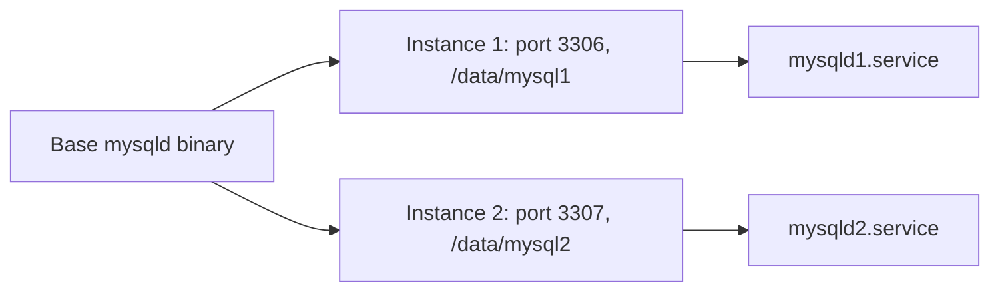

# How to Install Multiple MySQL Instances on the Same Server

Author: [nawazdhandala](https://www.github.com/nawazdhandala)

Tags: MySQL, Installation, Configuration, Linux, Database

Description: Run two or more MySQL instances on one Linux server using separate data directories, ports, socket files, and systemd service units without conflicts.

---

## How It Works

Each MySQL instance needs its own data directory, configuration file, port, Unix socket, PID file, and log files. On systemd-based Linux, the cleanest approach is to create one `mysqld@.service` template unit and instantiate it for each server, or to create independent service unit files. MySQL also ships a `mysqld_multi` utility, but the systemd template approach is more modern.



## Prerequisites

- Linux server with systemd (Ubuntu 22.04+, Rocky Linux 9, Debian 12, etc.)
- MySQL server package installed
- Root or sudo access

## Step 1 - Create Separate Data Directories

```bash
sudo mkdir -p /data/mysql1 /data/mysql2
sudo chown -R mysql:mysql /data/mysql1 /data/mysql2
sudo chmod 750 /data/mysql1 /data/mysql2
```

## Step 2 - Create Configuration Files

### Instance 1 - `/etc/mysql/instance1.cnf`

```ini
[mysqld]
datadir              = /data/mysql1
socket               = /run/mysql/mysql1.sock
port                 = 3306
pid-file             = /run/mysql/mysql1.pid
log-error            = /var/log/mysql/instance1-error.log
server-id            = 1
character-set-server = utf8mb4
collation-server     = utf8mb4_unicode_ci

[client]
socket = /run/mysql/mysql1.sock
```

### Instance 2 - `/etc/mysql/instance2.cnf`

```ini
[mysqld]
datadir              = /data/mysql2
socket               = /run/mysql/mysql2.sock
port                 = 3307
pid-file             = /run/mysql/mysql2.pid
log-error            = /var/log/mysql/instance2-error.log
server-id            = 2
character-set-server = utf8mb4
collation-server     = utf8mb4_unicode_ci

[client]
socket = /run/mysql/mysql2.sock
```

Create the runtime and log directories.

```bash
sudo mkdir -p /run/mysql /var/log/mysql
sudo chown mysql:mysql /run/mysql /var/log/mysql
```

## Step 3 - Initialize Each Data Directory

```bash
sudo mysqld --defaults-file=/etc/mysql/instance1.cnf --initialize --user=mysql
sudo mysqld --defaults-file=/etc/mysql/instance2.cnf --initialize --user=mysql
```

Retrieve the temporary root passwords.

```bash
sudo grep 'temporary password' /var/log/mysql/instance1-error.log
sudo grep 'temporary password' /var/log/mysql/instance2-error.log
```

## Step 4 - Create systemd Service Files

### `/etc/systemd/system/mysqld1.service`

```ini
[Unit]
Description=MySQL Instance 1
After=network.target

[Service]
Type=notify
User=mysql
Group=mysql
ExecStart=/usr/sbin/mysqld --defaults-file=/etc/mysql/instance1.cnf
LimitNOFILE=10000
Restart=on-failure
RestartPreventExitStatus=1
RuntimeDirectory=mysql
RuntimeDirectoryMode=0755
RuntimeDirectoryPreserve=yes

[Install]
WantedBy=multi-user.target
```

### `/etc/systemd/system/mysqld2.service`

```ini
[Unit]
Description=MySQL Instance 2
After=network.target

[Service]
Type=notify
User=mysql
Group=mysql
ExecStart=/usr/sbin/mysqld --defaults-file=/etc/mysql/instance2.cnf
LimitNOFILE=10000
Restart=on-failure
RestartPreventExitStatus=1
RuntimeDirectory=mysql
RuntimeDirectoryMode=0755
RuntimeDirectoryPreserve=yes

[Install]
WantedBy=multi-user.target
```

## Step 5 - Start and Enable the Instances

```bash
sudo systemctl daemon-reload
sudo systemctl enable --now mysqld1
sudo systemctl enable --now mysqld2
```

Check both are running.

```bash
sudo systemctl status mysqld1 mysqld2
```

## Step 6 - Secure Each Instance

Connect to instance 1 using its socket or port.

```bash
mysql -u root -p --socket=/run/mysql/mysql1.sock
```

```sql
ALTER USER 'root'@'localhost' IDENTIFIED BY 'Instance1Pass!';
FLUSH PRIVILEGES;
EXIT;
```

Connect to instance 2.

```bash
mysql -u root -p --host=127.0.0.1 --port=3307
```

```sql
ALTER USER 'root'@'localhost' IDENTIFIED BY 'Instance2Pass!';
FLUSH PRIVILEGES;
EXIT;
```

## Verify Both Instances

```bash
mysql -u root -p --socket=/run/mysql/mysql1.sock -e "SELECT @@port, @@datadir;"
mysql -u root -p --host=127.0.0.1 --port=3307 -e "SELECT @@port, @@datadir;"
```

```text
+--------+--------------+
| @@port | @@datadir    |
+--------+--------------+
|   3306 | /data/mysql1/|
+--------+--------------+

+--------+--------------+
| @@port | @@datadir    |
+--------+--------------+
|   3307 | /data/mysql2/|
+--------+--------------+
```

## Memory Considerations

Each MySQL instance maintains its own InnoDB buffer pool. For two instances on an 8 GB server, a reasonable split is:

```ini
# instance1.cnf
innodb_buffer_pool_size = 3G

# instance2.cnf
innodb_buffer_pool_size = 3G
```

Leave at least 2 GB for the OS, file cache, and other processes.

## Summary

Running multiple MySQL instances on one server requires separate data directories, configuration files, ports, socket paths, and service units. Initialize each data directory independently with `mysqld --initialize`, create per-instance systemd service files pointing to their configuration files, and start them with `systemctl`. Each instance is completely isolated and can run different MySQL versions if needed by using different binary paths.
