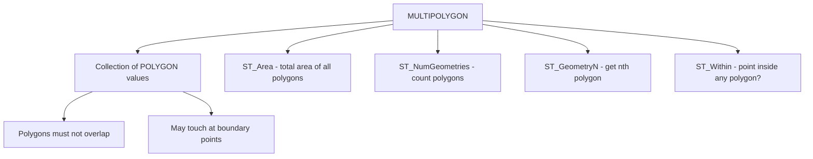

# How to Use MULTIPOLYGON in MySQL

Author: [nawazdhandala](https://www.github.com/nawazdhandala)

Tags: MySQL, SQL, Spatial, GIS, Geometry, Database

Description: Learn how to store and query collections of geographic areas using the MULTIPOLYGON data type in MySQL, with territory modeling, area calculation, and containment queries.

---

## What Is MULTIPOLYGON

`MULTIPOLYGON` is a spatial data type in MySQL that stores a collection of one or more `POLYGON` values as a single geometry. The component polygons must not overlap one another, though they may share boundary points. MULTIPOLYGON is useful for representing geographic entities that consist of multiple non-contiguous areas, such as a country with islands, a state with an exclave, a franchise territory spanning multiple districts, or a shipping zone with excluded gaps.



## Syntax

```sql
-- Column definition
column_name MULTIPOLYGON [NOT NULL] [SRID srid_value]

-- Create from WKT (each polygon enclosed in its own parentheses)
ST_GeomFromText(
    'MULTIPOLYGON(((x1 y1, x2 y2, x3 y3, x1 y1)), ((x4 y4, x5 y5, x6 y6, x4 y4)))',
    srid
)

-- Useful functions
ST_NumGeometries(mp)       -- count of member polygons
ST_GeometryN(mp, n)        -- nth polygon (1-based)
ST_Area(mp)                -- total area (sum of all polygons)
ST_Centroid(mp)            -- centroid of the entire collection
ST_AsText(mp)              -- WKT representation
```

## Examples

### Create a Table with a MULTIPOLYGON Column

```sql
CREATE TABLE territories (
    id          INT          PRIMARY KEY AUTO_INCREMENT,
    entity_name VARCHAR(100) NOT NULL,
    territory   MULTIPOLYGON NOT NULL SRID 4326,
    SPATIAL INDEX idx_territory (territory)
);
```

### Insert MULTIPOLYGON Values

```sql
-- A company with territories in two separate city districts
INSERT INTO territories (entity_name, territory) VALUES
(
    'Metro Delivery Co - NYC Zones',
    ST_GeomFromText(
        'MULTIPOLYGON(
            ((40.700 -74.020, 40.700 -73.970, 40.730 -73.970, 40.730 -74.020, 40.700 -74.020)),
            ((40.750 -73.990, 40.750 -73.950, 40.780 -73.950, 40.780 -73.990, 40.750 -73.990))
        )',
        4326
    )
),
(
    'Island State Example',
    ST_GeomFromText(
        'MULTIPOLYGON(
            ((40.680 -74.050, 40.680 -74.010, 40.710 -74.010, 40.710 -74.050, 40.680 -74.050)),
            ((40.750 -73.800, 40.750 -73.760, 40.780 -73.760, 40.780 -73.800, 40.750 -73.800)),
            ((40.820 -73.900, 40.820 -73.860, 40.850 -73.860, 40.850 -73.900, 40.820 -73.900))
        )',
        4326
    )
);
```

### Query MULTIPOLYGON Properties

```sql
SELECT
    entity_name,
    ST_NumGeometries(territory)          AS polygon_count,
    ROUND(ST_Area(territory) / 1000000, 2) AS total_area_sq_km,
    ST_AsText(ST_Centroid(territory))    AS centroid
FROM territories;
```

```text
+------------------------------+---------------+------------------+-------------------------------+
| entity_name                  | polygon_count | total_area_sq_km | centroid                      |
+------------------------------+---------------+------------------+-------------------------------+
| Metro Delivery Co - NYC Zones| 2             |            25.37 | POINT(40.74 -73.98)           |
| Island State Example         | 3             |            33.81 | POINT(40.77 -73.90)           |
+------------------------------+---------------+------------------+-------------------------------+
```

### Check If a Point Falls Inside Any Polygon in the Collection

```sql
SET @test_point = ST_GeomFromText('POINT(40.715 -74.000)', 4326);

SELECT entity_name
FROM territories
WHERE ST_Within(@test_point, territory);
```

```text
+------------------------------+
| entity_name                  |
+------------------------------+
| Metro Delivery Co - NYC Zones|
+------------------------------+
```

### Extract Individual Polygons

```sql
SELECT
    entity_name,
    ST_AsText(ST_GeometryN(territory, 1)) AS polygon_1,
    ST_AsText(ST_GeometryN(territory, 2)) AS polygon_2
FROM territories
WHERE entity_name = 'Metro Delivery Co - NYC Zones';
```

```text
+------------------------------+-----------------------------------------------+-----------------------------------------------+
| entity_name                  | polygon_1                                     | polygon_2                                     |
+------------------------------+-----------------------------------------------+-----------------------------------------------+
| Metro Delivery Co - NYC Zones| POLYGON((40.7 -74.02,40.7 -73.97,...))        | POLYGON((40.75 -73.99,40.75 -73.95,...))       |
+------------------------------+-----------------------------------------------+-----------------------------------------------+
```

### Find Territories That Intersect a Search Region

```sql
SET @search_region = ST_GeomFromText(
    'POLYGON((40.670 -74.060, 40.670 -73.940, 40.730 -73.940, 40.730 -74.060, 40.670 -74.060))',
    4326
);

SELECT entity_name
FROM territories
WHERE ST_Intersects(territory, @search_region);
```

```text
+------------------------------+
| entity_name                  |
+------------------------------+
| Metro Delivery Co - NYC Zones|
| Island State Example         |
+------------------------------+
```

### Compute Per-Polygon Area with a Numbers Table

```sql
WITH RECURSIVE nums AS (
    SELECT 1 AS n
    UNION ALL
    SELECT n + 1 FROM nums WHERE n < 10
)
SELECT
    t.entity_name,
    nums.n                                       AS polygon_index,
    ROUND(ST_Area(ST_GeometryN(t.territory, nums.n)) / 1000000, 2) AS area_sq_km
FROM territories t
JOIN nums ON nums.n <= ST_NumGeometries(t.territory)
ORDER BY t.entity_name, nums.n;
```

```text
+------------------------------+---------------+------------+
| entity_name                  | polygon_index | area_sq_km |
+------------------------------+---------------+------------+
| Island State Example         | 1             |      11.28 |
| Island State Example         | 2             |      11.27 |
| Island State Example         | 3             |      11.26 |
| Metro Delivery Co - NYC Zones| 1             |      14.10 |
| Metro Delivery Co - NYC Zones| 2             |      11.27 |
+------------------------------+---------------+------------+
```

## Best Practices

- Ensure component polygons do not overlap; `ST_IsValid` will return 0 for overlapping MULTIPOLYGON geometries.
- Use SRID 4326 for real-world geographic area modeling.
- Add a `SPATIAL INDEX` to support fast `ST_Within`, `ST_Intersects`, and `MBRContains` queries.
- Use `ST_Area` for total combined area and `ST_GeometryN` to get the area of each individual polygon.
- For country or region boundaries, consider importing from public GIS datasets like Natural Earth rather than creating complex WKT strings manually.

## Summary

`MULTIPOLYGON` stores a set of non-overlapping `POLYGON` values as a single geometry. Insert with `ST_GeomFromText('MULTIPOLYGON(((...)), ((...)))', srid)`. Use `ST_NumGeometries` to count polygons, `ST_GeometryN` to access individual polygons, `ST_Area` for total combined area, and `ST_Within` or `ST_Intersects` for spatial containment and overlap queries. Spatial indexes accelerate queries across large datasets.
