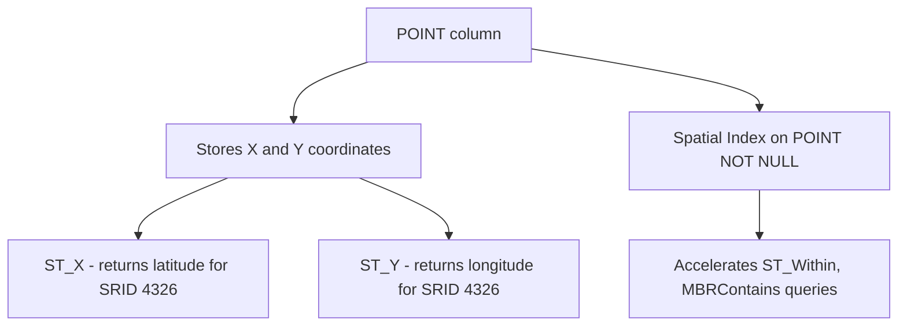

# How to Use POINT Data Type in MySQL

Author: [nawazdhandala](https://www.github.com/nawazdhandala)

Tags: MySQL, SQL, Spatial, GIS, Geometry, Database

Description: Learn how to store and query single geographic coordinates using the POINT data type in MySQL, with ST_GeomFromText, ST_X, ST_Y, and spatial index examples.

---

## What Is the POINT Data Type

`POINT` is a spatial data type in MySQL that represents a single location in a two-dimensional coordinate space. It stores a pair of coordinate values as a single column value. For geographic coordinate systems like WGS84 (SRID 4326), the first axis is latitude and the second axis is longitude, following the axis order defined by the spatial reference system. POINT is the most common spatial type used for storing things like store locations, delivery addresses, or GPS coordinates.

MySQL uses the OpenGIS standard for geometry types. POINT values can be created from Well-Known Text (WKT) using `ST_GeomFromText`, or from coordinates using `ST_PointFromText` and the `Point()` constructor.



## Syntax

```sql
-- Column definition
column_name POINT [NOT NULL] [SRID srid_value]

-- Create a POINT value from WKT (SRID 4326 axis order: latitude first)
ST_GeomFromText('POINT(latitude longitude)', srid)

-- Create a POINT value using the Point constructor (SRID 0 by default)
Point(x, y)

-- Extract coordinates (for SRID 4326: X = latitude, Y = longitude)
ST_X(point_column)   -- returns first axis (latitude for SRID 4326)
ST_Y(point_column)   -- returns second axis (longitude for SRID 4326)
```

## Examples

### Create a Table with a POINT Column

```sql
CREATE TABLE landmarks (
    id        INT          PRIMARY KEY AUTO_INCREMENT,
    name      VARCHAR(100) NOT NULL,
    category  VARCHAR(50),
    location  POINT        NOT NULL SRID 4326,
    SPATIAL INDEX idx_location (location)
);
```

SRID 4326 is the WGS84 coordinate reference system used by GPS. Specifying the SRID enforces that all inserted values use the same reference system and enables correct geodetic calculations.

### Insert POINT Values

```sql
-- Using ST_GeomFromText (WKT format for SRID 4326: latitude longitude)
INSERT INTO landmarks (name, category, location) VALUES
    ('Eiffel Tower',       'Monument',  ST_GeomFromText('POINT(48.8584 2.2945)',    4326)),
    ('Statue of Liberty',  'Monument',  ST_GeomFromText('POINT(40.6892 -74.0445)', 4326)),
    ('Sydney Opera House', 'Arts',      ST_GeomFromText('POINT(-33.8568 151.2153)', 4326)),
    ('Big Ben',            'Monument',  ST_GeomFromText('POINT(51.5007 -0.1246)',   4326)),
    ('Colosseum',          'Monument',  ST_GeomFromText('POINT(41.8902 12.4922)',   4326));

-- Using ST_SRID with Point constructor
INSERT INTO landmarks (name, category, location) VALUES
    ('Tokyo Tower', 'Monument', ST_SRID(Point(35.6586, 139.7454), 4326));
```

### Read POINT Coordinates

```sql
SELECT
    name,
    category,
    ST_X(location) AS latitude,
    ST_Y(location) AS longitude
FROM landmarks
ORDER BY name;
```

```text
+-----------------------+-----------+-----------+------------+
| name                  | category  | latitude  | longitude  |
+-----------------------+-----------+-----------+------------+
| Big Ben               | Monument  |  51.50070 |  -0.124600 |
| Colosseum             | Monument  |  41.89020 |  12.492200 |
| Eiffel Tower          | Monument  |  48.85840 |   2.294500 |
| Statue of Liberty     | Monument  |  40.68920 | -74.044500 |
| Sydney Opera House    | Arts      | -33.85680 | 151.215300 |
| Tokyo Tower           | Monument  |  35.65860 | 139.745400 |
+-----------------------+-----------+-----------+------------+
```

### Calculate Distance Between Two Points

```sql
-- Distance in meters using a spherical Earth model
SELECT
    name,
    ROUND(
        ST_Distance_Sphere(
            location,
            ST_GeomFromText('POINT(48.8584 2.2945)', 4326)
        )
    ) AS distance_from_eiffel_meters
FROM landmarks
WHERE name != 'Eiffel Tower'
ORDER BY distance_from_eiffel_meters;
```

```text
+-----------------------+-----------------------------+
| name                  | distance_from_eiffel_meters |
+-----------------------+-----------------------------+
| Big Ben               |                      341614 |
| Colosseum             |                     1105702 |
| Statue of Liberty     |                     5837396 |
| Tokyo Tower           |                     9726445 |
| Sydney Opera House    |                    16959485 |
+-----------------------+-----------------------------+
```

### Find Points Within a Bounding Box

```sql
-- Find European landmarks (rough bounding box)
SET @europe_bbox = ST_GeomFromText(
    'POLYGON((35 -10, 35 40, 60 40, 60 -10, 35 -10))',
    4326
);

SELECT name, ST_X(location) AS lat, ST_Y(location) AS lon
FROM landmarks
WHERE MBRContains(@europe_bbox, location);
```

```text
+--------------+---------+--------+
| name         | lat     | lon    |
+--------------+---------+--------+
| Eiffel Tower | 48.8584 | 2.2945 |
| Big Ben      | 51.5007 | -0.1246|
| Colosseum    | 41.8902 | 12.4922|
+--------------+---------+--------+
```

### Convert POINT to WKT String

```sql
SELECT name, ST_AsText(location) AS wkt
FROM landmarks
LIMIT 3;
```

```text
+-----------------------+-----------------------------+
| name                  | wkt                         |
+-----------------------+-----------------------------+
| Eiffel Tower          | POINT(48.8584 2.2945)       |
| Statue of Liberty     | POINT(40.6892 -74.0445)     |
| Sydney Opera House    | POINT(-33.8568 151.2153)    |
+-----------------------+-----------------------------+
```

### Update a POINT Value

```sql
UPDATE landmarks
SET location = ST_GeomFromText('POINT(48.8590 2.2950)', 4326)
WHERE name = 'Eiffel Tower';
```

## NULL and Constraint Handling

```sql
-- Column allows NULL
CREATE TABLE optional_location (
    id       INT PRIMARY KEY AUTO_INCREMENT,
    name     VARCHAR(100),
    location POINT   -- nullable, no spatial index possible
);

-- Check for rows with no location set
SELECT name FROM optional_location WHERE location IS NULL;

-- Set a location for a row
UPDATE optional_location
SET location = ST_GeomFromText('POINT(0 0)', 4326)
WHERE id = 1;
```

## Best Practices

- Declare POINT columns as `NOT NULL` with a fixed SRID so MySQL can use a spatial index and perform correct geodetic calculations.
- Always use `ST_GeomFromText('POINT(lat lon)', 4326)` format - for SRID 4326, the axis order is latitude first, longitude second, matching the SRS definition.
- Use `ST_X()` to get latitude and `ST_Y()` to get longitude for SRID 4326. Alternatively, use `ST_Latitude()` and `ST_Longitude()` (MySQL 8.0.12+) for unambiguous access.
- For distance queries in meters, use `ST_Distance_Sphere` (fast, spherical approximation) or `ST_Distance` with SRID 4326 (exact geodetic using the WGS84 ellipsoid).
- Combine a `MBRContains` bounding box (spatial index) with an exact distance filter for efficient radius searches.

## Summary

The `POINT` data type in MySQL stores a single (X, Y) coordinate pair representing a location in a two-dimensional space. Declare POINT columns `NOT NULL` with SRID 4326 for WGS84 geographic coordinates. Insert values with `ST_GeomFromText('POINT(lat lon)', 4326)`, following the SRS-defined axis order of latitude first, longitude second. Extract coordinates with `ST_X()` (latitude) and `ST_Y()` (longitude) for SRID 4326, or use `ST_Latitude()` and `ST_Longitude()` for clarity. Add a `SPATIAL INDEX` on the column to accelerate spatial queries using `MBRContains`, `ST_Within`, and related functions.
