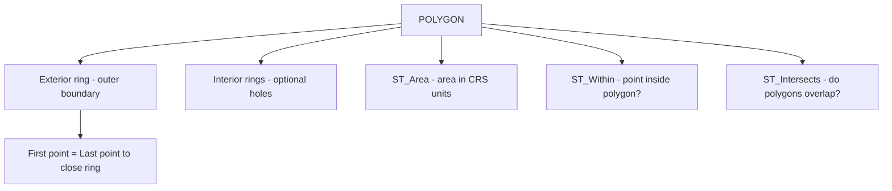

# How to Use POLYGON Data Type in MySQL

Author: [nawazdhandala](https://www.github.com/nawazdhandala)

Tags: MySQL, SQL, Spatial, GIS, Geometry, Database

Description: Learn how to store and query geographic areas using the POLYGON data type in MySQL, including area calculation, containment checks, and spatial index usage.

---

## What Is the POLYGON Data Type

`POLYGON` is a spatial data type in MySQL that represents a closed two-dimensional area bounded by a linear ring. A polygon is defined by an exterior ring and zero or more interior rings (holes). The first and last point of each ring must be identical to close the shape.

Polygons are used to model areas such as city boundaries, building footprints, delivery zones, country borders, and geofences.



## Syntax

```sql
-- Column definition
column_name POLYGON [NOT NULL] [SRID srid_value]

-- Create from WKT: exterior ring, then optional interior rings
ST_GeomFromText('POLYGON((x1 y1, x2 y2, x3 y3, x1 y1))', srid)

-- Polygon with a hole
ST_GeomFromText('POLYGON((outer ring), (inner ring hole))', srid)

-- Useful functions
ST_Area(polygon)             -- area in CRS square units
ST_Length(ST_ExteriorRing(polygon))  -- perimeter length
ST_Centroid(polygon)         -- center point
ST_ExteriorRing(polygon)     -- outer ring as LINESTRING
ST_NumInteriorRings(polygon) -- number of holes
ST_InteriorRingN(polygon, n) -- nth interior ring
```

## Examples

### Create a Table with a POLYGON Column

```sql
CREATE TABLE delivery_zones (
    id          INT          PRIMARY KEY AUTO_INCREMENT,
    name        VARCHAR(100) NOT NULL,
    city        VARCHAR(100),
    fee_tier    TINYINT      DEFAULT 1,
    boundary    POLYGON      NOT NULL SRID 4326,
    SPATIAL INDEX idx_boundary (boundary)
);
```

### Insert POLYGON Values

```sql
-- Simple rectangular delivery zones (latitude longitude pairs for SRID 4326)
INSERT INTO delivery_zones (name, city, fee_tier, boundary) VALUES
(
    'Downtown Zone',
    'New York',
    1,
    ST_GeomFromText(
        'POLYGON((40.700 -74.020, 40.700 -73.970, 40.730 -73.970, 40.730 -74.020, 40.700 -74.020))',
        4326
    )
),
(
    'Midtown Zone',
    'New York',
    2,
    ST_GeomFromText(
        'POLYGON((40.740 -74.010, 40.740 -73.960, 40.770 -73.960, 40.770 -74.010, 40.740 -74.010))',
        4326
    )
),
(
    'Loop Zone',
    'Chicago',
    1,
    ST_GeomFromText(
        'POLYGON((41.870 -87.640, 41.870 -87.620, 41.890 -87.620, 41.890 -87.640, 41.870 -87.640))',
        4326
    )
);
```

### Query Polygon Properties

```sql
SELECT
    name,
    city,
    ROUND(ST_Area(boundary), 2)          AS area_sq_meters,
    ST_AsText(ST_Centroid(boundary))    AS centroid_wkt,
    ST_NumInteriorRings(boundary)       AS holes
FROM delivery_zones;
```

```text
+----------------+----------+----------------+----------------------------+-------+
| name           | city     | area_sq_meters | centroid_wkt               | holes |
+----------------+----------+----------------+----------------------------+-------+
| Downtown Zone  | New York |   14076948.35  | POINT(40.715 -73.995)      |     0 |
| Midtown Zone   | New York |   14069231.78  | POINT(40.755 -73.985)      |     0 |
| Loop Zone      | Chicago  |    3661407.12  | POINT(41.88 -87.63)        |     0 |
+----------------+----------+----------------+----------------------------+-------+
```

### Check If a Point Falls Inside a Polygon

```sql
-- Is Times Square inside any delivery zone?
SET @times_square = ST_GeomFromText('POINT(40.7580 -73.9855)', 4326);

SELECT name, city
FROM delivery_zones
WHERE ST_Within(@times_square, boundary);
```

```text
+--------------+----------+
| name         | city     |
+--------------+----------+
| Midtown Zone | New York |
+--------------+----------+
```

### Find Zones That Intersect a Search Area

```sql
SET @search_area = ST_GeomFromText(
    'POLYGON((40.690 -74.030, 40.690 -73.950, 40.735 -73.950, 40.735 -74.030, 40.690 -74.030))',
    4326
);

SELECT name, city
FROM delivery_zones
WHERE ST_Intersects(boundary, @search_area);
```

```text
+---------------+----------+
| name          | city     |
+---------------+----------+
| Downtown Zone | New York |
+---------------+----------+
```

### Create a Polygon with a Hole

A polygon with an interior ring has an area excluded from its bounds. This is useful for modeling a zone with a no-delivery area inside.

```sql
INSERT INTO delivery_zones (name, city, fee_tier, boundary) VALUES
(
    'Outer Zone with Park Exclusion',
    'Chicago',
    3,
    ST_GeomFromText(
        'POLYGON(
            (41.860 -87.660, 41.860 -87.600, 41.900 -87.600, 41.900 -87.660, 41.860 -87.660),
            (41.870 -87.650, 41.890 -87.650, 41.890 -87.620, 41.870 -87.620, 41.870 -87.650)
        )',
        4326
    )
);

SELECT
    name,
    ST_NumInteriorRings(boundary) AS holes,
    ROUND(ST_Area(boundary), 2)   AS net_area_sq_meters
FROM delivery_zones
WHERE name = 'Outer Zone with Park Exclusion';
```

### Extract the Exterior Ring

```sql
SELECT
    name,
    ST_AsText(ST_ExteriorRing(boundary)) AS exterior_ring_wkt
FROM delivery_zones
WHERE name = 'Downtown Zone';
```

## Validation

MySQL validates polygon geometry during insertion. Common issues:

```sql
-- ST_IsValid checks if a polygon follows the OGC rules
SELECT name, ST_IsValid(boundary) AS is_valid
FROM delivery_zones;

-- Attempt to insert a self-intersecting polygon raises an error with strict mode
-- Use ST_Buffer(geom, 0) to repair minor issues
UPDATE delivery_zones
SET boundary = ST_Buffer(boundary, 0)
WHERE ST_IsValid(boundary) = 0;
```

## Best Practices

- Always close the ring by repeating the first point as the last point.
- Use SRID 4326 for real-world geographic polygons so spatial functions calculate correct distances and areas.
- Add a `SPATIAL INDEX` to polygon columns for fast `ST_Within`, `ST_Intersects`, and `MBRContains` queries.
- Use `ST_IsValid` to validate polygon geometry before relying on spatial query results.
- With SRID 4326 in MySQL 8.0+, `ST_Area()` returns geodesic area in square meters automatically. Do not transform to SRID 3857 (Web Mercator) for area calculation as it severely distorts areas away from the equator.

## Summary

`POLYGON` stores a closed two-dimensional area defined by an exterior ring and optional interior holes. Insert values with `ST_GeomFromText('POLYGON((lat lon, ...))', 4326)`, ensuring the first and last coordinate pairs match. Note that SRID 4326 in MySQL 8.0 uses latitude-longitude axis order. Use `ST_Area` to calculate the area in square meters, `ST_Centroid` to get the center point, `ST_Within` to test point containment, and `ST_Intersects` to find overlapping polygons. Spatial indexes accelerate containment and intersection queries on polygon columns.
