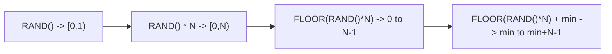

# How to Use RAND() Function in MySQL for Random Numbers

Author: [nawazdhandala](https://www.github.com/nawazdhandala)

Tags: MySQL, SQL, Numeric Function, Database

Description: Learn how to use MySQL RAND() to generate random floating-point numbers, random integers, random rows, and reproducible random sequences with seeds.

---

## What Is the RAND() Function?

`RAND()` returns a pseudo-random floating-point number in the range `[0, 1)` (including 0, excluding 1). It is commonly used for random row sampling, randomized ordering, generating test data, and probabilistic filtering.

**Syntax:**

```sql
RAND()
RAND(seed)
```

- Called with no arguments: returns a non-deterministic random value that changes on every call.
- Called with a `seed` integer: returns a deterministic sequence. The same seed always produces the same sequence within a query.
- If `seed` is `NULL`, it is treated as `0` (equivalent to `RAND(0)`), returning a deterministic value.

---

## Basic Examples

```sql
SELECT RAND();
-- Returns: e.g., 0.7165434821345

SELECT RAND();
-- Returns: e.g., 0.2349871230841  (different each time)

SELECT RAND(42);
-- Returns: 0.6555866465...  (always the same for seed 42)

SELECT RAND(42);
-- Returns: 0.6555866465...  (reproducible)
```

---

## Generating Random Integers in a Range

To get a random integer between `min` and `max` (inclusive):

```sql
-- Formula: FLOOR(RAND() * (max - min + 1)) + min
SELECT FLOOR(RAND() * 100) + 1 AS rand_1_to_100;

-- Random integer 1-6 (dice roll)
SELECT FLOOR(RAND() * 6) + 1 AS dice_roll;

-- Random integer 0-99
SELECT FLOOR(RAND() * 100) AS rand_0_to_99;

-- Random integer between 50 and 100
SELECT FLOOR(RAND() * 51) + 50 AS rand_50_to_100;
```

---

## How RAND() Maps to Integer Ranges



---

## Random Row Sampling

```sql
-- Return 10 random rows from a table
SELECT id, name, email
FROM customers
ORDER BY RAND()
LIMIT 10;
```

**Performance note:** `ORDER BY RAND()` forces a full table scan and filesort. For large tables, use the following approach instead:

```sql
-- Efficient random sampling for large tables
SELECT *
FROM customers
WHERE id >= (
    SELECT FLOOR(RAND() * (SELECT MAX(id) FROM customers))
)
ORDER BY id
LIMIT 1;
```

---

## A/B Testing: Random Assignment

```sql
-- Randomly assign users to group A or B
SELECT
    user_id,
    CASE
        WHEN RAND() < 0.5 THEN 'Group A'
        ELSE 'Group B'
    END AS ab_group
FROM users;
```

For a 70/30 split:

```sql
SELECT
    user_id,
    CASE
        WHEN RAND() < 0.7 THEN 'Control'
        ELSE 'Treatment'
    END AS experiment_group
FROM users;
```

---

## Probabilistic Filtering

```sql
-- Sample approximately 10% of rows
SELECT *
FROM events
WHERE RAND() < 0.10;
```

---

## Generating Random Test Data

```sql
-- Create a table of random test records
CREATE TABLE test_data (
    id INT AUTO_INCREMENT PRIMARY KEY,
    value DOUBLE,
    category CHAR(1)
);

INSERT INTO test_data (value, category)
SELECT
    ROUND(RAND() * 1000, 2),
    ELT(FLOOR(RAND() * 4) + 1, 'A', 'B', 'C', 'D')
FROM (SELECT 1 UNION SELECT 2 UNION SELECT 3 UNION SELECT 4 UNION SELECT 5
      UNION SELECT 6 UNION SELECT 7 UNION SELECT 8 UNION SELECT 9 UNION SELECT 10) t;
```

---

## Using RAND() with a Seed for Reproducibility

The seed makes the random sequence deterministic, which is useful for debugging or reproducible test scenarios:

```sql
SELECT RAND(1), RAND(1), RAND(1);
-- Same value each time: 0.40540353...

-- Seeded sequence per row using row number
SELECT
    n,
    RAND(n) AS seeded_random
FROM (
    SELECT 1 AS n UNION SELECT 2 UNION SELECT 3 UNION SELECT 4 UNION SELECT 5
) t;
```

---

## Random Password Generation (Basic)

```sql
-- Generate a random 8-character hex string (suitable as a token)
SELECT SUBSTR(MD5(RAND()), 1, 8) AS random_token;

-- Or use UUID for a random identifier
SELECT UUID() AS random_uuid;
```

---

## RAND() in UPDATE (Randomizing Data)

```sql
-- Assign random priorities to tasks
UPDATE tasks
SET priority = FLOOR(RAND() * 5) + 1
WHERE priority IS NULL;
```

---

## Replication Warning

`RAND()` without a seed is non-deterministic. In statement-based replication, each server evaluates `RAND()` independently, potentially giving different results on replicas. MySQL flags this as unsafe for SBR:

```sql
-- Unsafe for statement-based replication
INSERT INTO log_samples SELECT * FROM events WHERE RAND() < 0.01;
```

To mitigate, use row-based replication (RBR) or generate the random value in the application layer.

---

## RAND() vs UUID() vs Random Strings

| Method            | Output            | Use Case                               |
|-------------------|-------------------|----------------------------------------|
| `RAND()`          | Float [0,1)       | Sampling, probabilistic logic          |
| `FLOOR(RAND()*N)` | Integer 0 to N-1  | Dice rolls, random IDs in range        |
| `UUID()`          | 36-char UUID string | Unique identifiers                   |
| `MD5(RAND())`     | 32-char hex string | Tokens, test data                     |

---

## Summary

`RAND()` generates pseudo-random floating-point numbers between 0 (inclusive) and 1 (exclusive). Use `FLOOR(RAND() * N) + min` for random integers within a range. Its most common applications are random row sampling (`ORDER BY RAND() LIMIT N`), A/B test group assignment, probabilistic filtering (`WHERE RAND() < 0.1`), and test data generation. For large-table sampling, avoid `ORDER BY RAND()` due to performance overhead and instead use range-based sampling. Pass a seed value to `RAND(seed)` for reproducible sequences.
