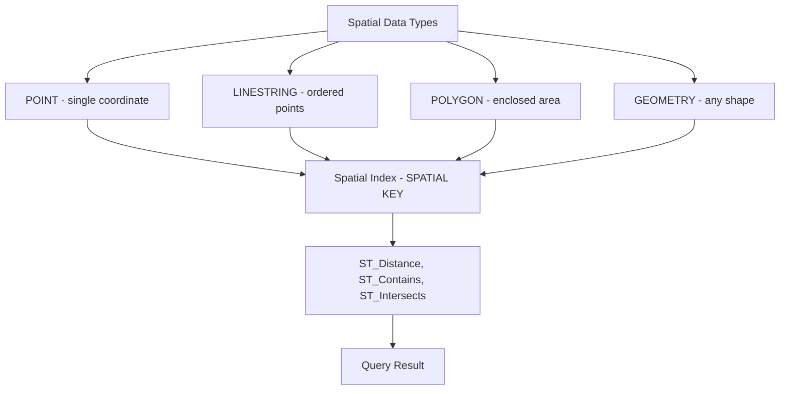

# How to Use MySQL Spatial Data Types and Functions

Author: [nawazdhandala](https://www.github.com/nawazdhandala)

Tags: MySQL, SQL, Spatial Data, GIS, Geography, Database

Description: Learn how to use MySQL spatial data types like POINT and POLYGON along with spatial functions to store and query geographic location data.

---

## How MySQL Spatial Data Works

MySQL supports the OpenGIS standard for storing and querying geometric and geographic data. Spatial data types such as `POINT`, `LINESTRING`, `POLYGON`, and `GEOMETRY` can be stored in columns and queried using spatial functions. MySQL 5.7 introduced spatial data types with the `ST_` function prefix. MySQL 8.0 added full spatial reference system (SRS) support with geodetic calculations for geographic data.



## Spatial Data Types

```text
POINT         - A single coordinate pair (latitude, longitude for SRID 4326)
LINESTRING    - A sequence of points forming a line
POLYGON       - A closed area defined by rings
MULTIPOINT    - A collection of points
MULTILINESTRING - A collection of lines
MULTIPOLYGON  - A collection of polygons
GEOMETRY      - Any of the above (generic supertype)
GEOMETRYCOLLECTION - Mixed collection
```

## Setup: Sample Table

```sql
CREATE TABLE locations (
    id        INT AUTO_INCREMENT PRIMARY KEY,
    name      VARCHAR(100),
    category  VARCHAR(50),
    coords    POINT NOT NULL SRID 4326,
    SPATIAL INDEX idx_coords (coords)
);

INSERT INTO locations (name, category, coords) VALUES
('Central Park',     'park',       ST_GeomFromText('POINT(40.7829 -73.9654)', 4326)),
('Times Square',     'landmark',   ST_GeomFromText('POINT(40.7580 -73.9857)', 4326)),
('Brooklyn Bridge',  'landmark',   ST_GeomFromText('POINT(40.7061 -73.9969)', 4326)),
('JFK Airport',      'airport',    ST_GeomFromText('POINT(40.6413 -73.7781)', 4326)),
('LaGuardia Airport','airport',    ST_GeomFromText('POINT(40.7773 -73.8740)', 4326));
```

Note: For geographic (lat/lon) data, use SRID 4326 (WGS 84). The default WKT axis order for SRID 4326 is (latitude, longitude).

## Creating Spatial Values

**ST_GeomFromText** - create geometry from WKT (Well Known Text):

```sql
SELECT ST_GeomFromText('POINT(40.7580 -73.9857)', 4326) AS times_square;
```

**ST_Point** - create a point directly:

```sql
SELECT ST_Point(40.7580, -73.9857, 4326) AS pt;
```

**Polygon example:**

```sql
SELECT ST_GeomFromText(
    'POLYGON((40.70 -74.02, 40.70 -73.97, 40.78 -73.97, 40.78 -74.02, 40.70 -74.02))',
    4326
) AS manhattan_bbox;
```

## ST_Distance - Calculate Distance

`ST_Distance` returns the distance between two geometries. With SRID 4326 it returns meters.

```sql
SELECT
    a.name                                      AS location_a,
    b.name                                      AS location_b,
    ROUND(ST_Distance(a.coords, b.coords))      AS distance_meters,
    ROUND(ST_Distance(a.coords, b.coords) / 1000, 2) AS distance_km
FROM locations a
JOIN locations b ON a.id < b.id
ORDER BY distance_meters;
```

**Find locations within 5 km of Times Square:**

```sql
SET @times_square = ST_GeomFromText('POINT(40.7580 -73.9857)', 4326);

SELECT
    name,
    category,
    ROUND(ST_Distance(coords, @times_square) / 1000, 2) AS km_from_times_square
FROM locations
WHERE ST_Distance(coords, @times_square) <= 5000
ORDER BY km_from_times_square;
```

## ST_Contains and ST_Within

`ST_Contains(geom_a, geom_b)` returns 1 if geom_a completely contains geom_b.

```sql
SET @manhattan = ST_GeomFromText(
    'POLYGON((40.70 -74.02, 40.70 -73.97, 40.80 -73.97, 40.80 -74.02, 40.70 -74.02))',
    4326
);

SELECT name, category
FROM locations
WHERE ST_Contains(@manhattan, coords);
```

## MBRContains - Bounding Box Search

For faster approximate containment checks using a minimum bounding rectangle:

```sql
SET @bbox = ST_GeomFromText(
    'POLYGON((40.70 -74.05, 40.70 -73.95, 40.80 -73.95, 40.80 -74.05, 40.70 -74.05))',
    4326
);

SELECT name FROM locations
WHERE MBRContains(@bbox, coords);
```

## Extracting Coordinates

```sql
SELECT
    name,
    ST_X(coords) AS latitude,
    ST_Y(coords) AS longitude,
    ST_AsText(coords) AS wkt
FROM locations;
```

```text
+--------------------+----------+-----------+-------------------------------+
| name               | latitude | longitude | wkt                           |
+--------------------+----------+-----------+-------------------------------+
| Central Park       | 40.7829  | -73.9654  | POINT(40.7829 -73.9654)       |
| Times Square       | 40.758   | -73.9857  | POINT(40.758 -73.9857)        |
| Brooklyn Bridge    | 40.7061  | -73.9969  | POINT(40.7061 -73.9969)       |
| JFK Airport        | 40.6413  | -73.7781  | POINT(40.6413 -73.7781)       |
| LaGuardia Airport  | 40.7773  | -73.874   | POINT(40.7773 -73.874)        |
+--------------------+----------+-----------+-------------------------------+
```

## Spatial Indexes

Spatial indexes use R-trees and only work on columns declared `NOT NULL` with an explicit SRID.

```sql
-- Add spatial index to existing table:
ALTER TABLE locations ADD SPATIAL INDEX idx_sp (coords);

-- Spatial index is used by ST_Contains, MBRContains, and ST_Within.
-- ST_Distance queries do NOT use spatial indexes in MySQL 8 (full scan).
```

For distance-based proximity queries on large tables, a common pattern is:

1. Use a bounding box (MBRContains) to quickly narrow the candidate set using the index.
2. Then apply exact ST_Distance on that smaller candidate set.

```sql
SET @lat = 40.7580;
SET @lon = -73.9857;
SET @radius_km = 5;
SET @deg = @radius_km / 111.0;   -- rough degree approximation

SET @bbox = ST_GeomFromText(
    CONCAT('POLYGON((', @lat-@deg,' ',@lon-@deg,',',
                        @lat-@deg,' ',@lon+@deg,',',
                        @lat+@deg,' ',@lon+@deg,',',
                        @lat+@deg,' ',@lon-@deg,',',
                        @lat-@deg,' ',@lon-@deg,'))'), 4326);

SELECT name,
       ROUND(ST_Distance(coords, ST_Point(@lat, @lon, 4326)) / 1000, 2) AS km
FROM locations
WHERE MBRContains(@bbox, coords)
  AND ST_Distance(coords, ST_Point(@lat, @lon, 4326)) <= @radius_km * 1000
ORDER BY km;
```

## Best Practices

- Always specify SRID 4326 for geographic (latitude/longitude) data; without an SRID, MySQL stores planar coordinates that give incorrect distances.
- For SRID 4326, MySQL 8.0 defaults to the SRS axis order: latitude first, then longitude in WKT. Use `ST_Latitude()` / `ST_Longitude()` instead of `ST_X()` / `ST_Y()` for clearer geographic code.
- Use `SPATIAL INDEX` on `NOT NULL` POINT columns with a fixed SRID to enable index-assisted containment queries.
- For large-scale proximity searches, combine a bounding-box pre-filter with exact `ST_Distance` filtering.
- Export spatial data as GeoJSON using `ST_AsGeoJSON` when integrating with mapping libraries.

## Summary

MySQL spatial data types and functions enable storing and querying geographic data within a relational database. `POINT`, `POLYGON`, `LINESTRING`, and the generic `GEOMETRY` types hold geometric shapes. Functions like `ST_Distance` compute real-world distances, `ST_Contains` and `ST_Within` test containment, and `ST_X` / `ST_Y` extract coordinates. `SPATIAL INDEX` accelerates containment queries. For location-aware applications these built-in capabilities often eliminate the need for a dedicated GIS database.
