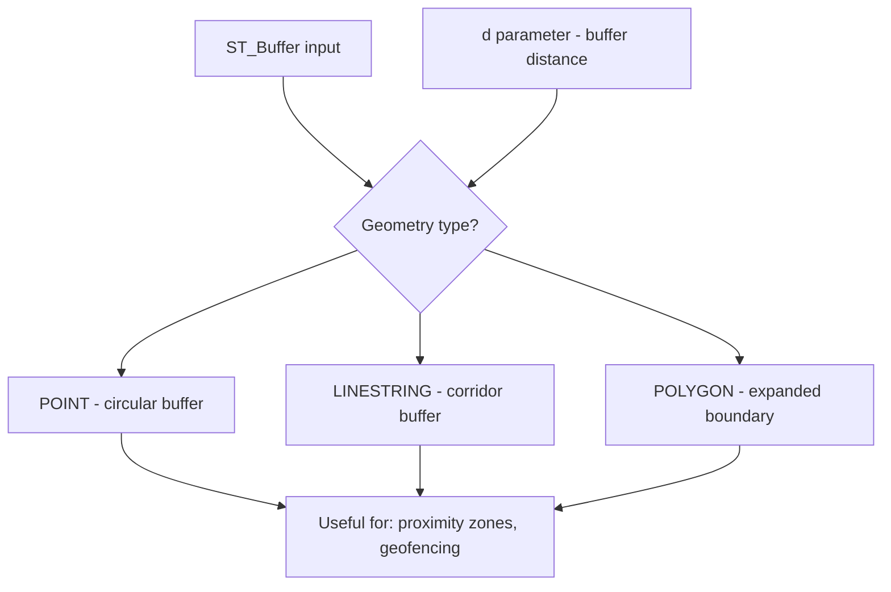

# How to Use ST_Buffer() in MySQL

Author: [nawazdhandala](https://www.github.com/nawazdhandala)

Tags: MySQL, SQL, Spatial, GIS, ST_Buffer, Database

Description: Learn how to use ST_Buffer() in MySQL to create buffer zones around geometry values, enabling proximity queries, geofencing, and expansion of spatial areas.

---

## What Is ST_Buffer

`ST_Buffer(g, d)` is a MySQL spatial function that returns a new geometry representing all points within distance `d` of the input geometry `g`. The result is a new geometry that "pads" or expands the original by the specified distance:

- For a `POINT`, the buffer is a circle of radius `d`.
- For a `LINESTRING`, the buffer is a zone extending `d` on each side of the line.
- For a `POLYGON`, the buffer expands the polygon outward by `d` units.

With SRID 0 (Cartesian), the distance is in the same units as the coordinates. With SRID 4326 in MySQL 8.0.25+, the distance is in meters.



## Syntax

```sql
ST_Buffer(geometry, distance)
ST_Buffer(geometry, distance, options)

-- options are buffer strategy values created with ST_Buffer_Strategy() (MySQL 8.0+)
-- Example: ST_Buffer_Strategy('end_flat') for flat end caps on LINESTRING

-- For SRID 0 (Cartesian), distance is in coordinate units
-- For SRID 4326 (MySQL 8.0.25+), distance is in meters
```

## Examples

### Setup: Facilities Table

```sql
CREATE TABLE facilities (
    id       INT          PRIMARY KEY AUTO_INCREMENT,
    name     VARCHAR(100) NOT NULL,
    type     VARCHAR(50),
    location POINT        NOT NULL SRID 0
);

INSERT INTO facilities (name, type, location) VALUES
    ('Hospital A',   'hospital', ST_GeomFromText('POINT(10 20)', 0)),
    ('Hospital B',   'hospital', ST_GeomFromText('POINT(50 80)', 0)),
    ('Clinic C',     'clinic',   ST_GeomFromText('POINT(30 40)', 0)),
    ('Clinic D',     'clinic',   ST_GeomFromText('POINT(70 60)', 0));
```

### Create a Circular Buffer Around a Point

```sql
-- Create a buffer of radius 15 units around Hospital A
SET @hospital_a = ST_GeomFromText('POINT(10 20)', 0);
SET @buffer     = ST_Buffer(@hospital_a, 15);

SELECT ST_GeometryType(@buffer) AS buffer_type,
       ST_AsText(@buffer)       AS buffer_wkt_truncated;
```

```text
+-------------+----------------------------------------------------------------------+
| buffer_type | buffer_wkt_truncated                                                  |
+-------------+----------------------------------------------------------------------+
| Polygon     | POLYGON((25 20,24.9... -- many points approximating a circle          |
+-------------+----------------------------------------------------------------------+
```

### Find Points Within a Buffer Zone

```sql
-- Which clinics are within 30 units of Hospital A?
SET @hospital  = (SELECT location FROM facilities WHERE name = 'Hospital A');
SET @zone      = ST_Buffer(@hospital, 30);

SELECT name, type
FROM facilities
WHERE ST_Within(location, @zone)
  AND name != 'Hospital A';
```

```text
+----------+--------+
| name     | type   |
+----------+--------+
| Clinic C | clinic |
+----------+--------+
```

### Buffer Around a LINESTRING

```sql
-- A road segment
SET @road = ST_GeomFromText('LINESTRING(0 0, 100 0)', 0);
-- 10-unit corridor on each side
SET @road_buffer = ST_Buffer(@road, 10);

SELECT ST_GeometryType(@road_buffer) AS type,
       ROUND(ST_Area(@road_buffer), 2) AS approx_area;
```

```text
+----------+-------------+
| type     | approx_area |
+----------+-------------+
| Polygon  |     2314.16 |
+----------+-------------+
```

The area approximates 2 * radius * length + pi * radius^2 for the half-circle end caps.

### Buffer Around a POLYGON

```sql
SET @zone = ST_GeomFromText(
    'POLYGON((10 10, 50 10, 50 50, 10 50, 10 10))',
    0
);

SET @expanded_zone = ST_Buffer(@zone, 5);

SELECT
    ROUND(ST_Area(@zone), 2)          AS original_area,
    ROUND(ST_Area(@expanded_zone), 2) AS expanded_area;
```

```text
+---------------+---------------+
| original_area | expanded_area |
+---------------+---------------+
|       1600.00 |       2478.54 |
+---------------+---------------+
```

### Use ST_Buffer for Proximity Joins

Find all facilities within 30 units of any hospital:

```sql
SELECT f.name AS facility, h.name AS nearest_hospital
FROM facilities f
JOIN facilities h ON h.type = 'hospital'
WHERE f.type != 'hospital'
  AND ST_Within(f.location, ST_Buffer(h.location, 30));
```

```text
+----------+-----------------+
| facility | nearest_hospital|
+----------+-----------------+
| Clinic C | Hospital A      |
| Clinic D | Hospital B      |
+----------+-----------------+
```

### ST_Buffer for Geofence Expansion

When you have a polygon zone and want to create an "early warning" zone slightly larger than the original:

```sql
CREATE TABLE alert_zones AS
SELECT
    id,
    zone,
    boundary                     AS exact_boundary,
    ST_Buffer(boundary, 0.01)    AS early_warning_boundary  -- 0.01 degrees ~1.1 km
FROM delivery_zones;
```

### Buffer Strategies (MySQL 8.0+)

```sql
-- Buffer a linestring with flat end caps instead of round
SET @road = ST_GeomFromText('LINESTRING(0 0, 10 0)', 0);

SELECT ST_AsText(
    ST_Buffer(@road, 2, ST_Buffer_Strategy('end_flat'))
) AS flat_buffer_wkt;
```

## ST_Buffer with SRID 4326

In MySQL 8.0.25+, `ST_Buffer()` supports geographic spatial reference systems. With SRID 4326, the distance parameter is in meters:

```sql
-- Buffer approximately 1 km around a point (distance in meters)
SET @loc    = ST_GeomFromText('POINT(40.7128 -74.006)', 4326);
SET @buf_km = ST_Buffer(@loc, 1000);  -- 1000 meters = 1 km

SELECT ST_AsText(ST_Centroid(@buf_km)) AS centroid;
```

In MySQL versions before 8.0.25, `ST_Buffer()` does not support geographic SRS and raises an error. As a workaround, project to a meter-based CRS using `ST_Transform`, then buffer, then project back.

## Best Practices

- Use SRID 0 (Cartesian) for simple proximity logic where coordinate units are already meaningful (meters, feet, etc.).
- For real-world geographic buffers with SRID 4326 in MySQL 8.0.25+, pass the distance directly in meters. In older versions, use `ST_Transform` to a meter-based CRS.
- Use `ST_Buffer` to build a proximity zone, then test containment with `ST_Within` or `MBRContains`.
- Buffer results are approximated polygons with many vertices; use `ST_Simplify` if you need fewer vertices.

## Summary

`ST_Buffer(g, d)` returns a new geometry expanded by distance `d` around input geometry `g`. For a POINT it produces a circle, for a LINESTRING a corridor, and for a POLYGON an expanded area. Use it to create proximity zones, expand geofences, or build soft boundaries. Combine `ST_Buffer` with `ST_Within` or `ST_Intersects` to perform efficient proximity joins and containment checks.
