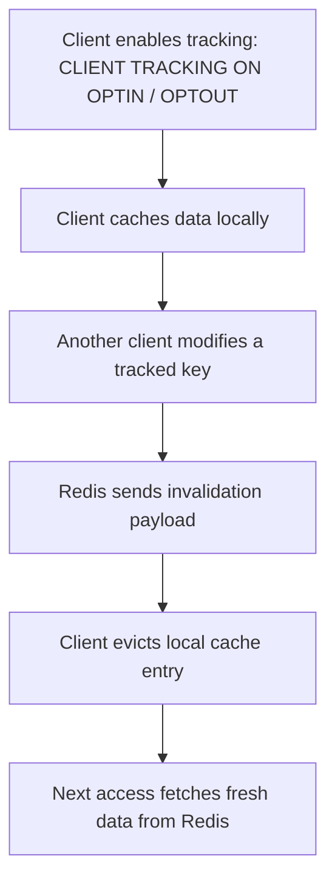
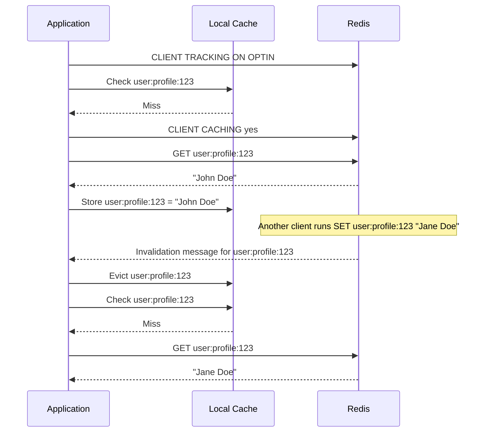

# How to Use CLIENT CACHING in Redis for Client-Side Caching

Author: [nawazdhandala](https://www.github.com/nawazdhandala)

Tags: Redis, Client, Caching, Performance, RESP3

Description: Learn how to use CLIENT CACHING in Redis to control client-side caching invalidation tracking, enabling applications to cache data locally and receive notifications when it changes.

---

## Overview

`CLIENT CACHING` is part of Redis's client-side caching protocol, which allows clients to cache data locally and receive invalidation messages when cached keys change. `CLIENT CACHING yes` and `CLIENT CACHING no` are used with `CLIENT TRACKING` in `OPTIN` and `OPTOUT` modes to control whether the next read is tracked for invalidation.



## Prerequisites

Client-side caching requires:
1. `CLIENT TRACKING` to be enabled
2. `CLIENT CACHING` to be used in `OPTIN` or `OPTOUT` mode

## Enabling Tracking

### With OPTIN

```redis
CLIENT TRACKING ON OPTIN
CLIENT CACHING yes
GET user:profile:123
```

### With OPTOUT

```redis
CLIENT TRACKING ON OPTOUT
CLIENT CACHING no
GET temporary:counter:abc
```

## CLIENT CACHING Syntax

```redis
CLIENT CACHING yes
CLIENT CACHING no
```

- `yes`: Track the next read command in `OPTIN` mode
- `no`: Skip tracking for the next read command in `OPTOUT` mode

This affects only the next command issued after `CLIENT CACHING`.

## How It Works

When `CLIENT TRACKING` is enabled in `OPTIN` mode, Redis only tracks keys that you explicitly opt in with `CLIENT CACHING yes`. In `OPTOUT` mode, Redis tracks reads by default and `CLIENT CACHING no` skips tracking for a specific command.

### Track a specific key

```redis
CLIENT TRACKING ON OPTIN
CLIENT CACHING yes
GET user:profile:123
```

Redis will now send an invalidation notification if `user:profile:123` changes.

### Skip tracking for a transient read

```redis
CLIENT TRACKING ON OPTOUT
CLIENT CACHING no
GET temporary:counter:abc
```

The key `temporary:counter:abc` is read but not added to the invalidation tracking list.

## Full Client-Side Caching Workflow



## OPTIN vs OPTOUT

| Mode | How tracking works | `CLIENT CACHING` use |
|------|-------------------|-------------------|
| `OPTIN` | Only keys explicitly opted in are tracked | Use `CLIENT CACHING yes` before the read |
| `OPTOUT` | Reads are tracked by default | Use `CLIENT CACHING no` before reads you want to skip |

## Practical Use Case: Selective Caching

Not every key is worth caching locally. Use `OPTIN` for stable configuration data and `OPTOUT` for volatile reads you do not want to track:

```redis
# Stable configuration data
CLIENT TRACKING ON OPTIN
CLIENT CACHING yes
HGETALL config:global

# Frequently changing counters
CLIENT TRACKING ON OPTOUT
CLIENT CACHING no
GET stats:requests:total
```

## Summary

`CLIENT CACHING yes/no` controls whether the next read is tracked for client-side caching. It is effective only when `CLIENT TRACKING` is enabled in `OPTIN` or `OPTOUT` mode. Use `CLIENT CACHING yes` to opt into tracking for keys you want to cache locally, and `CLIENT CACHING no` to skip tracking for volatile or uncacheable data. This gives fine-grained control over which data is subject to invalidation notifications, reducing unnecessary invalidation traffic for data that does not benefit from local caching.
