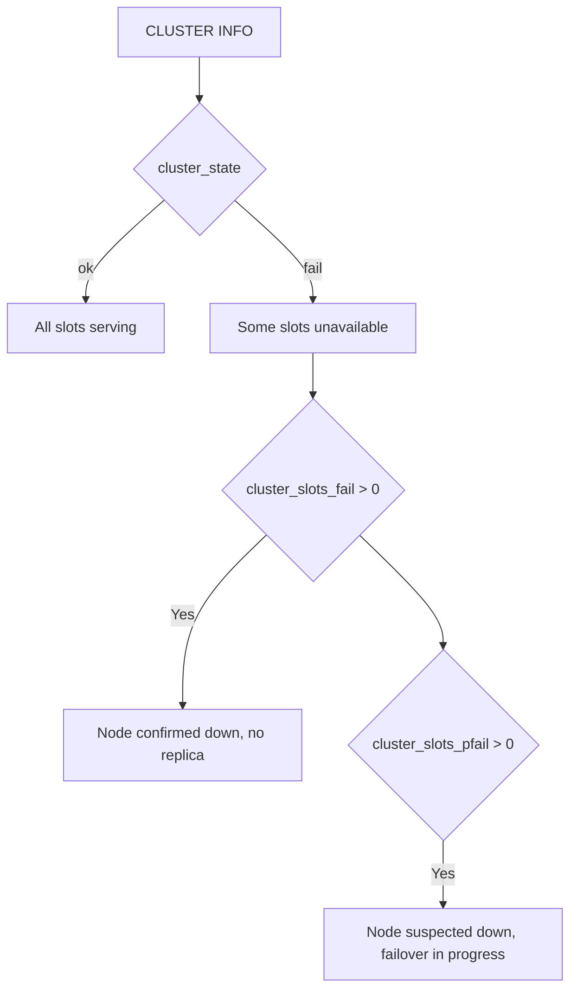

# How to Use CLUSTER INFO in Redis to Check Cluster Status

Author: [nawazdhandala](https://www.github.com/nawazdhandala)

Tags: Redis, Cluster, Monitoring, Operation, CLUSTER INFO

Description: Learn how to use CLUSTER INFO in Redis to get a comprehensive overview of cluster state, slot assignments, node counts, and epoch values for health monitoring and troubleshooting.

---

## Overview

`CLUSTER INFO` returns a structured summary of the current node's view of the Redis Cluster state. It shows whether the cluster is healthy, how many slots are assigned and operational, the number of known nodes, and internal epoch counters. It is the first command to run when diagnosing cluster issues.

## Syntax

```redis
CLUSTER INFO
```

Returns a series of `field:value` pairs, one per line.

## Sample Output

```redis
CLUSTER INFO
```

```text
cluster_state:ok
cluster_slots_assigned:16384
cluster_slots_ok:16384
cluster_slots_pfail:0
cluster_slots_fail:0
cluster_known_nodes:6
cluster_size:3
cluster_current_epoch:6
cluster_my_epoch:1
cluster_stats_messages_sent:100234
cluster_stats_messages_received:99876
total_cluster_links_buffer_limit_exceeded:0
```

## Field Reference

| Field | Description |
|-------|-------------|
| `cluster_state` | `ok` if healthy; `fail` if cluster cannot operate |
| `cluster_slots_assigned` | Number of slots assigned to nodes (should be 16384) |
| `cluster_slots_ok` | Number of slots in working state |
| `cluster_slots_pfail` | Slots on nodes in PFAIL (suspected down) state |
| `cluster_slots_fail` | Slots on nodes in FAIL (confirmed down) state |
| `cluster_known_nodes` | Total nodes known to this node, including nodes in HANDSHAKE state |
| `cluster_size` | Number of primary nodes serving at least one slot |
| `cluster_current_epoch` | Cluster-wide epoch (logical clock) |
| `cluster_my_epoch` | This node's configuration epoch |
| `cluster_stats_messages_sent` | Gossip messages sent |
| `cluster_stats_messages_received` | Gossip messages received |
| `total_cluster_links_buffer_limit_exceeded` | Count of cluster links freed due to exceeding buffer limit (Redis 7.0+) |

## Interpreting Cluster State

### Healthy cluster

```text
cluster_state:ok
cluster_slots_assigned:16384
cluster_slots_ok:16384
cluster_slots_pfail:0
cluster_slots_fail:0
```

All 16384 slots are assigned and functioning normally.

### Cluster with suspected node failure

```text
cluster_state:ok
cluster_slots_pfail:1024
cluster_slots_fail:0
```

`pfail` (probable failure) means some nodes suspect a node is down but have not yet reached quorum. The cluster is still serving traffic.

### Cluster in fail state

```text
cluster_state:fail
cluster_slots_fail:1024
```

One or more primaries are confirmed down with no replica available to take over. The cluster stops accepting writes for affected slots.



## Monitoring Cluster Health

### Shell script for health check

```bash
#!/bin/bash
REDIS_HOST=192.168.1.10
REDIS_PORT=7001

STATE=$(redis-cli -h $REDIS_HOST -p $REDIS_PORT CLUSTER INFO | grep cluster_state | cut -d: -f2 | tr -d '[:space:]')
FAIL_SLOTS=$(redis-cli -h $REDIS_HOST -p $REDIS_PORT CLUSTER INFO | grep cluster_slots_fail | cut -d: -f2 | tr -d '[:space:]')

if [ "$STATE" != "ok" ] || [ "$FAIL_SLOTS" -gt "0" ]; then
  echo "ALERT: Redis cluster is not healthy. State=$STATE FailSlots=$FAIL_SLOTS"
  exit 1
else
  echo "Redis cluster is OK"
fi
```

## Standalone Mode

If cluster mode is not enabled (the `cluster-enabled` configuration directive is set to `no`), running `CLUSTER INFO` returns an error:

```text
(error) ERR This instance has cluster support disabled
```

To check whether a node has cluster mode enabled, use the `INFO` command and look for the `cluster_enabled` field in the `# Cluster` section:

```redis
INFO cluster
```

```text
# Cluster
cluster_enabled:0
```

## cluster_state:fail Causes

The cluster enters `fail` state when:
1. Any slot is unassigned or its assigned primary is in FAIL state (when `cluster-require-full-coverage` is `yes`, which is the default)
2. The node cannot reach a majority of primary nodes (reachable masters < quorum)

If you set `cluster-require-full-coverage` to `no`, the cluster remains in `ok` state even when some slots are unserved, allowing the remaining slots to continue accepting traffic.

## Summary

`CLUSTER INFO` provides a single-command health snapshot of Redis Cluster. Key fields to monitor are `cluster_state` (must be `ok`), `cluster_slots_assigned` (must be 16384), `cluster_slots_ok` (must equal `cluster_slots_assigned`), and `cluster_slots_fail` (must be 0). Use `cluster_slots_pfail` as an early warning indicator that failover may be in progress. Run `CLUSTER INFO` from multiple nodes to detect inconsistent views of cluster state.
