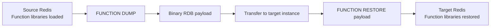
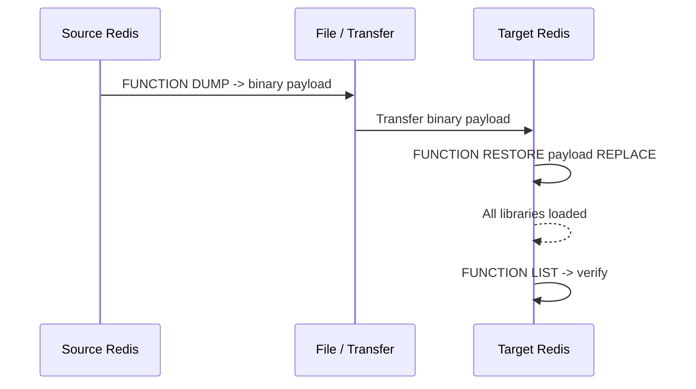

# How to Use FUNCTION DUMP and RESTORE in Redis for Function Backup

Author: [nawazdhandala](https://www.github.com/nawazdhandala)

Tags: Redis, FUNCTION DUMP, FUNCTION RESTORE, Function, Backup

Description: Learn how to use FUNCTION DUMP and FUNCTION RESTORE in Redis to serialize all function libraries to binary and restore them on another instance.

---

## What are FUNCTION DUMP and FUNCTION RESTORE

FUNCTION DUMP serializes all currently loaded function libraries into a binary RDB payload. FUNCTION RESTORE takes that binary payload and loads it into a Redis instance, restoring all libraries. Together they provide a portable backup and migration mechanism for Redis Functions.

```redis
FUNCTION DUMP
FUNCTION RESTORE serialized-value [FLUSH | APPEND | REPLACE]
```



## FUNCTION DUMP

FUNCTION DUMP returns a bulk string containing all function libraries serialized in RDB format. The output is binary and not human-readable.

```redis
FUNCTION DUMP
-- Returns: binary RDB payload (shown as escaped bytes)
-- "\xf6\x00\x03..." etc.
```

### Capturing the dump in redis-cli

```bash
redis-cli --raw --no-auth-warning FUNCTION DUMP > functions.bin
```

The `--raw` flag ensures the binary payload is written without redis-cli formatting. This saves the binary payload to a file.

## FUNCTION RESTORE

FUNCTION RESTORE loads the binary payload produced by FUNCTION DUMP.

```redis
FUNCTION RESTORE <serialized-value>
```

### Conflict policy options

| Policy | Behavior |
|---|---|
| `FLUSH` | Delete all existing libraries before restoring |
| `APPEND` | Add libraries from the dump without deleting existing ones; error on name conflict |
| `REPLACE` | Replace existing libraries with the same name from the dump |

Default behavior (no policy) is equivalent to APPEND.

```redis
-- Restore with FLUSH: replace everything
FUNCTION RESTORE <payload> FLUSH

-- Restore with APPEND: add new libraries only
FUNCTION RESTORE <payload> APPEND

-- Restore with REPLACE: overwrite matching library names
FUNCTION RESTORE <payload> REPLACE
```

## Practical Migration Workflow

### Step 1: Dump from source

```bash
redis-cli --raw -h source-host -p 6379 FUNCTION DUMP > functions_backup.bin
```

The `--raw` flag ensures the binary payload is output without formatting.

### Step 2: Restore on target

Use the `-x` flag to read the binary payload from stdin as the last argument:

```bash
redis-cli -x -h target-host -p 6379 FUNCTION RESTORE < functions_backup.bin
```

This uses the default APPEND policy. To achieve a full replacement, flush existing functions first:

```bash
redis-cli -h target-host -p 6379 FUNCTION FLUSH
redis-cli -x -h target-host -p 6379 FUNCTION RESTORE < functions_backup.bin
```

For restore with REPLACE or FLUSH policy in a single command, use a Redis client library (Python, Node.js, etc.) that handles binary data natively, since redis-cli's `-x` flag always places stdin as the last argument.

### Step 3: Verify

```redis
FUNCTION LIST
```



## Full Backup Example Using redis-cli

```bash
# Backup all functions from production
redis-cli --raw -h prod-redis FUNCTION DUMP > functions_backup.bin

# Restore to staging (default APPEND policy)
redis-cli -x -h staging-redis FUNCTION RESTORE < functions_backup.bin
```

Or pipe directly between instances without an intermediate file:

```bash
redis-cli --raw -h prod-redis FUNCTION DUMP | redis-cli -x -h staging-redis FUNCTION RESTORE
```

## Difference from RDB Persistence

Function libraries are included in the regular RDB snapshot automatically. FUNCTION DUMP provides a targeted, on-demand export containing only function data, useful when:
- You want to migrate only functions, not all data
- You need to copy functions to a new empty instance
- You want a versioned backup of your function libraries separate from data backups

| Method | Includes | Portable | On-demand |
|---|---|---|---|
| RDB snapshot | All data + functions | Yes | Yes (BGSAVE) |
| FUNCTION DUMP | Functions only | Yes | Yes |

## Error Cases

```redis
-- Attempting to restore a library that already exists without REPLACE
FUNCTION RESTORE <payload>
-- ERR: Library already exists

-- Corrupted or wrong-version payload
FUNCTION RESTORE invalidbytes
-- ERR: DUMP payload version or checksum are wrong
```

## Summary

FUNCTION DUMP serializes all Redis function libraries to a portable binary format, and FUNCTION RESTORE loads them back on any compatible Redis instance. Use the FLUSH, APPEND, or REPLACE policy to control how conflicts are handled during restore. This pair of commands is the standard way to migrate, backup, or deploy function libraries across Redis environments without copying the full dataset.
