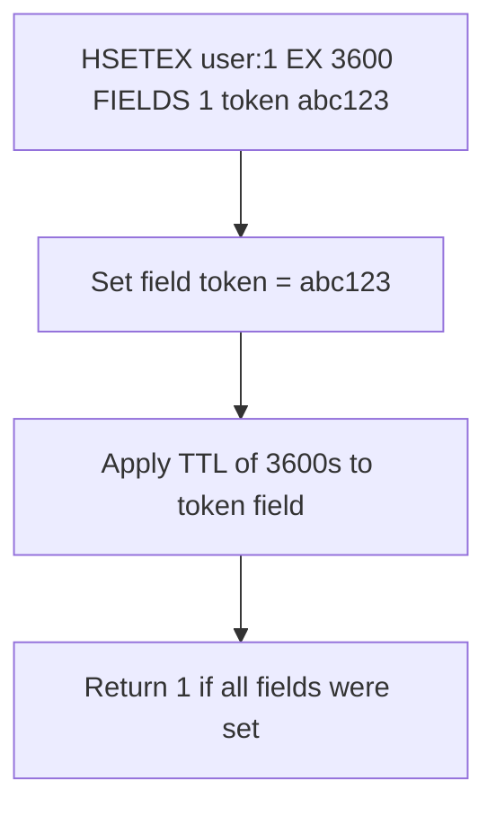

# How to Use HSETEX in Redis to Set Hash Fields with Expiration

Author: [nawazdhandala](https://www.github.com/nawazdhandala)

Tags: Redis, HSETEX, Hash, Expiration, TTL, Field, Command

Description: Learn how to use the Redis HSETEX command (Redis 7.4+) to set hash field values with per-field TTLs in a single atomic operation, combining HSET and HEXPIRE.

---

## How HSETEX Works

`HSETEX` sets one or more hash fields and applies an expiration to all of them in a single atomic operation. It is essentially the combination of `HSET` + `HEXPIRE` in one command. Before Redis 8.0, you needed two separate commands (and potentially a Lua script for atomicity) to set a field with a TTL. `HSETEX` makes this a first-class atomic operation.

`HSETEX` was introduced in Redis 8.0.



## Syntax

```redis
HSETEX key [FNX | FXX] [EX seconds | PX milliseconds | EXAT unix-time-seconds | PXAT unix-time-milliseconds | KEEPTTL] FIELDS numfields field value [field value ...]
```

- `FNX` - only set the fields if none of them already exist
- `FXX` - only set the fields if all of them already exist
- `EX seconds` - TTL in seconds for all specified fields
- `PX milliseconds` - TTL in milliseconds for all specified fields
- `EXAT unix-time-seconds` - absolute Unix timestamp in seconds at which the fields expire
- `PXAT unix-time-milliseconds` - absolute Unix timestamp in milliseconds at which the fields expire
- `KEEPTTL` - retain the existing TTL associated with the fields
- `FIELDS numfields` - number of field-value pairs to follow
- Returns `1` if all fields were set, or `0` if no fields were set (e.g., when using `FNX` and fields already exist)

The `EX`, `PX`, `EXAT`, `PXAT`, and `KEEPTTL` options are mutually exclusive. For millisecond precision, use `PX` instead of `EX`.

## Examples

### Basic HSETEX

Set a token field with a 1-hour TTL.

```redis
HSET user:1 name "Alice" email "alice@example.com"
HSETEX user:1 EX 3600 FIELDS 1 token "abc123"
HGET user:1 token
HTTL user:1 FIELDS 1 token
```

```text
(integer) 2
(integer) 1
"abc123"
1) (integer) 3600
```

The `name` and `email` fields have no TTL; only `token` has a 3600-second TTL.

### Set multiple fields with the same TTL

Set two temporary fields at once.

```redis
HSET session:xyz user_id "42" role "admin"
HSETEX session:xyz EX 1800 FIELDS 2 temp_data "payload" cache_fragment "<html>"
HTTL session:xyz FIELDS 4 user_id role temp_data cache_fragment
```

```text
(integer) 2
(integer) 1
1) (integer) -1
2) (integer) -1
3) (integer) 1800
4) (integer) 1800
```

`user_id` and `role` are permanent; `temp_data` and `cache_fragment` expire in 1800s.

### Millisecond precision with PX

Set a field with a 500 ms TTL using the `PX` option.

```redis
HSET rate:user:42 name "Bob"
HSETEX rate:user:42 PX 500 FIELDS 1 window_slot "1"
HPTTL rate:user:42 FIELDS 1 window_slot
```

```text
(integer) 1
(integer) 1
1) (integer) 499
```

### Replacing HSET + HEXPIRE with HSETEX

Before Redis 8.0 (two commands, not atomic):

```redis
HSET user:1 token "xyz"
HEXPIRE user:1 3600 FIELDS 1 token
```

With Redis 8.0+ (atomic):

```redis
HSETEX user:1 EX 3600 FIELDS 1 token "xyz"
```

### OTP field initialization

Create a one-time password field that auto-expires in 5 minutes.

```redis
HSET user:99 name "Carol" email "carol@example.com"
HSETEX user:99 EX 300 FIELDS 1 otp "726419"
HTTL user:99 FIELDS 1 otp
```

```text
(integer) 2
(integer) 1
1) (integer) 300
```

After 5 minutes, the `otp` field is automatically deleted. The user record remains.

### Temporary feature flag

Enable a feature for a user for 24 hours.

```redis
HSET user:5 name "Dave" plan "pro"
HSETEX user:5 EX 86400 FIELDS 1 beta_feature_enabled "true"
HTTL user:5 FIELDS 1 beta_feature_enabled
```

```text
(integer) 2
(integer) 1
1) (integer) 86400
```

### HSETEX vs HSET + HEXPIRE

| Approach | Atomic | Syntax |
|----------|--------|--------|
| `HSET` + `HEXPIRE` | No (two commands) | Verbose |
| `HSETEX` | Yes (single command) | Concise |
| Lua script | Yes | Complex |

## Use Cases

- Setting session tokens with automatic expiry within a user hash
- Adding OTP fields to existing user records
- Temporary feature flags with a defined time window
- Cache fragments stored within a data hash with independent TTLs
- Time-limited rate limit counters embedded in a user hash
- Short-lived authentication tokens without creating separate string keys

## Summary

`HSETEX` (Redis 8.0+) atomically sets hash fields and assigns them a TTL in a single command, replacing the non-atomic pattern of `HSET` + `HEXPIRE`. Use it whenever you need to add expiring fields to a hash - OTPs, session tokens, feature flags, and cache fragments. For millisecond-precision TTLs, use the `PX` option instead of `EX`. Pair with `HGETDEL` and `HTTL` for complete per-field lifecycle management.
