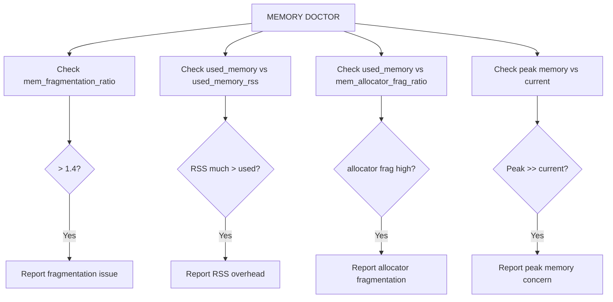

# How to Use MEMORY DOCTOR in Redis for Memory Diagnostics

Author: [nawazdhandala](https://www.github.com/nawazdhandala)

Tags: Redis, Memory, MEMORY DOCTOR, Diagnostic, Monitoring

Description: Learn how to use MEMORY DOCTOR to get a plain-English diagnosis of Redis memory health issues, including fragmentation, RSS overhead, and peak memory consumption.

---

## Introduction

`MEMORY DOCTOR` analyzes the current memory state of Redis and returns a human-readable diagnostic report. It surfaces common memory issues such as high fragmentation, large RSS-to-used-memory ratios, and peak memory accumulation, making it useful for quick health checks.

## Basic Syntax

```redis
MEMORY DOCTOR
```

Returns a plain-text string describing detected memory issues or confirming that memory is healthy.

## Example Outputs

### Healthy instance

```redis
MEMORY DOCTOR
# "Hi Sam, I can't find any memory issue in your instance. I can only account for what occurs on this base."
```

(The "Sam" greeting and HAL 9000-style phrasing are actual Redis behavior -- the command uses sci-fi humor throughout its output.)

### High fragmentation

```redis
MEMORY DOCTOR
# "Sam, I detected a few issues in this Redis instance memory implants:
# * High total RSS overhead: This instance has a memory fragmentation and RSS overhead greater than 1.4 (this means that the Resident Set Size of the process is much larger than the sum of the logical allocations Redis performed)."
```

### Peak memory is much higher than current usage

```redis
MEMORY DOCTOR
# "Sam, I detected a few issues in this Redis instance memory implants:
# * Peak memory: In the past this instance used more than 150% the memory that is currently using. The allocator is normally not able to release memory after a peak, so you can expect to see a big fragmentation ratio, however this is actually harmless and is due to the memory allocator not returning useless memory to the OS."
```

## What MEMORY DOCTOR Checks



## Correlating with INFO memory

`MEMORY DOCTOR` summarizes findings from `INFO memory`. Look at these fields for context:

```redis
INFO memory
# used_memory:104857600          (100MB - data)
# used_memory_rss:188743680      (180MB - OS-level)
# mem_fragmentation_ratio:1.80   (high - 80% fragmentation)
# used_memory_peak:536870912     (512MB peak)
# used_memory_peak_perc:19.53%   (currently only 20% of peak)
# allocator_frag_ratio:1.40
# rss_overhead_ratio:1.15
```

## Responding to MEMORY DOCTOR Findings

### High fragmentation

```redis
# Enable active defragmentation
CONFIG SET activedefrag yes
CONFIG SET active-defrag-threshold-lower 10
CONFIG SET active-defrag-cycle-max 25
```

### RSS much higher than used_memory

This typically indicates:
- Memory was allocated and freed many times (fragmentation)
- Active defrag is disabled
- jemalloc is holding released pages

Check:

```redis
INFO memory
# mem_allocator:jemalloc-5.3.0
# allocator_allocated:100MB
# allocator_active:150MB
# allocator_resident:180MB
```

### Peak memory concerns

The peak memory warning from `MEMORY DOCTOR` is informational -- it indicates the allocator is holding onto memory from a past spike. Try returning cached memory to the OS:

```redis
MEMORY PURGE
```

This asks the allocator (jemalloc) to release unused dirty pages. If fragmentation remains high after a large peak, a server restart is the most reliable way to reclaim that memory.

## MEMORY DOCTOR in a Health Check Script

```bash
#!/bin/bash
DIAGNOSIS=$(redis-cli MEMORY DOCTOR)

if echo "$DIAGNOSIS" | grep -qi "issue\|problem\|warning\|high"; then
  echo "WARN: Redis memory issues detected:"
  echo "$DIAGNOSIS"
  exit 1
else
  echo "OK: Redis memory is healthy"
fi
```

## Related MEMORY Subcommands

| Command | Purpose |
|---|---|
| `MEMORY USAGE key` | Bytes used by a specific key |
| `MEMORY STATS` | Detailed memory statistics |
| `MEMORY MALLOC-STATS` | Raw jemalloc allocator statistics |
| `MEMORY PURGE` | Return cached memory to OS |
| `MEMORY HELP` | List available MEMORY subcommands |
| `MEMORY DOCTOR` | Plain-English diagnostic summary |

## Summary

`MEMORY DOCTOR` provides an easy-to-read summary of memory health issues in Redis. It detects high fragmentation, RSS overhead, and peak memory anomalies. Use it as a quick first-pass diagnostic, then follow up with `INFO memory` and `MEMORY STATS` for detailed metrics. Respond to fragmentation warnings by enabling `activedefrag` and use `MEMORY PURGE` to return idle memory to the OS.
